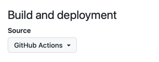

# docs-builder

[](https://github.com/elastic/docs-builder/actions/workflows/ci.yml)

Distributed documentation tooling for a distributed company.

This repository is host to:

* *`docs-builder`* command line tool to generate single doc-sets
* *`docs-assembler`* command line tool to assemble all the doc sets.

Both get distributed [as native OSX, Linux and Windows binaries for several CPU architectures.](#installation)

The documentation files:
* are written in common Markdown with [Additional syntax extension](https://docs-v3-preview.elastic.dev/elastic/docs-builder/tree/main/syntax/) to produce a richer writing and reading experience. 
* By conventions the documentation lives in `docs` folder but the tooling will look for any folder holding a `docset.yml` file given the current working directory.

## Distributed documentation

The main driver for folks writing documentation is `docs-builder`. 
This tool builds each repository in isolation and in addition produces a links.json file.

Each time a repository successfully builds on its respective main integration branch, our automation will publish its links.json file.
For example, [Elasticsearch's links.json](https://elastic-docs-link-index.s3.us-east-2.amazonaws.com/elastic/elasticsearch/main/links.json) representing all linkable resources in the Elasticsearch repository.

The `docs-assembler` tool then assembles all the repositories in the [link-registry](https://elastic-docs-link-index.s3.us-east-2.amazonaws.com/link-index.json) using their last known good commit.

This allows us to:

* Validate outbound and inbound links ahead of time, even during local `docs-builder` builds.
* Snapshot builds: only building commits that produced a `links.json` 
  * Documentation errors in one repository won't affect all the others. 
  * Resilient to repositories having build failures on their integration branches, we fall back to the last known good commit.


## Installation

### Linux / OSX
```bash
curl -sL https://ela.st/docs-builder-install | sh
```

### Windows
```ps
iex (New-Object System.Net.WebClient).DownloadString('https://ela.st/docs-builder-install-win')
```

Installing through the script will download the latest version of the tool and make it available in your `PATH`.

If you want to manually install the tool you can download the latest release from the [Releases Page](https://github.com/elastic/docs-builder/releases)

### Building locally

Install [.NET 9.0](https://dotnet.microsoft.com/en-us/download/dotnet/9.0), then run:

```bash
./build.sh publishbinaries
```
After which the locally built binaries will be available at:

* **docs-builder**: `./.artifacts/publish/docs-builder/release/docs-builder`
* **docs-assembler**: `./.artifacts/publish/docs-assembler/release/docs-assembler`
 
## Getting Started

Our [Documentation](https://docs-v3-preview.elastic.dev/elastic/docs-builder/tree/main/contribute/locally) is the best place to learn how to start using the tool locally.

The TLDR, however, is

* Running `docs-builder` from the root of any checkout with a `docs` folder will build the documentation.
  * Running `docs-builder` consecutively will only rebuild the documentation that has changed.
  * Running `docs-builder` with the `--force` flag will force a full rebuild of the documentation.
  * You can target different folders by passing a path to `docs-builder --path <path>`
* Running `docs-builder serve` will provide a local server with live reloading.
  * You can leave this command running while you add/remove/rename files in your `docs` folder.


### Other commands to know:

* `docs-builder mv` [Move files and folders](https://docs-v3-preview.elastic.dev/elastic/docs-builder/tree/main/contribute/move)
* `docs-builder diff validate` [Manage redirects across doc sets](https://docs-v3-preview.elastic.dev/elastic/docs-builder/tree/main/contribute/redirects#validation)


## Github Action

The `docs-builder` tool is available as a GitHub action.

It runs as native code on a distroless image `~25mb` so there is little overhead invoking the tooling.

```yaml
jobs:
  docs:
    runs-on: ubuntu-latest
    steps:
      - uses: actions/checkout@v4
      - name: Build documentation
        uses: elastic/docs-builder@main
```


### GitHub Pages

To set up the tool to publish to GitHub pages use the following configuration.
**NOTE**: In the near feature we'll make this a dedicated single step GitHub action

```yaml
environment:
  name: github-pages
  url: ${{ steps.deployment.outputs.page_url }}
steps:
  - uses: actions/checkout@v4
    
  - name: Publish Github
    uses: elastic/docs-builder/actions/publish@main
    id: deployment
```

Make sure your repository settings are set up to deploy from GitHub actions see:

https://github.com/elastic/{your-repository}/settings/pages

---


---

# Local Development

See [CONTRIBUTING.md](CONTRIBUTING.md) for more information on how to develop locally and contribute to the project.
