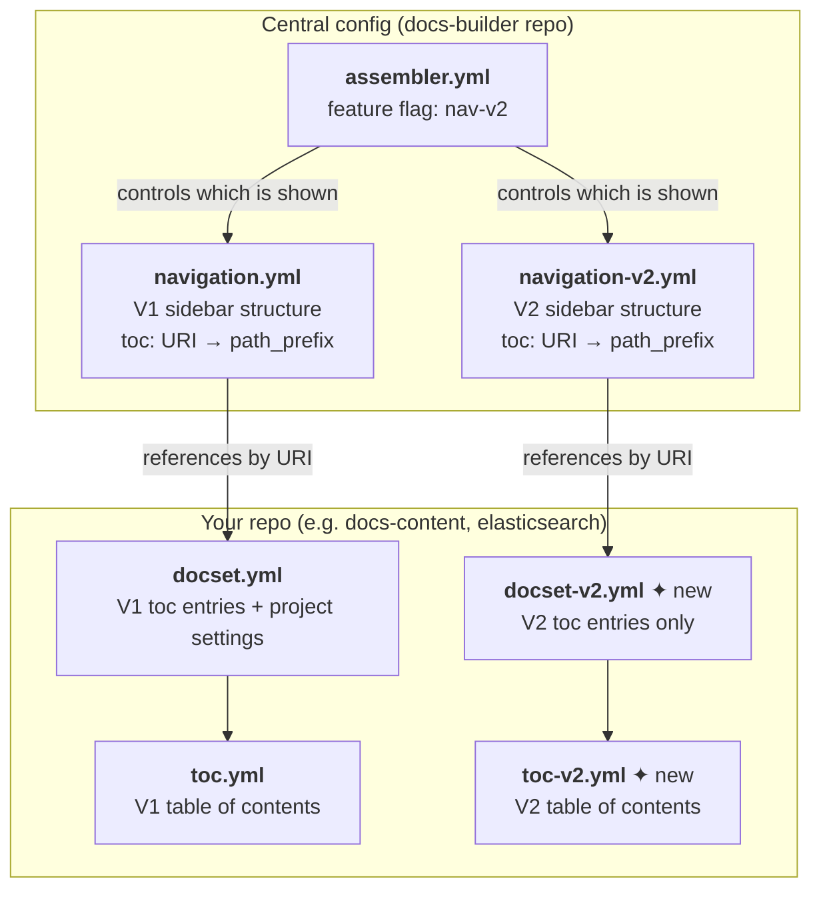
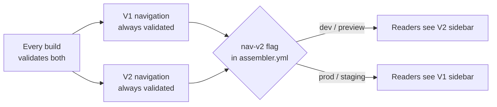
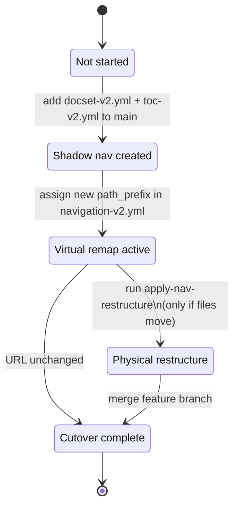

# Navigation V2 Migration — Overview for Docs Writers

**Status:** Draft
**Date:** 2026-03-24
**Audience:** Docs writers and content owners familiar with `docs-builder` CLI and config files
**Technical detail:** See [RFC-nav-v2-migration.md](RFC-nav-v2-migration.md)

---

## What is happening and why

The Elastic docs site is getting a new navigation system — **V2** — with a redesigned information
architecture (IA). The main visible change is the sidebar: content is reorganised into new sections,
and some pages move to new URLs.

The migration cannot happen all at once. Different repos are ready at different times, and moving
hundreds of URLs requires careful redirect management. The strategy is to **run V1 and V2 in
parallel** during the transition. A feature flag in `assembler.yml` controls which version readers
see — V2 will be live in `dev` and `preview` environments first, then flipped to production when
everything is validated.

**What changes for readers:** the sidebar structure and, for some content, the URL.

**What changes for you:** two new per-repo config files (`docset-v2.yml` and `toc-v2.yml`),
and your repo's entries in the central `navigation-v2.yml`.

**What does not change:** your `.md` source files, relative links between pages, images, and
`{include}` directives — these all continue to work as-is throughout the migration.

---

## The config files at a glance



---

## What each file does

### `navigation-v2.yml` (central, in docs-builder)

The master V2 sidebar definition. Same concept as `navigation.yml` — maps `toc:` URIs to
`path_prefix:` values — but with a richer structure that supports labels, groups, and cross-links.

Every repo that appears in `navigation.yml` **must also appear** in `navigation-v2.yml`. Omitting a
repo is a build error.

```yaml
nav:
  - label: Elasticsearch fundamentals        # non-clickable section heading
    children:
    - toc: docs-content://get-started
      path_prefix: elasticsearch-fundamentals/get-started   # new URL in V2

  - label: Reference
    children:
    - toc: elasticsearch://reference/elasticsearch
      path_prefix: reference/elasticsearch   # same as V1 — URL unchanged
    - toc: logstash://reference
      path_prefix: reference/logstash        # same as V1 — URL unchanged
```

If a repo's content is keeping its current URLs (most reference repos), the `path_prefix:` values
are identical to V1 and you just copy them across.

### `docset-v2.yml` (per repo)

A navigation-only companion to `docset.yml`. It lists the V2 `toc:` entry points for your repo.
It does **not** carry project metadata, features, or settings — only navigation.

```yaml
# docset-v2.yml — minimal example
max_toc_depth: 3
toc:
  - toc: reference        # requires reference/toc-v2.yml to exist
  - toc: get-started      # requires get-started/toc-v2.yml to exist
```

Every `toc:` entry listed here **must** have a corresponding `toc-v2.yml` in that directory.
There is no fallback to `toc.yml` — the build fails if `toc-v2.yml` is missing.

### `toc-v2.yml` (per directory, in your repo)

The V2 table of contents for a directory. Lives alongside `toc.yml`. Completely independent —
it cannot reference `toc.yml` entries and `toc.yml` cannot reference it.

You only need to create `toc-v2.yml` if your V2 sidebar structure differs from V1 for that
directory. If the structure is identical, the `toc-v2.yml` is a copy.

---

## How V1 and V2 coexist during migration

Every build validates **both** V1 and V2. A failure in either is a build error. The feature flag
only controls which sidebar is *rendered* — not which is *validated*.



**During the transition, your content works for both V1 and V2 from the same source files.** This
is possible because:

- Relative links between pages are validated against source files on disk — they don't care about
  output URLs.
- Images and `{include}` directives are resolved entirely from source paths — output URLs don't
  affect them.
- Cross-links (`elasticsearch://reference/...`) are remapped at build time using whichever set of
  path prefixes is active (V1 or V2).

---

## Your repo's migration journey

Each repo moves through these states independently. You are in control of the pace.



### State 1 — Not started

Your repo has no `docset-v2.yml`. The V2 sidebar shows your existing V1 toc structure as a
fallback. URLs are identical to V1. No action needed from you yet, but the build emits a
migration-progress warning to track which repos still need migration.

### State 2 — Shadow nav created

You add `docset-v2.yml` and `toc-v2.yml` to your repo's `main` branch. The V2 sidebar now
shows your V2 toc structure. URLs are still the same as V1 — this is a sidebar-only change.

This is the right state to iterate on the V2 information architecture for your content without
affecting any live URLs.

**What to do:**
1. Create `docset-v2.yml` at the repo root with your V2 toc entry points.
2. Create `toc-v2.yml` in each listed directory.
3. Open a PR against `main`.

### State 3 — Virtual remap active

The `navigation-v2.yml` entry for your repo now has a different `path_prefix:` than V1. Your
content is served at new URLs in the V2 build — but **your source files do not move**. The build
handles the remapping automatically.

This is the "virtual remap" phase. It lets you validate that the V2 URL structure is correct
before committing to physically reorganising files.

**What to do:**
1. Agree on the new `path_prefix:` values with the IA team.
2. Update `navigation-v2.yml` in the docs-builder repo.
3. Run `docs-builder assembler validate-nav-migration` (see below) to preview the redirects.

### State 4 — Physical restructure (optional)

Only needed for repos where the source directory layout should match the new URL structure
(usually `docs-content`). A CLI command moves files, updates relative links, `{include}`
directives, and `toc-v2.yml` entries automatically.

```
docs-builder assembler apply-nav-restructure --repo docs-content
```

The command outputs a diff for your review — nothing is committed automatically. The result goes on
a short-lived feature branch that merges at cutover.

Repos whose content keeps its current URLs (most reference repos) skip this state entirely.

### State 5 — Cutover complete

The feature flag flips to production. `redirect.yml` is deployed so old V1 URLs redirect to the
new V2 URLs. Your repo is fully on V2.

---

## The `validate-nav-migration` command

Run this at any time during the migration to get a full picture of the current state:

```
docs-builder assembler validate-nav-migration
```

It requires a full checkout (the same environment as a normal build). It:

- Shows which repos are in each migration state
- Lists every URL that will change (V1 path → V2 path)
- Generates a preview of `redirect.yml`
- Flags any redirect conflicts

Example output:
```
Migration status:
  docs-content:     shadow nav + path changes (42 files move)
  elasticsearch:    shadow nav, no path changes
  logstash:         not started ⚠ V1 fallback
  kibana:           not started ⚠ V1 fallback

Redirects (redirect.yml):
  /docs/manage-data/ingest → /docs/elasticsearch-fundamentals/ingest
  /docs/get-started/quickstart → /docs/elasticsearch-fundamentals/quickstart
  ...

Impossible redirects: 0
Path collisions: 0
```

---

## What the build validates

The build checks V2 on every run. Here is what triggers an error versus a warning:

| Check | Level | What it means |
|-------|-------|---------------|
| A `toc:` URI in `navigation.yml` is missing from `navigation-v2.yml` | **Error** | Every repo must be explicitly listed in V2 |
| A `toc-v2.yml` is missing for an entry in `docset-v2.yml` | **Error** | Strict opt-in — no silent fallback |
| Two V2 toc entries produce the same output path | **Error** | Path collision in V2 |
| A V2 URL maps to a file that V1 assigns to a different file | **Error** | Redirect conflict — cannot be resolved at cutover |
| A file is unreachable from both V1 and V2 navigation | **Error** | Orphaned file |
| A repo is in `navigation-v2.yml` but has no `docset-v2.yml` | **Warning** | Migration not yet started for this repo |

---

## Frequently asked questions

**Do I need to change my `.md` files?**
No — not during virtual remap. If your repo goes through the physical restructure phase, the
`apply-nav-restructure` command handles file moves and link rewrites for you.

**What happens to my cross-links during the transition?**
They continue to work. V1 builds resolve `repo://path` using V1 path prefixes; V2 builds use V2
path prefixes. A single build is always internally consistent.

**Can I keep the same URLs in V2?**
Yes. If your content's URLs are staying the same, set the same `path_prefix:` in
`navigation-v2.yml` as in `navigation.yml`. Most reference repos will do this.

**What if my V2 toc structure is identical to V1?**
Create `docset-v2.yml` and `toc-v2.yml` files that are copies of the V1 equivalents. The build
requires them to exist explicitly — there is no auto-inheritance.

**When do I need `toc-v2.yml` vs just `toc.yml`?**
Always, when you have a `docset-v2.yml` entry for that directory. V2 toc loading never falls back
to `toc.yml` — the files are completely independent trees.

**Can repos migrate at different speeds?**
Yes, that is the whole point. Each repo moves through the states on its own timeline. Repos not yet
migrated show the V1 fallback in the V2 sidebar without any action needed.
