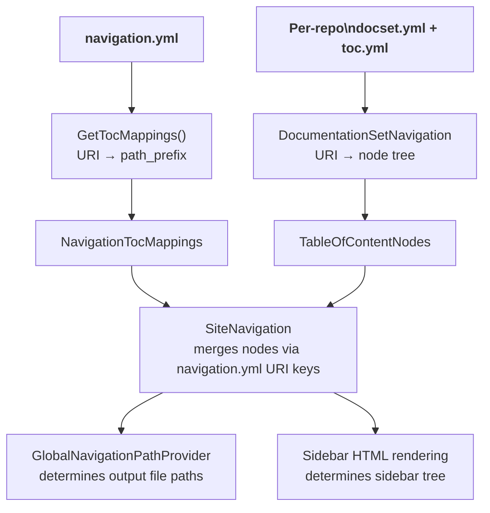
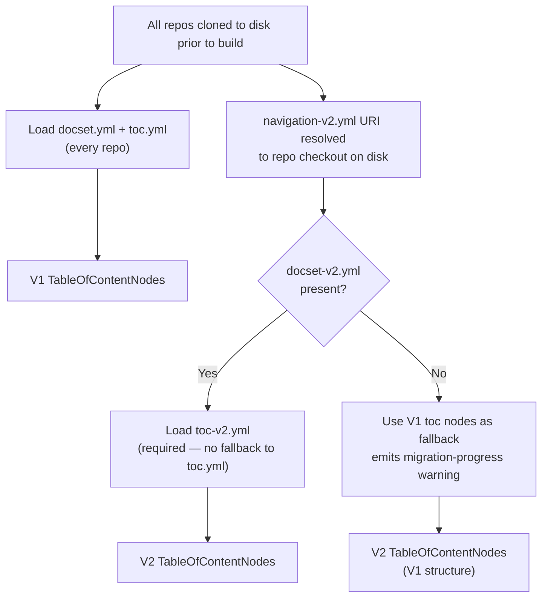
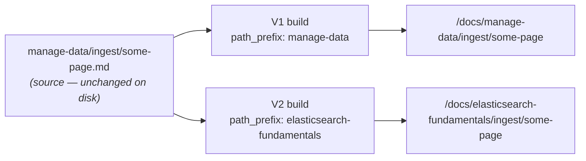
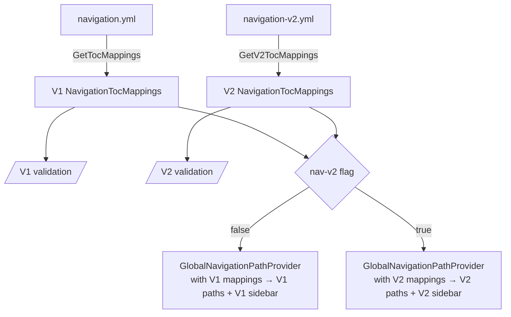
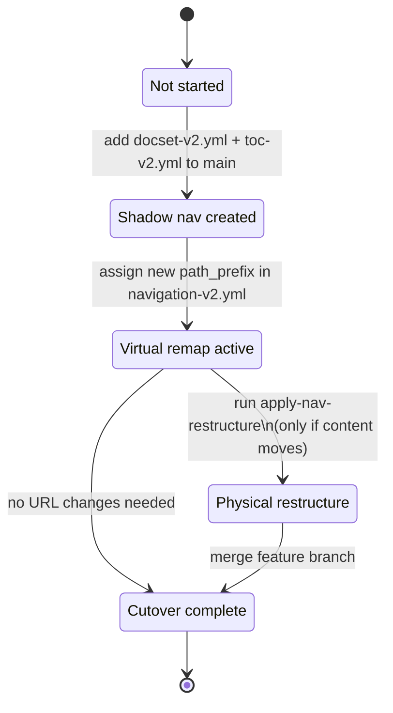
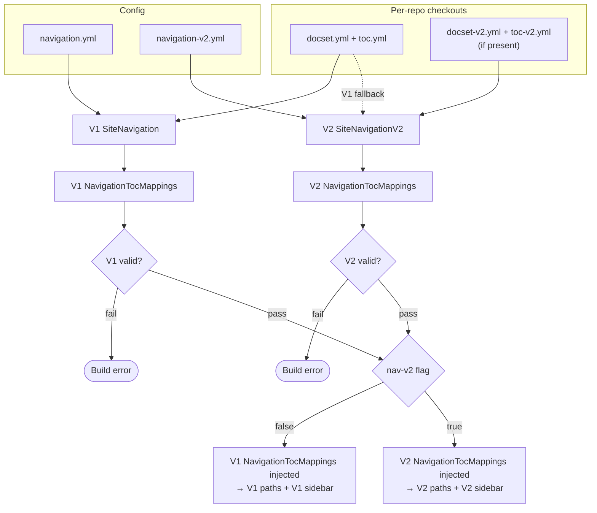
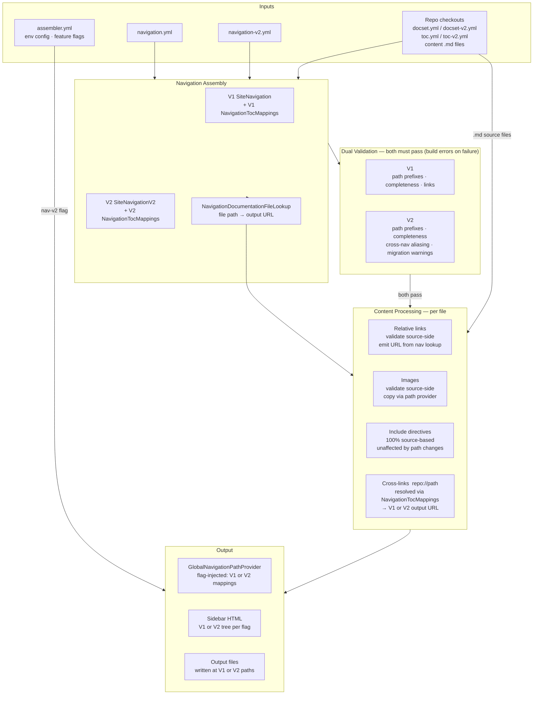

# RFC: V1 to V2 Navigation Migration

**Status:** Draft
**Date:** 2026-03-23
**Branch:** `nav-v2` (PR [#2927](https://github.com/elastic/docs-builder/pull/2927))

---

## 1. Summary

This RFC describes the strategy for migrating the Elastic documentation site from V1 navigation
to V2 navigation. The migration cannot happen atomically: different content repositories have
different readiness levels and may need structural changes to their TOC files. The system must
support running both navigation versions simultaneously, with full validation of both during every
build, while a feature flag controls which version is served.

V2 eventually changes where some content lives (primarily narrative sections from `docs-content`).
Reference content (`reference/logstash`, `reference/elasticsearch`, etc.) is unlikely to change URLs.

### Decided

| # | Decision | Resolution |
|---|----------|------------|
| 1 | V2 TOC fallback for unmigrated repos | Fall back to V1 toc nodes. If a repo has both `docset.yml` and `docset-v2.yml`, only V2 nodes are used in V2 navigation (V1 nodes excluded from V2 tree). |
| 2 | V2 path prefix strategy | Explicit `path_prefix:` in `navigation-v2.yml`, same pattern as V1. A validation command generates `redirect.yml` and checks for impossible redirects. |
| 3 | Virtual remap vs physical moves | Virtual remap first. Validate nav + UI. Then a refactor command applies physical moves when ready. |
| 4 | Validation strictness | Strict — V2 validation failures are build errors. |
| 5 | Merge to main | Merge V2 infrastructure to main without breakages. Physical file moves happen later on a feature branch created when committing to path changes. |
| 6 | Link index versioning | Not needed. Link indexes contain source-relative paths (e.g., [elasticsearch-py links.json](https://elastic-docs-link-index.s3.us-east-2.amazonaws.com/elastic/elasticsearch-py/main/links.json)). The environment resolver remaps at query time using toc mappings. |
| 7 | `docset-v2.yml` schema | Strictly navigation: `toc:` entries + `max_toc_depth` + `suppress_diagnostics`. No project metadata, no features. Every entry must have a corresponding `toc-v2.yml` (no fallback to `toc.yml`). |
| 8 | `navigation-v2.yml` completeness | Every `toc:` URI present in `navigation.yml` must appear explicitly in `navigation-v2.yml`. Omitting a repo is a build error. No auto-inheritance from V1. |
| 9 | Phase 3 path provider mechanism | Feature-flag switch at build time. The assembler constructs both V1 and V2 `NavigationTocMappings` for validation, then injects the appropriate one into `GlobalNavigationPathProvider` based on the flag. `SiteNavigationV2` does not hold both simultaneously. |
| 10 | Collision invariant | Two checks: (a) no two V2 `toc:` entries produce the same output path prefix (intra-V2 duplicate); (b) no V2 URL that maps to file X where V1 already assigns that same URL to a different file Y (cross-nav aliasing — creates an unredirectable conflict). |
| 11 | V2 completeness in mixed state | Build error if a file is reachable in neither V2 navigation nor V1 fallback. Warning (not error) if a repo appears in `navigation-v2.yml` only via V1 fallback nodes (no `docset-v2.yml`), to track migration progress without blocking the build. |

### Deferred

| # | Decision | See section |
|---|----------|-------------|
| 6 | V2 branch reference strategy for physical move phase | Section 8.5 — deferred until Phase B |

---

## 2. Background

### V1 navigation (current production)

- **`config/navigation.yml`** — central file mapping `toc:` URI references to `path_prefix:` values.
  Each entry like `toc: logstash://reference` with `path_prefix: reference/logstash` determines both
  the sidebar structure and the output URL path.
- **Per-repo `docset.yml` + `toc.yml`** — each repository defines its internal TOC tree. The
  assembler discovers these during checkout, builds `DocumentationSetNavigation` objects, and
  registers them as `TableOfContentNodes` keyed by URI (e.g., `logstash://reference`).
- **`SiteNavigation`** — merges all per-repo navigation nodes using the URI keys from
  `navigation.yml`, forming the complete sidebar tree.
- **`NavigationTocMappings`** — built from `navigation.yml` by `AssembleSources.GetTocMappings()`.
  Maps each `toc:` URI to its `path_prefix`. This is what `GlobalNavigationPathProvider` uses to
  determine where each file is written on disk.

The critical coupling: `navigation.yml` determines **both** the sidebar structure **and** the output
file paths. These two concerns are fused.

### V2 navigation (prototype on `nav-v2` branch)

- **`config/navigation-v2.yml`** — a new YAML format with five item types: `label:`, `toc:`,
  `page:`, `group:`, `title:`. Labels are non-clickable section headings. Groups are placeholder
  folders. The structure represents the target information architecture (IA).
- **`SiteNavigationV2`** — extends `SiteNavigation`. Passes the original V1 `SiteNavigationFile` to
  the base constructor (so file output paths remain V1), then builds a parallel `V2NavigationItems`
  tree for sidebar rendering.
- **Feature flag** `nav-v2` — enabled for `dev` and `preview` environments in `assembler.yml`.

Current limitation: V2 is **sidebar-only**. File output paths are still determined entirely by V1's
`navigation.yml`. The V2 nav cannot define its own path prefixes. This is the gap that needs closing.

---

## 3. Goals and constraints

1. **Both V1 and V2 must be valid** — every build validates both navigation trees. Validation
   failures on either side are build errors (strict).
2. **Feature flag controls output** — a single build emits V1 or V2, never both. The flag
   determines which sidebar HTML is rendered and (eventually) which path prefixes are used.
3. **Gradual per-repo migration** — repositories opt into V2 independently by providing shadow
   navigation files (`docset-v2.yml`, `toc-v2.yml`).
4. **No path conflicts** — V2 paths must not create intra-V2 duplicates or cross-nav aliasing (see
   Decision 10). A validation tool pre-renders redirects and detects impossible redirect scenarios.
5. **Relative links, images, and includes must work for both** — virtual remap ensures content
   works for both V1 and V2 from a single checkout.
6. **Reference content stays put** — URLs like `reference/logstash`, `reference/elasticsearch` are
   unlikely to change. Narrative content from `docs-content` is more likely to move.
7. **Clean merge to main** — V2 infrastructure goes to `main` behind the feature flag. Physical
   file moves happen later on a dedicated feature branch.
8. **`navigation-v2.yml` must be complete** — every `toc:` URI present in `navigation.yml` must
   also appear explicitly in `navigation-v2.yml`. Omitting a repo is a build error. There is no
   auto-inheritance from V1. This forces intentional placement of every repo in the V2 IA.

---

## 4. Current architecture: how paths flow



### How links and images resolve

| Mechanism | Validation (does target exist?) | Emitted URL |
|-----------|--------------------------------|-------------|
| Relative links `[](../page.md)` | **Source-based** — resolved from current file's directory in the repo checkout | **Navigation-based** — uses `NavigationDocumentationFileLookup.Url` which comes from the navigation tree + path prefix |
| Images `` | **Source-based** — same as links | URL computed from scope + prefix rules; file copied by source-relative path through `GlobalNavigationPathProvider` |
| `{include}` directives | **100% source-based** — resolved from current file or doc root | N/A (inline inclusion, no URL) |
| Cross-links `repo://path` | **Link index** — repo-relative paths published in `links.json` | **Environment resolver** — maps repo URI to output URL using `NavigationTocMappings` |

This table is key to understanding why virtual remap works (section 6).

---

## 5. Per-repository shadow navigation

Each repository can opt into V2 by providing parallel navigation files.

### 5.1 New files per repo

| File | Purpose | Constraint |
|------|---------|------------|
| `docset-v2.yml` | V2-specific documentation set config | **Navigation only** — no project metadata, no features, no settings. Only `toc:` entries. |
| `toc-v2.yml` | V2-specific table of contents | Lives alongside `toc.yml` in the same directories. Completely isolated — cannot be referenced from `docset.yml`'s tree, and cannot reference `toc.yml`'s tree. |

**`docset-v2.yml` schema:**

Strictly navigation. Supports `toc:` entries, `max_toc_depth`, and `suppress_diagnostics`. No
project metadata, no features, no settings. Every `toc:` entry **must** have a corresponding
`toc-v2.yml` in its directory — there is no fallback to `toc.yml`. This forces explicit opt-in
per TOC root and avoids ambiguity about which tree structure is active.

```yaml
# docset-v2.yml — minimal example
max_toc_depth: 3
toc:
  - toc: reference       # requires reference/toc-v2.yml
  - toc: get-started     # requires get-started/toc-v2.yml
```

If a `toc-v2.yml` is missing for any entry, the build fails (strict validation).

### 5.2 Loading flow

All repos are cloned to disk before the build starts. The assembler walks the checkout on disk to
load navigation. `navigation-v2.yml` references repos by full URI (e.g.
`elasticsearch://reference/elasticsearch`). For each URI, the assembler resolves the target repo
checkout and looks for `toc-v2.yml` if `docset-v2.yml` exists, otherwise loads `toc.yml`.



The assembler loads both in parallel. Repos without `docset-v2.yml` contribute only V1 nodes to
the V2 dictionaries (fallback). `navigation-v2.yml` must still explicitly list every repo — the
fallback applies to *which toc files* are loaded, not to whether the repo appears in V2 nav.

### 5.3 Fallback and exclusivity rules

**Repos without `docset-v2.yml`:** V2 navigation falls back to the V1 toc nodes for that repo.
The V2 sidebar renders the V1 tree structure. No action required from the repo.

**Repos with `docset-v2.yml`:** Only V2 nodes are used in the V2 navigation tree. V1 nodes from
that repo are **excluded** from `SiteNavigationV2`. This ensures there is no ambiguity about which
toc structure applies.

The V1 navigation always uses V1 nodes regardless of whether `docset-v2.yml` exists. The two
navigation systems are fully independent.

### 5.4 URI namespace isolation

V1 and V2 toc entries from the same repo share the same URI scheme (`repo://path`). This means
`TableOfContentNodes` for V1 and V2 cannot live in the same dictionary without colliding.

The assembler must maintain **two separate in-memory lookup dictionaries, populated from disk
during the build**:

- `V1Nodes: Dictionary<Uri, IRootNavigationItem>` — populated by loading `docset.yml` + `toc.yml`
  from each repo checkout
- `V2Nodes: Dictionary<Uri, IRootNavigationItem>` — populated by loading `docset-v2.yml` +
  `toc-v2.yml` for migrated repos, or falling back to V1 toc nodes for unmigrated repos

`SiteNavigation` (V1) uses `V1Nodes`. `SiteNavigationV2` uses `V2Nodes`.

---

## 6. Virtual remap: how V2 changes paths without moving files

Virtual remap is the strategy for the transition period. Files stay at their current source
locations on disk. V2's path provider maps them to new output URLs. No changes needed in any
content repo's `main` branch.

### 6.1 How it works

The existing path resolution chain has a clean seam:

1. **Source validation** — `DiagnosticLinkInlineParser.ResolveFile()` validates that link targets
   exist by looking them up **in the repo checkout**. This is 100% source-based and unaffected by
   output path changes.

2. **URL emission** — `UpdateLinkUrl()` resolves the emitted `href` via
   `NavigationDocumentationFileLookup.Url`, which comes from the navigation tree. The navigation
   tree is built from `SiteNavigation` (V1) or `SiteNavigationV2` (V2). Each assigns URLs based
   on its own path prefix mappings.

3. **File output** — `DocumentationGenerator.OutputFile()` delegates to
   `GlobalNavigationPathProvider.OutputFile()`, which uses `NavigationTocMappings` to remap
   source-relative paths to output paths.

4. **Image output** — images go through the same `OutputFile()` path. The `RelativePath` from the
   source root is remapped by the path provider, so images land at the correct V2 output location.

5. **Include directives** — 100% source-based. Not affected by output path changes at all.

6. **Cross-links** — the `PublishEnvironmentUriResolver` maps `repo://path` URIs to output URLs
   using `NavigationTocMappings`. When building for V2, it uses V2 mappings, producing V2 URLs.



The source file `manage-data/ingest/some-page.md` does not move. Only the output path changes
based on which `NavigationTocMappings` is active.

### 6.2 Why virtual remap is safe

| Concern | Why it works |
|---------|-------------|
| Relative links between pages in same TOC | Emitted URLs come from `NavigationDocumentationFileLookup.Url`, which uses V2 path prefixes. Pages that move together maintain correct relative URLs. |
| Images with relative references | `./images/foo.png` is validated source-side (works). Output path goes through `GlobalNavigationPathProvider` (remapped correctly). HTML `src` computed from same URL rules (consistent). |
| Include directives | 100% source-based. No output path involvement. Unaffected. |
| Cross-links from other repos | Environment resolver uses V2 toc mappings in V2 builds. All repos see consistent V2 URLs within a single build. |
| Images with absolute paths | `/images/foo.png` does NOT go through `GlobalNavigationPathProvider` — it resolves relative to document source root. If path prefixes change, this could break. Need to audit for absolute image references. |

### 6.3 What virtual remap cannot do

- **Different file groupings within a TOC**: Virtual remap changes the output path prefix for an
  entire TOC root. It cannot move individual files to different TOC roots. If V2 wants to split
  `docs-content://manage-data` into separate sections, the repo must provide separate `toc-v2.yml`
  entries that define finer-grained TOC roots.

- **Source directory cleanup**: After cutover, the source directory structure still reflects V1. The
  refactor command (section 8.4) handles this.

### 6.4 Dual path providers during transition



Both `NavigationTocMappings` instances are constructed during every build — V1 for validation,
V2 for validation. The feature flag then selects which mappings are injected into
`GlobalNavigationPathProvider` for output. `SiteNavigationV2` does not hold both mappings
simultaneously; the selection happens in the assembler before the path provider is instantiated.

The V2 mappings are built by a new `GetV2TocMappings()` that reads `navigation-v2.yml` and
extracts `toc:` + `path_prefix:` entries (same parsing pattern as V1's `GetTocMappings()`).

---

## 7. Known pain points and mitigations

### 7.1 Relative links in content

**How they work:** Validated against source paths (repo checkout). Emitted URLs use
`NavigationDocumentationFileLookup.Url`.

**Under virtual remap:** Source validation passes (files haven't moved). Emitted URLs correctly use
V2 path prefixes. **No issues.**

**Under physical move (later phase):** Source validation fails for moved files. Links must be
updated. The refactor command handles this (section 8.4).

### 7.2 Image path resolution

**How they work:** Validated source-side. Copied through `GlobalNavigationPathProvider.OutputFile()`.
HTML `src` computed via URL/scope rules.

**Under virtual remap:** Path provider remaps both the image file output and the HTML src
consistently. **No issues for relative image references.**

**Risk:** Absolute image paths in content (e.g., `/images/foo.png`) bypass the path provider. Audit
needed. Relative image references (`./images/foo.png`) are safe.

### 7.3 Include directives

**How they work:** 100% source-based. Resolved from current file or doc root.

**Under virtual remap:** **No issues.** Files don't move, includes resolve identically.

**Under physical move:** Includes must be updated if the including file moves relative to the
included file. The refactor command handles this.

### 7.4 Cross-links between repositories

**How they work:** Resolved via the link index (`links.json`) + environment resolver. The
`PublishEnvironmentUriResolver` uses `NavigationTocMappings` to map repo URIs to output URLs.

**Under virtual remap:** V2 builds use V2 toc mappings in the resolver. All cross-links within a
single build see consistent V2 URLs. **No issues.**

**Link index versioning: not needed.**

Confirmed: link indexes contain source-relative paths (e.g.,
[elasticsearch-py links.json](https://elastic-docs-link-index.s3.us-east-2.amazonaws.com/elastic/elasticsearch-py/main/links.json)).
The `PublishEnvironmentUriResolver` maps these to output URLs at query time using
`NavigationTocMappings`. V2 builds use V2 mappings, V1 builds use V1 mappings. The index itself
does not change — only the resolver's mapping table differs.

---

## 8. Content migration workflow

### 8.1 Two-phase approach

The migration happens in two phases:

**Phase A — Virtual remap:** Files stay in place. V2 navigation defines new path prefixes in
`navigation-v2.yml`. The `GlobalNavigationPathProvider` remaps output paths. Content works for both
V1 and V2 from a single checkout. This phase validates the nav structure and UI.

**Phase B — Physical restructure:** Once the nav and UI are validated, a refactor command
physically moves files to match the V2 output structure. This creates a short-lived feature branch
that merges to main at cutover.

### 8.2 Per-repo migration lifecycle



| State | V2 toc source | V2 paths |
|-------|--------------|----------|
| Not started | V1 fallback toc nodes | = V1 paths |
| Shadow nav created | V2 toc nodes (`toc-v2.yml`) | may still = V1 paths |
| Virtual remap active | V2 toc nodes | diverge from V1; files stay at V1 source |
| Physical restructure | V2 toc nodes | diverge from V1; files moved on disk |
| Cutover complete | V2 only | V2 is production |

### 8.3 Navigation migration validation command

A new CLI command validates the migration and pre-renders redirects:

```
docs-builder assembler validate-nav-migration
```

**Prerequisite:** this command runs within the full assembler build context, with all repos cloned
to disk. It is not a standalone tool — it requires the same checkout state as a normal build.

This command:

1. **Loads both V1 and V2 navigation** — builds both `NavigationTocMappings` from the cloned
   checkouts.
2. **Computes the diff** — for every file in every repo checkout, compares its V1 output path to
   its V2 output path.
3. **Generates `redirect.yml`** — maps V1 paths to V2 paths for all files that moved.
4. **Validates for impossible redirects** — detects cases where:
   - Two V2 `toc:` entries produce the same output path prefix (intra-V2 duplicate).
   - A V2 URL maps to file X where V1 already assigns that URL to a different file Y (cross-nav
     aliasing — the V1→V2 redirect for Y would resolve to X instead).
   - Redirect chains (A->B->C) that could cause loops.
5. **Reports migration status per repo** — which repos have `docset-v2.yml`, which have path
   changes, which are fully migrated, and which are still on V1 fallback (warning).

Example output:
```
Migration status:
  docs-content:     shadow nav + path changes (42 files move)
  elasticsearch:    shadow nav, no path changes
  logstash:         not started (V1 fallback)
  kibana:           not started (V1 fallback)

Redirects (redirect.yml):
  /docs/manage-data/ingest -> /docs/elasticsearch-fundamentals/ingest
  /docs/get-started/quickstart -> /docs/elasticsearch-fundamentals/quickstart
  ...

Impossible redirects: 0
Path collisions: 0
```

### 8.4 Refactor command

A second CLI command applies physical file moves after virtual remap is validated:

```
docs-builder assembler apply-nav-restructure --repo docs-content
```

This command:

1. **Reads V1 and V2 navigation** for the specified repo.
2. **Computes file moves** — maps each file's current source path to its target V2 source path.
3. **Moves files on disk** — `git mv` or equivalent.
4. **Updates `toc-v2.yml`** — adjusts paths to reflect the new directory structure.
5. **Updates include directives** — rewrites `{include}` paths in moved files.
6. **Updates relative links** — rewrites relative link targets in moved files.
7. **Generates a summary** — lists all changes for review before committing.

The output of this command is a set of file system changes that can be committed as a single PR
(the short-lived feature branch from section 8.2). It is not applied automatically — the developer
reviews and commits.

### 8.5 V2 branch reference for physical move phase

During the physical restructure phase, a content repo's V2 feature branch has files at different
locations than `main`. The assembler may need to check out this branch for V2 validation.

> **OPEN: V2 branch checkout strategy**
>
> Once physical moves begin (Phase B), the assembler needs to validate that the restructured
> content still builds correctly under V2. Options:
>
> - **a) Per-repo `v2_ref` in `assembler.yml`** — explicit branch override:
>   ```yaml
>   references:
>     docs-content:
>       current: main
>       v2_ref: nav-v2-restructure
>   ```
>   Pro: Explicit. Con: Config churn. Only needed for the short restructure period.
>
> - **b) Not needed** — the refactor command produces changes that are validated locally before
>   pushing. The feature branch is short-lived (days, not weeks). CI on the feature branch runs
>   the full V2 build. The assembler on `main` continues using virtual remap until the feature
>   branch merges.
>   Pro: No assembler changes. Con: No cross-repo V2 validation until merge.
>
> - **c) Deferred** — decide when we actually reach Phase B. The virtual remap phase will expose
>   whether cross-repo V2 validation during restructure is needed.

---

## 9. Dual validation strategy

Every build validates both V1 and V2 navigation. Validation failures are **build errors** (strict).

### 9.1 What "validate V2" means

1. **Structural validity** — `navigation-v2.yml` parses correctly. All `toc:` URIs present in
   `navigation.yml` must also appear in `navigation-v2.yml` (build error if any are missing). All
   `toc:` URIs resolve to known nodes (V2 nodes if the repo has `docset-v2.yml`, V1 fallback
   otherwise). All `page:` URIs resolve to real files.
2. **Path prefix validity** — two checks:
   - *Intra-V2*: no two V2 `toc:` entries produce the same output path prefix.
   - *Cross-nav aliasing*: no V2 URL that maps to file X where V1 already assigns that same URL
     to a different file Y. This would create an unredirectable conflict — the redirect from Y's
     V1 URL would point to X instead of Y.
3. **TOC completeness** — two sub-checks:
   - *Error*: any file in any checked-out repo that is reachable in neither V2 navigation nor V1
     fallback is a build error.
   - *Warning*: repos that appear in `navigation-v2.yml` but are served only via V1 fallback nodes
     (no `docset-v2.yml`) emit a migration-progress warning. Files reachable via V1 fallback
     satisfy completeness and are not errors.
4. **Cross-link resolution** — all cross-links resolve under V2's path mapping.

### 9.2 Build flow with dual validation



---

## 10. `navigation-v2.yml` format with path prefixes

The V2 format adds `path_prefix:` to `toc:` entries, matching the V1 pattern:

```yaml
# navigation-v2.yml must list every toc: URI that appears in navigation.yml.
# Omitting a repo is a build error — there is no auto-inheritance from V1.
nav:
  - label: Elasticsearch fundamentals
    children:
    - toc: docs-content://get-started
      path_prefix: elasticsearch-fundamentals/get-started
    - group: Elasticsearch concepts
      children:
      - title: Elasticsearch essentials

  - label: Reference
    children:
    - toc: elasticsearch://reference/elasticsearch
      path_prefix: reference/elasticsearch           # same as V1 — no URL change
    - toc: logstash://reference
      path_prefix: reference/logstash                # same as V1 — no URL change
    - toc: kibana://reference
      path_prefix: reference/kibana                  # same as V1 — no URL change
```

Reference content keeps V1 path prefixes. Narrative content gets new path prefixes where the IA
dictates a different URL structure.

---

## 11. Merging V2 infrastructure to main

### 11.1 What goes to main now

The `nav-v2` branch contains unrelated changes (changelog rendering, `ListSubPages` removal). These
must be separated. Only the V2 navigation infrastructure merges:

**New files:**

| File | Purpose |
|------|---------|
| `config/navigation-v2.yml` | V2 navigation skeleton (WIP) |
| `src/.../Toc/NavigationV2File.cs` | V2 YAML model + deserializer |
| `src/.../Navigation/V2/LabelNavigationNode.cs` | Non-clickable section heading |
| `src/.../Navigation/V2/PlaceholderNavigationLeaf.cs` | Disabled placeholder link |
| `src/.../Navigation/V2/PlaceholderNavigationNode.cs` | Placeholder folder node |
| `src/.../Navigation/V2/PageCrossLinkLeaf.cs` | Cross-link leaf |
| `src/.../Navigation/V2/SiteNavigationV2.cs` | V2 site navigation (extends V1) |
| `src/.../Navigation/_TocTreeNavV2.cshtml` | V2 Razor partial |
| `src/.../Assets/pages-nav-v2.ts` | V2 sidebar JS (accordion, current page) |
| `src/.../Navigation/GlobalNavigationHtmlWriter.cs` | V2 rendering path |

**Modified files (V2-specific changes only):**

| File | Change |
|------|--------|
| `config/assembler.yml` | `NAV_V2: true` for `dev` and `preview` |
| `src/.../Builder/FeatureFlags.cs` | `NavV2Enabled` property |
| `src/.../ConfigurationFileProvider.cs` | `NavV2Deserializer`, `NavigationV2File` property |
| `src/.../NavigationViewModel.cs` | `IsNavV2` property |
| `src/.../Navigation/_TocTree.cshtml` | V1/V2 branch in Razor |
| `src/.../AssemblerBuildService.cs` | Dual loading, V2 instantiation |
| `src/.../main.ts` | V2 init on htmx:load |

### 11.2 Merge approach

Merge V2 infrastructure to `main` cleanly — no breakages. The feature flag ensures production is
unaffected (`nav-v2` is off for `prod`, `staging`, `edge`). The `navigation-v2.yml` skeleton lives
on `main` as a WIP artifact iterated against dev/preview builds.

Physical file moves happen later on a dedicated feature branch, created only when committing to
path changes (Phase B).

---

## 12. Phased implementation plan

### Phase 1: Merge V2 sidebar infrastructure to main

- Separate nav-v2 changes from unrelated changes on the branch
- V2 is sidebar-only, same output paths as V1
- Feature flag controls which sidebar renders
- No per-repo changes needed
- `navigation-v2.yml` uses V1 toc nodes directly (fallback)
- **Deliverable:** V2 sidebar visible in dev/preview, V1 in production

### Phase 2: Per-repo shadow navigation + dual validation

- Define `docset-v2.yml` / `toc-v2.yml` schema and loading
- Implement dual node registries in the assembler
- Implement strict dual validation
- Repos begin creating `docset-v2.yml` to customize V2 sidebar structure
- V2 sidebar uses V2 toc nodes where available, V1 fallback elsewhere
- Still same output paths — sidebar structure changes only
- **Deliverable:** repos can independently customize V2 sidebar appearance

### Phase 3: V2 path resolution (virtual remap)

- Add `path_prefix:` support to `navigation-v2.yml`
- Build V2 `NavigationTocMappings` from `navigation-v2.yml` (new `GetV2TocMappings()`)
- Implement V2 `GlobalNavigationPathProvider`
- Path conflict detection between V1 and V2
- Content that stays at same paths: same `path_prefix` as V1
- Content that moves: new `path_prefix` in V2, virtual remap handles output
- **Deliverable:** V2 can serve content at different URLs than V1

### Phase 4: Migration validation tooling

- Implement `docs-builder assembler validate-nav-migration`
- Pre-render `redirect.yml` from V1->V2 path diffs
- Validate for impossible redirects and path collisions
- Per-repo migration status reporting
- **Deliverable:** confidence that cutover is safe

### Phase 5: Physical restructure (when ready)

- Implement `docs-builder assembler apply-nav-restructure`
- For repos with path changes: run refactor command, review, commit
- Short-lived feature branch per repo
- Update includes, relative links, toc-v2.yml in the branch
- **Deliverable:** source layout matches V2 output layout

### Phase 6: Cutover

- Flip feature flag in production (`prod` environment)
- Deploy `redirect.yml` for V1->V2 URL redirects
- Merge restructure feature branches to main
- Monitor for broken links, missing content
- **Deliverable:** V2 is production

### Phase 7: Cleanup

- Remove V1 navigation code (`SiteNavigation` base path, V1 rendering)
- Remove `navigation.yml` (keep as input for redirect generation)
- Remove feature flag
- Consolidate `docset-v2.yml` -> `docset.yml`, `toc-v2.yml` -> `toc.yml`
- **Deliverable:** single navigation system

---

## 13. Risk register

| Risk | Likelihood | Impact | Mitigation |
|------|-----------|--------|------------|
| Long-lived V2 branches diverge from main | Low (virtual remap avoids them until Phase 5) | High | Virtual remap first; physical restructure is short-lived |
| V2 validation falls out of sync during transition | Low (strict validation) | Medium | Build errors on V2 validation failure |
| Cross-links break during transition | Low | High | Single path provider per build; consistent mappings |
| `navigation-v2.yml` becomes stale while repos migrate | Medium | Medium | Strict validation + CI enforcement |
| Absolute image paths break under V2 path prefixes | Low | Medium | Audit for absolute image refs; prefer relative |
| Performance impact of dual validation | Low | Low | Validation is fast relative to content processing |
| Repos never migrate, V2 stays perpetually incomplete | Medium | High | Per-repo tracking via `validate-nav-migration` |
| Refactor command misses edge cases (unusual links, includes) | Medium | Medium | Command outputs diff for human review before commit |

---

## Appendix A: Key source files

| File | Role |
|------|------|
| `config/navigation.yml` | V1 global navigation definition |
| `config/navigation-v2.yml` | V2 global navigation definition |
| `config/assembler.yml` | Environment config + feature flags |
| `src/.../Toc/SiteNavigationFile.cs` | V1 nav YAML model |
| `src/.../Toc/NavigationV2File.cs` | V2 nav YAML model |
| `src/.../Toc/DocumentationSetFile.cs` | Per-repo docset loading + TOC resolution |
| `src/.../Navigation/Assembler/SiteNavigation.cs` | V1 site navigation builder |
| `src/.../Navigation/V2/SiteNavigationV2.cs` | V2 site navigation (extends V1) |
| `src/.../Assembler/AssembleSources.cs` | `GetTocMappings()` — builds URI->path_prefix map |
| `src/.../Assembler/Navigation/GlobalNavigationPathProvider.cs` | Determines output file paths |
| `src/.../Assembler/Building/AssemblerBuildService.cs` | Orchestrates nav loading + build |
| `src/.../Myst/InlineParsers/DiagnosticLinkInlineParser.cs` | Link + image resolution |
| `src/.../Myst/Directives/Include/IncludeBlock.cs` | Include directive resolution |
| `src/.../Links/CrossLinks/CrossLinkResolver.cs` | Cross-link resolution |

## Appendix B: Glossary

| Term | Meaning |
|------|---------|
| **TOC** | Table of Contents — the tree structure within a single repository's documentation |
| **Navigation** | The assembled sidebar combining TOCs from all repositories |
| **Path prefix** | The URL path segment prepended to a TOC's content (e.g., `reference/logstash`) |
| **Shadow navigation** | V2-specific nav files (`docset-v2.yml`, `toc-v2.yml`) alongside V1 files |
| **Virtual remap** | Changing output URLs without moving source files on disk |
| **Physical restructure** | Moving source files to match V2 output layout (via refactor command) |
| **Feature flag** | `nav-v2` — controls which navigation version is rendered |
| **Narrative content** | Task-oriented docs in `docs-content` (get-started, solutions, etc.) |
| **Reference content** | API/config reference docs in product repos (elasticsearch, kibana, etc.) |
| **Redirect.yml** | Generated mapping of V1 paths to V2 paths for URL redirects at cutover |

---

## Appendix C: Integration pipeline

End-to-end view of how the assembler processes a build, from inputs to output files.



### Key invariants visible in this diagram

| Boundary | What crosses it | What does not |
|----------|----------------|---------------|
| Source → nav assembly | toc files loaded from disk | .md content |
| Nav assembly → content processing | `NavigationDocumentationFileLookup` (URL mapping) | path provider (injected separately) |
| Content processing → output | processed HTML, copied assets | source .md files |
| Feature flag | selects which `NavigationTocMappings` is injected | does not affect validation (both always run) |
