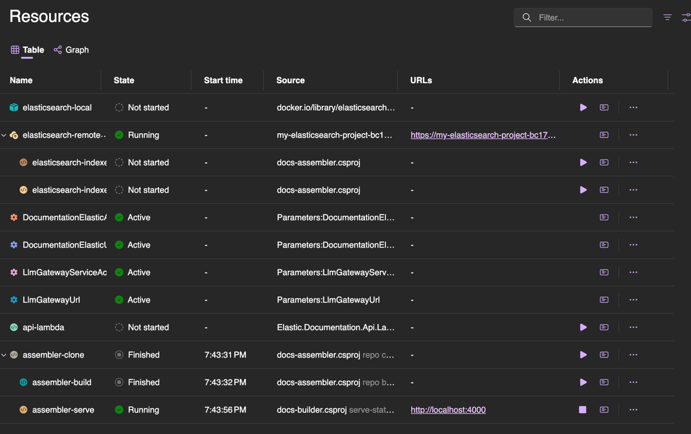

# Aspire for Elastic Documentation

We use [Aspire](https://learn.microsoft.com/en-us/dotnet/aspire/get-started/aspire-overview) for local development purposes to spin up all services in a controlled fashion.

> Aspire provides tools, templates, and packages for building observable, production-ready distributed apps. At the center is the app model—a code-first, single source of truth that defines your app's services, resources, and connections.  
>Aspire gives you a unified toolchain: launch and debug your entire app locally with one command, then deploy anywhere—Kubernetes, the cloud, or your own servers—using the same composition.

We do not use Aspire to generate production deployment scripts since [this is not fully baked for AWS and terraform yet](https://github.com/dotnet/aspire/issues/6559)


## Run all services locally

```bash
dotnet run --project aspire
```

Will automatically:

* clone all repositories according to `config/assembler.yml` using `docs-assembler repo clone-all`
* do a full site build of all repositories using `docs-assembler repo build-all`
* Serve a copy of the fully assembled documentation using `docs-builder serve-static`.

This should start a management UI over at: https://localhost:17166. This UI exposes all logs, traces, and metrics for each service



### Run without authorization tokens

If you do not have access to clone to private repositories you can use `--skip-private-repositories`

```bash
dotnet run --project aspire -- --skip-private-repositories
```

This will automagically scrub the private repositories from assembler.yml and navigation.yml.

Our integration tests, for instance, use this to run tests on CI tokenless.

## Elasticsearch Instance

By default, we assume local [dotnet user secrets](#user-secrets) have been set to communicate to an external Elasticsearch instance.

However, you can start a local Elasticsearch instance using 

```bash
dotnet run --project aspire -- --start-elasticsearch
```

This will run a local Elasticsearch docker image and expose that to Aspire service discovery instead.

### Elasticsearch indexing

Furthermore, it makes the following indexers available in the Aspire UI

* Plain Elasticsearch, index elasticsearch documents.
* Semantic Elasticsearch, same but with semantic fields.

These have to be run manually and can be run multiple times.


## User secrets

We use dotnet user secrets to provide parameters to aspire. These are all optional but needed if you want
the AI prompts and external Elasticsearch searches to work.

NOTE: using `--start-elasticsearch` the url and random password are automatically wired.

```bash
dotnet user-secrets --project aspire list
```

Should have these secrets

> Parameters:LlmGatewayUrl = https://****  
> Parameters:LlmGatewayServiceAccountPath = <PATH_TO_GCP_SERVICE_CREDENTIALS_FILE>   
> Parameters:DocumentationElasticUrl = https://*.elastic.cloud:443  
> Parameters:DocumentationElasticApiKey = ****


To set them:

```bash
dotnet user-secrets --project aspire set Parameters:DocumentationElasticApiKey <VALUE>
```

Do note `dotnet user-secrets` should only be used on local development machines and not on CI.

