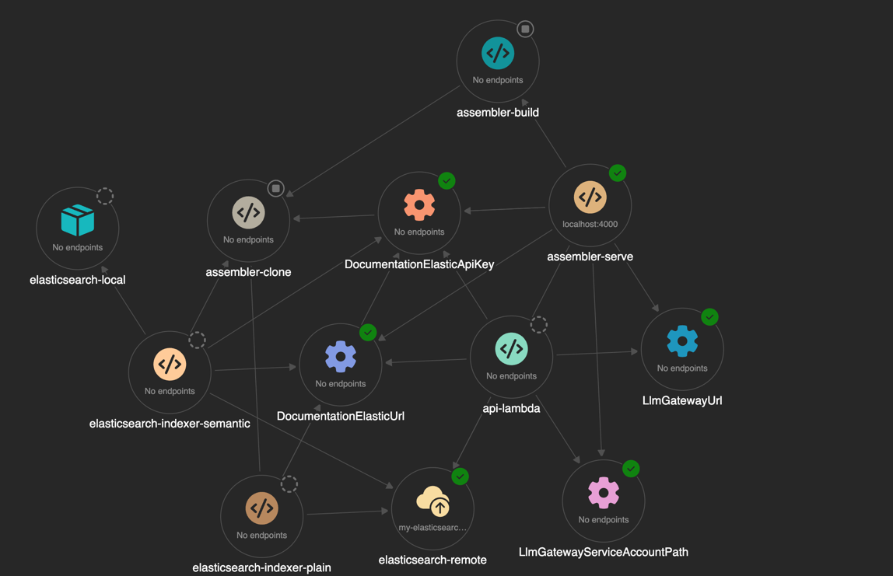
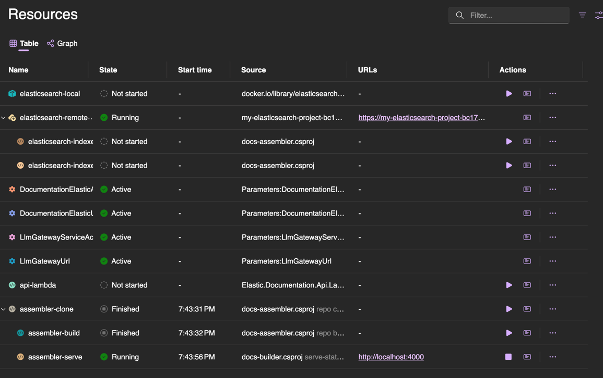

# Aspire for Elastic Documentation

We use [Aspire](https://learn.microsoft.com/en-us/dotnet/aspire/get-started/aspire-overview) for local development purposes to spin up all services in a controlled fashion.

> Aspire provides tools, templates, and packages for building observable, production-ready distributed apps. At the center is the app model—a code-first, single source of truth that defines your app's services, resources, and connections.  
>Aspire gives you a unified toolchain: launch and debug your entire app locally with one command, then deploy anywhere—Kubernetes, the cloud, or your own servers—using the same composition.

We do not use Aspire to generate production deployment scripts since [this is not fully baked for AWS and terraform yet](https://github.com/dotnet/aspire/issues/6559)



## Run all services locally

We're on **Aspire 13.5.3** — the latest standalone CLI release. No workload install, no `dotnet workload restore`. One command brings up the full stack:

```bash
dotnet aspire run
```

The Aspire CLI ships as a local dotnet tool pinned in `dotnet-tools.json`. Restore it once per clone alongside the other repo tools:

```bash
dotnet tool restore
```

This will automatically:

* reuse already-cloned repositories (default) or clone them if absent — via `docs-builder assembler clone --assume-cloned`
* build the unified site, skipping if the code/config/content stamp is unchanged — via `docs-builder assembler build`
* serve the fully assembled documentation via `docs-builder assembler serve`

This should start a management UI over at: https://localhost:17166. This UI exposes all logs, traces, and metrics for each service



### Default behaviour

Private repositories are **skipped by default** — `docs-builder`'s own docs are injected into `navigation.yml` in their place. This lets you validate the assembler without production credentials. Existing checkouts are **reused by default** (no fresh clone on every run). Build output is **skipped when unchanged** (MVID stamp matches code/config/content).

To change these defaults:

```bash
dotnet aspire run -- --no-skip-private-repositories  # include private repos (requires auth tokens)
dotnet aspire run -- --no-assume-cloned              # force a fresh clone
dotnet aspire run -- --no-assume-build               # force a full rebuild even if stamp matches
```

Our integration tests use these defaults to run tokenless on CI.

## Elasticsearch

All Elasticsearch connectivity targets **Elastic Cloud with EIS** (Elastic Inference Service). There is no local Elasticsearch container option — the index layout, inference endpoints, and semantic search configuration all require a Cloud deployment and cannot be replicated locally.

Configure your Cloud endpoint via `dotnet aspire secret set` — see [Aspire CLI reference](#aspire-cli-reference) below.

## Integration Tests

The `Elastic.Documentation.IntegrationTests` project includes integration tests that boot the full Aspire stack (clone → build → serve → api → mcp) and run liveness and smoke assertions against it.

### Running

```bash
dotnet test tests-integration/Elastic.Documentation.IntegrationTests
```

The tests use the default flags — `--skip-private-repositories` and `--assume-cloned` locally,
plus the MVID-based `--assume-build` on local (disabled automatically on CI). They require the
`ElasticsearchUrl` and `ElasticsearchApiKey` user secrets to be set for the API and MCP smoke assertions.

### Detached mode

Use `dotnet aspire start` to launch the stack in the background:

```bash
dotnet aspire start    # uses all defaults (skip private, reuse clones, stamp-based build skip)
dotnet aspire ps       # list running stacks
dotnet aspire stop     # shut down
```

## Aspire CLI reference

The `dotnet aspire` command is the primary interface for the local stack. Key commands:

### Running the stack

```bash
dotnet aspire run      # start interactively (blocks; Ctrl-C stops all services)
dotnet aspire start    # start in the background (detached)
dotnet aspire ps       # list running stacks and their dashboard URLs
dotnet aspire stop     # stop the background stack
```

### Managing secrets

Secrets are stored in the dotnet user-secrets store under the ID `docs-builder`. The Aspire CLI manages them directly — no need to open `secrets.json` by hand.

List all configured secrets:

```bash
dotnet aspire secret list
```

Set a secret:

```bash
dotnet aspire secret set <KEY> <VALUE>
```

For example:

```bash
dotnet aspire secret set ElasticsearchUrl    https://<your-cluster>.elastic.cloud:443
dotnet aspire secret set ElasticsearchApiKey <your-api-key>
dotnet aspire secret set LlmGatewayUrl       https://<llm-gateway-url>
dotnet aspire secret set LlmGatewayServiceAccountPath /path/to/service-account.json
```

Remove a secret:

```bash
dotnet aspire secret remove <KEY>
```
