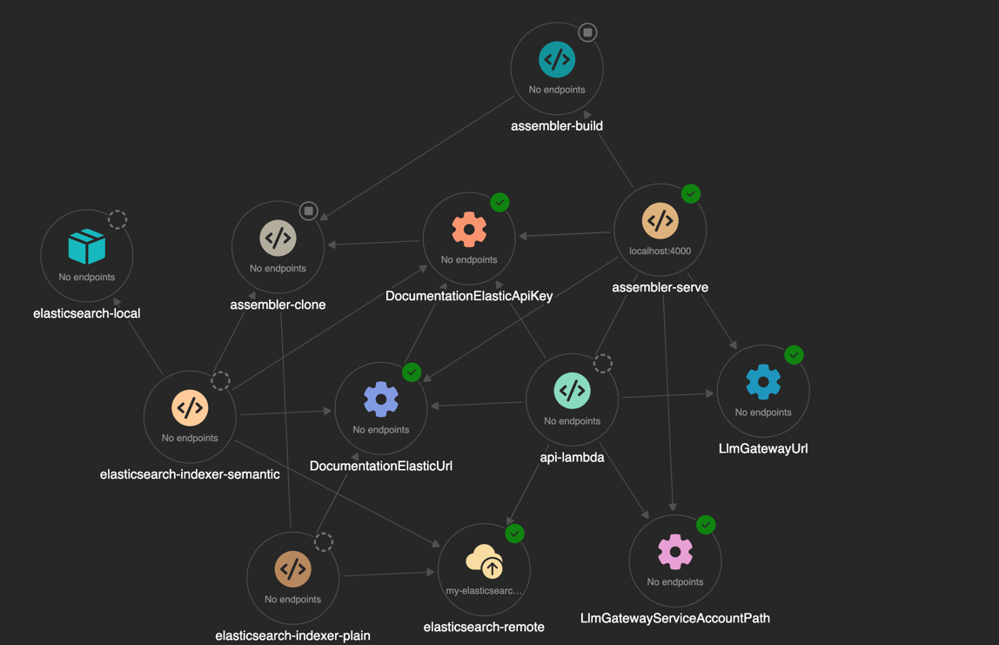

# Aspire for Elastic Documentation

We use [Aspire](https://learn.microsoft.com/en-us/dotnet/aspire/get-started/aspire-overview) for local development purposes to spin up all services in a controlled fashion.

> Aspire provides tools, templates, and packages for building observable, production-ready distributed apps. At the center is the app model—a code-first, single source of truth that defines your app's services, resources, and connections.  
>Aspire gives you a unified toolchain: launch and debug your entire app locally with one command, then deploy anywhere—Kubernetes, the cloud, or your own servers—using the same composition.

We do not use Aspire to generate production deployment scripts since [this is not fully baked for AWS and terraform yet](https://github.com/dotnet/aspire/issues/6559)



## Run all services locally

You may need to install the Aspire workload first. We also recommend installing the aspire plugin 

* [For Rider](https://plugins.jetbrains.com/plugin/23289--net-aspire)

```bash
sudo dotnet workload install aspire
```

Aspire is just another CLI program so can be run like all the other tools

```bash
dotnet run --project aspire
```

This will automatically:

* clone all repositories according to `config/assembler.yml` using `docs-builder assembler clone`
* do a full site build of all repositories using `docs-builder assembler build`
* Serve a copy of the fully assembled documentation using `docs-builder serve-static`.

This should start a management UI over at: https://localhost:17166. This UI exposes all logs, traces, and metrics for each service


### Run without authorization tokens

If you do not have access to clone to private repositories you can use `--skip-private-repositories`

```bash
dotnet run --project aspire -- --skip-private-repositories
```

This will automagically scrub the private repositories from assembler.yml and navigation.yml.

Our integration tests, for instance, use this to run tests on CI tokenless. When specifying this option locally we automatically inject `docs-builder`'s own docs into the `navigation.yml`. This allows us to test changes to documentation sets and their effect on assembler during PR's

## Elasticsearch Instance

By default, we assume local [dotnet user secrets](#user-secrets) have been set to communicate to an external Elasticsearch instance.

However, you can start a local Elasticsearch instance using 

```bash
dotnet run --project aspire -- --start-elasticsearch
```

This will run a local Elasticsearch docker image and expose that to Aspire service discovery instead.

### Elasticsearch indexing

Furthermore, it makes the following indexers available in the Aspire UI

* Plain Elasticsearch, index elasticsearch documents.
* Semantic Elasticsearch, same but with semantic fields.

These have to be run manually and can be run multiple times.

## User secrets

We use dotnet user secrets to provide parameters to aspire. These are all optional but needed if you want
the AI prompts and external Elasticsearch searches to work.

NOTE: using `--start-elasticsearch` the url and random password are automatically wired.

```bash
dotnet user-secrets --project aspire list
```

Should have these secrets

> Parameters:LlmGatewayUrl = https://****
> Parameters:LlmGatewayServiceAccountPath = <PATH_TO_GCP_SERVICE_CREDENTIALS_FILE>
> Parameters:DocumentationElasticUrl = https://*.elastic.cloud:443
> Parameters:DocumentationElasticApiKey = ****

To set them:

```bash
dotnet user-secrets --project aspire set Parameters:DocumentationElasticApiKey <VALUE>
```

Do note `dotnet user-secrets` should only be used on local development machines and not on CI.

## Integration Tests

The `Elastic.Assembler.IntegrationTests` project includes integration tests for various components, including the search functionality.

### Search Integration Tests

The search integration tests (`Search/SearchIntegrationTests.cs`) verify that the ElasticsearchGateway correctly processes queries through the `/docs/_api/v1/search` endpoint.

**Optimized Indexing**: The test base class (`SearchTestBase`) intelligently checks if the remote Elasticsearch instance already contains up-to-date indexed data. If the index exists with sufficient documents and a valid template, indexing is automatically skipped to improve test performance. Otherwise, the Elasticsearch indexer runs before the tests execute.

#### Prerequisites

The tests require a valid Elasticsearch instance. Choose one of these options:

1. **External Elasticsearch** - Set up user secrets:
   ```bash
   dotnet user-secrets --project aspire set Parameters:DocumentationElasticUrl <YOUR_ELASTICSEARCH_URL>
   dotnet user-secrets --project aspire set Parameters:DocumentationElasticApiKey <YOUR_API_KEY>
   ```

2. **Local Elasticsearch** - The `--start-elasticsearch` flag will be automatically handled by the test fixture:
   ```bash
   # Tests will use the configured Elasticsearch (local or remote)
   dotnet test tests-integration/Elastic.Assembler.IntegrationTests --filter "FullyQualifiedName~SearchIntegrationTests"
   ```

#### Running the Tests

```bash
# Run all integration tests
dotnet test tests-integration/Elastic.Assembler.IntegrationTests

# Run only search integration tests
dotnet test tests-integration/Elastic.Assembler.IntegrationTests --filter "FullyQualifiedName~SearchIntegrationTests"
```

#### Test Execution Flow

1. The test fixture starts all Aspire resources (clone, build, serve, API)
2. **Intelligent indexing check**: The test queries the remote Elasticsearch to check:
   - If the semantic index template exists and has a valid version
   - If the index contains sufficient documents (> 100)
   - If both conditions are met, indexing is **skipped** for faster test execution
3. If indexing is needed, the Elasticsearch indexer runs automatically in test mode (up to 10 minutes timeout)
4. Search queries are executed against the indexed data
5. Results are validated against expected URLs

**Notes**:
- The search tests use data-driven theory tests that verify expected search results
- Tests may initially fail if:
  - The Elasticsearch index is empty or not populated correctly
  - The expected URLs don't match the actual indexed content
  - Network connectivity issues with Elasticsearch
- **Performance optimization**: Subsequent test runs against the same Elasticsearch instance are significantly faster because indexing is skipped when data is already up-to-date
- The base class `SearchTestBase` can be extended for additional search-related tests, providing consistent initialization and intelligent indexing behavior

