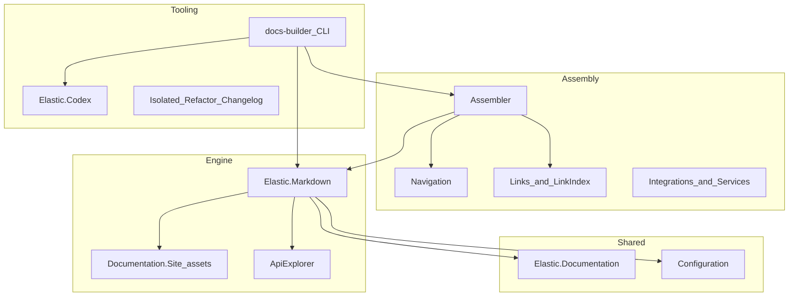

# Documentation project components (docs-builder)

The monorepo is already split into many .NET projects plus a TypeScript frontend. Mentally grouping them into **a small number of layers** helps decide whether further splits (separate repos or NuGet packages) are worth it.

## Technical layout

You do not need to invent new components from scratch: **the technical split already exists**. The solution ([`docs-builder.slnx`](../../docs-builder.slnx)) lists roughly **26 C# projects**, the frontend under [`src/Elastic.Documentation.Site/`](../../src/Elastic.Documentation.Site/), and Lambdas under [`src/infra/`](../../src/infra/). The useful exercise is to map those assemblies to **conceptual products**.

---

## Six conceptual blocks

| Block | Role | Main projects / folders |
| ----- | ---- | ----------------------- |
| **1. Markdown engine and rendering** | Myst parser/directives, Razor views, embedded API reference, SVG, bundled site assets | [`Elastic.Markdown`](../../src/Elastic.Markdown/Elastic.Markdown.csproj) (Markdig, Razor; ties to [`Elastic.ApiExplorer`](../../src/Elastic.ApiExplorer/Elastic.ApiExplorer.csproj), [`Elastic.Documentation.Site`](../../src/Elastic.Documentation.Site/), [`Elastic.Documentation.Svg`](../../src/Elastic.Documentation.Svg/Elastic.Documentation.Svg.csproj), [`Elastic.Documentation.LegacyDocs`](../../src/Elastic.Documentation.LegacyDocs/Elastic.Documentation.LegacyDocs.csproj)) |
| **2. Cross-cutting model and configuration** | Shared types, product/nav YAML, shared contracts | [`Elastic.Documentation`](../../src/Elastic.Documentation/Elastic.Documentation.csproj), [`Elastic.Documentation.Configuration`](../../src/Elastic.Documentation.Configuration/Elastic.Documentation.Configuration.csproj), [`Elastic.Documentation.ServiceDefaults`](../../src/Elastic.Documentation.ServiceDefaults/Elastic.Documentation.ServiceDefaults.csproj) |
| **3. Assembly and site graph** | Navigation tree, cross-repo link index, CI integrations | [`Elastic.Documentation.Navigation`](../../src/Elastic.Documentation.Navigation/Elastic.Documentation.Navigation.csproj), [`Elastic.Documentation.Links`](../../src/Elastic.Documentation.Links/Elastic.Documentation.Links.csproj), [`Elastic.Documentation.LinkIndex`](../../src/Elastic.Documentation.LinkIndex/Elastic.Documentation.LinkIndex.csproj), [`Elastic.Documentation.Assembler`](../../src/services/Elastic.Documentation.Assembler/Elastic.Documentation.Assembler.csproj), [`Elastic.Documentation.Integrations`](../../src/services/Elastic.Documentation.Integrations/Elastic.Documentation.Integrations.csproj), [`Elastic.Documentation.Services`](../../src/services/Elastic.Documentation.Services/Elastic.Documentation.Services.csproj) |
| **4. Authoring tools / CLI** | AOT `docs-builder` binary, isolated mode, refactor tooling, changelog | [`docs-builder`](../../src/tooling/docs-builder/docs-builder.csproj), [`Elastic.Documentation.Isolated`](../../src/services/Elastic.Documentation.Isolated/Elastic.Documentation.Isolated.csproj), [`Elastic.Documentation.Refactor`](../../src/authoring/Elastic.Documentation.Refactor/Elastic.Documentation.Refactor.csproj), [`Elastic.Changelog`](../../src/services/Elastic.Changelog/Elastic.Changelog.csproj), [`Elastic.Codex`](../../src/Elastic.Codex/Elastic.Codex.csproj) |
| **5. APIs and networked services** | HTTP API, remote MCP, search or other microservices | [`src/api/`](../../src/api/) (Core, Infrastructure, App, Mcp.Remote), [`Elastic.Documentation.Search`](../../src/services/Elastic.Documentation.Search/Elastic.Documentation.Search.csproj) |
| **6. Deployable infrastructure** | AWS jobs, GitHub Actions | [`src/infra/`](../../src/infra/) (for example `docs-lambda-index-publisher`), [`actions/`](../../actions/) |

The CLI ([`docs-builder.csproj`](../../src/tooling/docs-builder/docs-builder.csproj)) **composes** Assembler, Codex, Markdown, services, and more; it is the **entry point** that ties blocks 1–4 together.

---

## Simplified dependency view

---

## If you split further (separate repo or NuGet)

Avoid over-fragmentation. Reasonable boundaries if you need harder isolation later:

1. **`Elastic.Markdown` (plus optionally ApiExplorer/Svg)** as a reusable parsing/rendering library (already the most cohesive project).
2. **Links + LinkIndex + Navigation + Configuration** as the “site coherence” engine (validation and graph).
3. **Assembler + Integrations** as the **assembly pipeline** (depends heavily on the above).
4. **Frontend** is already a Node project inside the repo ([`Elastic.Documentation.Site`](../../src/Elastic.Documentation.Site/)); splitting it out only pays off if release cadence diverges a lot.
5. **API / Lambdas / Search** as their own deployables (already in separate folders).

Splitting the **CLI** from everything else is usually **last**, because it is the final AOT composition.

---

## Practical takeaway

- **Conceptually**, **six blocks** (table above) are enough to reason about the system.
- **In code**, you already have **many projects**; the useful question is not “how many components?” but **which boundary to version or publish separately** — natural candidates are **Markdown**, **links/navigation graph**, then **assembler**, in dependency order.

When the goal is concrete (for example “extract only the Myst parser to an internal NuGet” vs “split the monorepo into three repos”), drill into `.csproj` references and choose a minimal cut.
