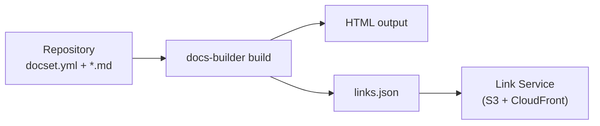
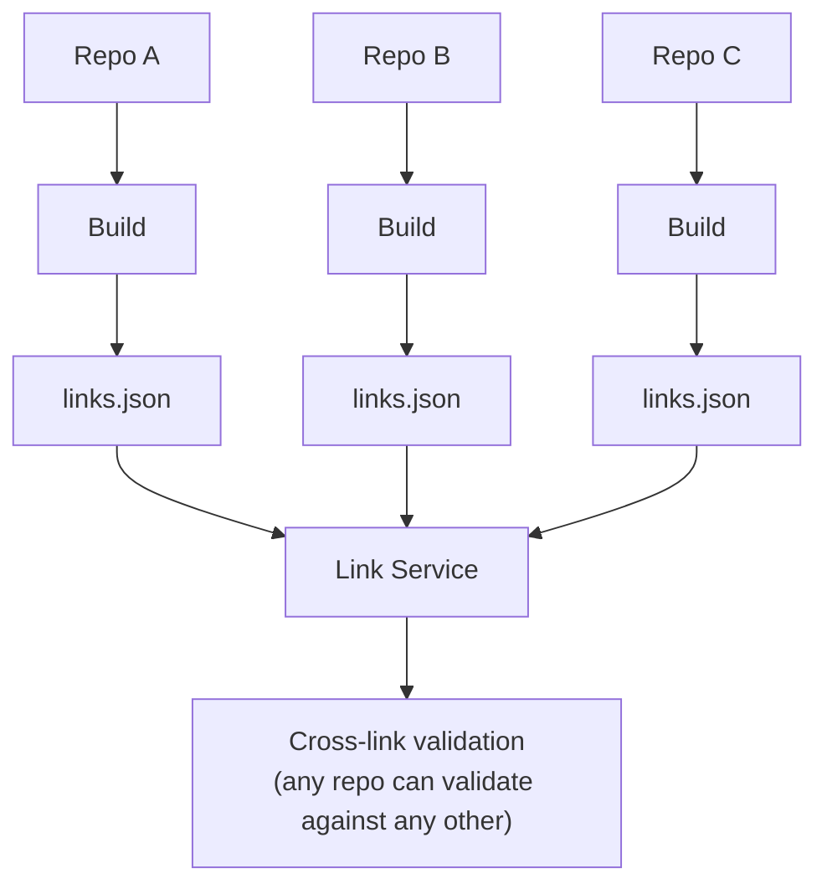
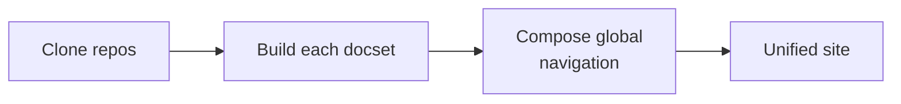
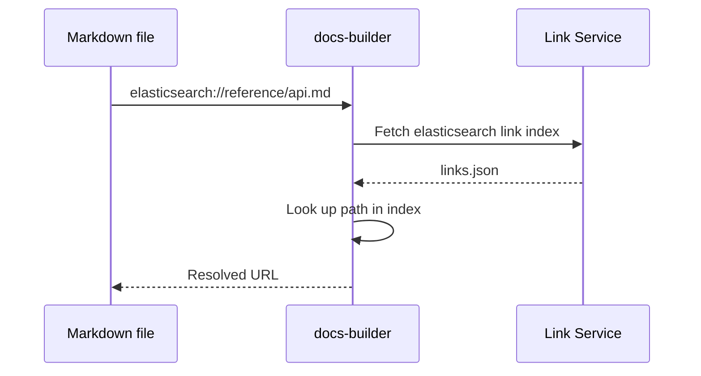

# Building blocks

:::{warning}
Old development note — likely to be deleted or substantially rewritten.
:::

This page provides a conceptual overview of the {{dbuild}} documentation model — how documentation sets are built, linked, and assembled into a unified site.

## Documentation set lifecycle

A **docset** is the fundamental unit: a folder containing a `docset.yml` configuration file and markdown source files. When {{dbuild}} builds a docset, it produces HTML output and a `links.json` file (the link index). The link index is published to an S3-backed link service, making it available for cross-repo validation.

Every successful CI build publishes its link index, so the link service always has current state for every repo and branch.

## Distributed build model

Repos build independently — there's no central build queue or mono-repo requirement. Each repo publishes its own link index. Cross-links between repos are validated against these published indexes. No repo blocks another from building or deploying.

This means a broken link in Repo A doesn't prevent Repo B from building. Validation is eventually consistent — when Repo A fixes the link target, Repo B's next build will pass.

For details on how links are published and validated, see [Link infrastructure](./link-infrastructure.md).

## Assembly flow

The **assembler** produces the unified documentation site from all repos. It clones every configured repo, builds each docset independently, composes global navigation, and deploys the result as one site.

The assembler uses the navigation system's re-homing capability to place each docset at the correct URL prefix without modifying the source repos.

For the full assembler workflow, see [Assembler](../documentation/assembler.md).

## Codex vs Assembler

Both the assembler and codex produce multi-repo documentation sites, but they differ in architecture:

| Aspect | Assembler | Codex |
|--------|-----------|-------|
| Navigation | Centralized global nav tree | No centralized nav — repos self-describe |
| URL structure | Controlled by site config | Repos at `/r/{name}`, optional groups at `/g/{group}` |
| Redirects | Tight redirect control | Simpler, repo-scoped redirects |
| Build model | Clone all → build all → deploy | Repos publish independently, composed at serve time |
| Coordination | Requires assembler config for every repo | Repos opt-in with minimal config |

The assembler is suited for tightly curated documentation sites. The codex is suited for large organizations where teams publish independently.

For details, see [Assembler](../documentation/assembler.md) and [Codex](../documentation/codex.md).

## Link resolution flow

When {{dbuild}} encounters a cross-link like `elasticsearch://reference/api.md`, it resolves it by fetching the target repo's link index from the link service:

The resolved URL depends on context — in isolated builds it points to the live site, in assembler builds it resolves to the local path within the unified output.

Cross-links require declaring dependencies in `docset.yml` under `cross_links:`. For the full resolution mechanics, see [Link infrastructure](./link-infrastructure.md).
