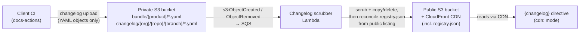

# Changelog bundle registry and CDN delivery

This page describes how changelog **bundles** are published to a public, CDN-fronted
S3 bucket, how the per-product `registry.json` manifest is produced by the **scrubber
Lambda** (the manifest's sole writer — see
[elastic/docs-eng-team#688](https://github.com/elastic/docs-eng-team/issues/688)), and the
`cdn:` mode for the [`{changelog}` directive](/syntax/changelog.md) that consumes
bundles directly from the CDN instead of from a local folder.

## Motivation

Today the `{changelog}` directive only renders bundles that live in a folder inside the
docset (default `changelog/bundles/`). That requires every consuming repository to vendor
a copy of the bundle YAML it wants to render.

The link service ([link infrastructure](/documentation/distributed-builds.md)) already demonstrates
the pattern we want: an S3 bucket fronted by CloudFront, publicly readable, with a small
JSON index at a well-known key. We apply the same approach to changelog bundles so a docset
can render another product's release notes by pointing the directive at the CDN — no vendored
copies, no cross-repo file syncing.

## Architecture



1. **Uploader** — `changelog upload --target s3` (invoked by the docs-actions changelog
   upload workflow) writes bundle YAML to `bundle/{product}/{file}` and changelog-entry YAML
   to `changelog/{org}/{repo}/{branch}/{file}` in the **private** bucket. That is all it does:
   it never writes a registry (there is no private registry at all).
2. **Scrubber Lambda (the registry's sole producer)** — S3 events from the private bucket are
   *triggers, not instructions*: for each affected key the Lambda reconciles the public object
   against current private-bucket state (present → scrub and copy; absent → delete the public
   copy), then rebuilds the affected group's `registry.json` from the **public bucket's actual
   listing** (`registry = f(state)`, never `f(event)`). Any successful reconcile repairs *all*
   accumulated drift in the group, not just the change that triggered it.
3. **Consumer** — for each product declared under `release_notes` in `docset.yml`, docs-builder
   reads `bundle/{product}/registry.json` from the CDN at build startup and fetches each listed
   bundle; the `{changelog}` directive in `cdn:` mode then renders from the prefetched result.

### Why a registry instead of an S3 listing

The public surface is a CDN (CloudFront) in front of S3. CloudFront does not expose bucket
listing, so the consumer cannot enumerate `bundle/{product}/`. The registry is a stable,
cacheable manifest at a predictable key that lists exactly which bundles exist for a product.

## `registry.json` format

Stored at `bundle/{product}/registry.json` (bundle index) or `changelog/{org}/{repo}/{branch}/registry.json`
(changelog-entry index), **in the public bucket only** — no private registry exists.
Serialized with `snake_case` keys.

```json
{
  "schema_version": 1,
  "producer": "changelog-scrubber-reconcile/1",
  "product": "elasticsearch",
  "generated_at": "2026-05-06T12:00:00+00:00",
  "bundles": [
    { "file": "9.4.0.yaml", "target": "9.4.0", "etag": "…" },
    { "file": "9.3.0.yaml", "target": "9.3.0", "etag": "…" }
  ]
}
```

| Field | Meaning |
|---|---|
| `schema_version` | Bumped when consumers must change their parser. A manifest declaring a *newer* schema than the reconciler understands is reported and left untouched, never downgraded. |
| `producer` | The reconcile algorithm version that wrote the manifest (`RegistryReconciler.Producer`). A mismatch forces a full metadata recompute and a rewrite even when entries come out identical — this is how metadata-logic fixes roll out to every group. Consumers should ignore it. |
| `product` | Grouping identifier — the product for a bundle index (`bundle/{product}/…`) or the `{org}/{repo}/{branch}` prefix for a changelog-entry index (`changelog/{org}/{repo}/{branch}/…`). |
| `generated_at` | UTC timestamp of the last reconcile that wrote the manifest. Never the only thing that changes — a reconcile whose entries are identical skips the write. |
| `bundles[].file` | Bundle file name, resolved at `bundle/{product}/{file}` (or entry file at `changelog/{org}/{repo}/{branch}/{file}` for the entry index). |
| `bundles[].target` | Target version/date from the bundle's declaration of **this** product (may be null). For an amend sidecar (`{name}.amend-{N}.yaml`), recomputed on every reconcile against its parent in the same public prefix; a missing parent records `null` and self-corrects once the parent lands. Entry indexes record no target. |
| `bundles[].etag` | The **public (CDN) object's ETag**, recorded verbatim from the public listing. Usable for HTTP cache revalidation against the CDN and as the reconciler's cheap change detector. |

Bundles are sorted by `target` descending (newest first) with a deterministic tiebreak on
`file`, so the JSON is stable across reruns.

### Absent ≠ empty

A group whose last public object is deleted gets its manifest **deleted**, not emptied: a
registry 404 means "unpublished" and is a fail-fast error for declared consumers (exactly as
for a product that was declared under `release_notes` but never published — the signal to
remove the declaration), while a manifest with an empty `bundles` list would read as a valid
zero-bundle state. The reconciler deliberately restores the former.

## Producer details: the scrubber Lambda reconciler

The manifest is produced exclusively by the scrubber Lambda's `RegistryReconciler`
(`Elastic.Changelog/Reconciliation/`). S3 event notifications are at-least-once and can arrive
out of order, so the handler never acts on an event's *type* — an event only means "this key
may have changed":

1. **Object-level reconcile** — GET the key from the private bucket: present → scrub the
   *current* content and PUT to public; 404 → conditionally delete the public copy. After the
   write, a HEAD re-validates that the private object still matches the snapshot the write was
   derived from, redoing the reconcile if a concurrent invocation raced it.
2. **Group reconcile** — list the group's public prefix (`/`-delimited so a branch containing
   `/` doesn't sweep nested pools; paginated), reuse entries whose recorded ETag still matches
   the listing, GET and recompute the rest (amends always recomputed), and write the manifest
   back. Within an SQS batch this work is coalesced: one object reconcile per distinct key, one
   group reconcile per distinct group.

Registry keys themselves are never copied or deleted — a `registry.json` event from an old CLI
only schedules a group reconcile. Client-authored JSON therefore never reaches the public
surface uninspected.

### Concurrency: optimistic, conditional writes

Concurrent reconciles of one group (parallel uploads, redeliveries) are serialized through
**S3 conditional writes**:

- On **update**: `If-Match: <etag-from-read>` — only succeeds if the manifest hasn't changed.
- On **create**: `If-None-Match: *` — only succeeds if the manifest still doesn't exist.
- On **group emptied**: conditional DELETE with `If-Match`, so a stale empty observation can't
  destroy a manifest a concurrent reconciler just rebuilt.

A `412 Precondition Failed` (or `409` conditional-write conflict) means another writer won the
race; the reconciler re-lists, rebuilds, and retries with jittered backoff (bounded). On
exhaustion the SQS message fails and is redelivered. If the rebuilt manifest equals what's
published (same `schema_version`, `producer`, `product`, and entry list), the write is skipped —
`generated_at` alone never causes churn.

### Consistency: convergence, not atomicity

S3 has no cross-key atomicity — the public YAML write and the registry write are separate
operations, and a reconcile can fail between them. The guarantee is therefore:

> The public registry **converges** to the exact public bucket state once the scrubber queue
> drains successfully. Any successfully processed event for a group repairs *all* accumulated
> drift in that group, not just the event's own key.

Consumers must tolerate the convergence window: the manifest may briefly reference a bundle
that is not yet (or no longer) on the public bucket — treat a listed-but-missing bundle as
non-fatal (skip + warn), not an error. A bundle that fails scrubbing (private references that
cannot be allowlisted) is never written to the public bucket; its message lands in the DLQ and
alarms (see the runbook in `elastic/docs-eng-team`), and the manifest — describing actual
public state — never lists it.

### Operator tooling: `registry reconcile` and `registry verify`

Failures no longer surface in any CI log, and drift can also be introduced out-of-band (manual
S3 operations, lost events). Two CLI commands cover diagnosis and repair — see the
[CLI reference](/cli/changelog/registry/index.md):

- **`changelog registry verify`** (read-only) compares each group's public manifest against
  what a reconcile of the current public listing would write, reporting divergence as
  `Missing` / `Stale` / `Corrupt` / `ObjectDivergent` (`UnsupportedSchema` reported
  distinctly). Non-zero exit on any divergence — it is the cutover gate and the standing
  drift-diagnosis tool.
- **`changelog registry reconcile`** never touches S3 itself: it sends explicit, versioned
  reconcile messages to the scrubber queue
  (`{"kind":"reconcile","version":1,"scope":"bundle"|"changelog","group":"…","correlation_id":"…"}`).
  On receipt the Lambda performs a **full group heal**: object-level reconcile over the union
  of both buckets' group listings, then the group reconcile — which makes even a lost or
  DLQ-expired scrub event recoverable. Group discovery enumerates both buckets so orphan
  public groups are healed too.

### Buckets and infrastructure

The uploader (GitHub Actions OIDC role) writes YAML to the **private** bucket
(`elastic-docs-v3-changelog-bundles-private`) only. The scrubber Lambda is the sole writer to
the **public** bucket (`elastic-docs-v3-changelog-bundles`, served via CloudFront + OAC), which
preserves the invariant that everything on the public surface has been vetted.

Infrastructure lives in `docs-infra` (`aws/elastic-web/us-east-1/elastic-docs-v3-changelog-bundles/`):

- Private-bucket S3 → SQS notifications on `s3:ObjectCreated:*` / `s3:ObjectRemoved:*` trigger
  the Lambda (batch size 10, 5 s batching window — multi-file uploads to one group tend to
  coalesce into a single reconcile).
- The scrubber role has `s3:GetObject` on private, `s3:GetObject`/`s3:PutObject`/`s3:DeleteObject`
  on public, and `s3:ListBucket` on both (public for group reconciles, private for full group
  heals).
- The registry-operator grant (docs-eng tooling repos only) covers `registry verify`
  (public `s3:ListBucket`/`s3:GetObject`) and `registry reconcile` (`sqs:SendMessage` on the
  scrubber queue).
- CloudWatch alarms watch the DLQ (any message) and the main queue's oldest-message age; the
  triage/redrive runbook lives in `elastic/docs-eng-team` (`docs/operations/runbooks.md`).
- CloudFront caching is **disabled** (`Managed-CachingDisabled`), so a written manifest is
  visible on the CDN immediately.

## `changelog bundle` entry sourcing (org/repo/branch gate)

The `changelog bundle` command aggregates individual changelog **entries**. It can read those
entries from the local folder or fetch the **authoring pool's** published entries from the CDN
(`changelog/{org}/{repo}/{branch}/registry.json` → `changelog/{org}/{repo}/{branch}/{file}`, via
`CdnChangelogEntryFetcher`).

Under the artifact-root layout, entries are org/repo/branch-scoped — not product-scoped — so CDN
entry sourcing keys off the resolvable authoring pool (repo with the same precedence as upload:
`--repo` > `bundle.repo` > git remote; owner from `--owner` > `bundle.owner`, default `elastic`;
branch from `--branch` > `bundle.branch`, default `main`), **not** off the bundle's target products.
This is what lets one repo (for example `kibana`) produce a bundle for a shared product (for example
`cloud-serverless`) while sourcing its own entries from `changelog/elastic/kibana/main/`, without that
product appearing in the repo's own `docset.yml`. The decision is made per run by
`ChangelogBundlingService`:

- **Local folder** when `bundle.use_local_changelogs: true`, when `--directory` is passed, or when
  the authoring repo cannot be resolved.
- **CDN** when the authoring repo resolves, local sourcing is not forced, and a CDN base is
  configured (`DOCS_BUILDER_CHANGELOG_CDN`, defaulting to the public distribution).

The same gate drives the `--plan` `needs_network` output, so a planning step and the actual bundle
run agree on whether the Docker bundle needs network access. The registry-fetch is fail-fast and an
entry still missing after its retry budget fails the bundle (an incomplete release would otherwise
ship silently). `CdnChangelogEntryFetcher` reuses a shared `HttpClient` in production and disposes an
owned client only when a test injects a handler, mirroring `CdnChangelogFetcher`.

## Consumer: `{changelog}` directive `cdn:` mode (implemented)

### Syntax

```markdown
:::{changelog}
:cdn: elasticsearch
:::
```

The directive accepts a `:cdn:` option naming the **product** to render (validated against
`[a-zA-Z0-9_-]+`). It is a *selector* over bundles that were prefetched at build startup, so the
product must be declared under `release_notes` in `docset.yml` (see
[Declaration and prefetch](#declaration-and-prefetch)). The product is optional: a valueless
`:cdn:` infers the product from the current repository (`BuildContext.Git.RepositoryName`),
mapped to its canonical product id via `products.yml` (for example the `elastic-otel-java` repo →
`edot-java` product). Multi-product repositories (for example `cloud`, which publishes
`cloud-hosted`, `cloud-serverless`, and `cloud-enterprise`) must name the product explicitly. When
the product cannot be inferred (git information unavailable) or is not declared under
`release_notes`, the directive emits an error.

The CDN base URL is environment configuration, not authored per page: it
defaults to the public changelog bundles distribution and is overridable via the
`DOCS_BUILDER_CHANGELOG_CDN` environment variable (absolute `http`/`https` URL) for
staging, local development, and testing.

When `:cdn:` is set, the local-folder argument is ignored (a warning is emitted if one is
also given) and the directive renders the prefetched CDN bundles instead.

### Declaration and prefetch [declaration-and-prefetch]

CDN-sourced products are declared once per docset under `release_notes` in `docset.yml`, mirroring
the `cross_links` mechanism:

```yaml
# docset.yml
release_notes:
  - product: elasticsearch
  - product: edot-java
```

Each entry is validated against `products.yml` (the id must exist and carry the `release-notes`
feature). At build startup — before any markdown is parsed — `ReleaseNotesFetcher` fetches the
registry and bundles for every declared product **concurrently**, stores the result in an immutable
`FetchedReleaseNotes`, and exposes it through `IReleaseNotesResolver`. The resolver is threaded into
the parser via `DocumentationSet`/`ParserContext`, so the `{changelog}` directive's `:cdn:` mode is
a pure in-memory lookup with no network I/O at parse time. Build paths that do not source release
notes use `NoopReleaseNotesResolver`.

### Fetch flow

1. `GET {cdnBase}/bundle/{product}/registry.json`.
2. Parse it; for each `bundles[].file`, `GET {cdnBase}/bundle/{product}/{file}`.
3. Feed the downloaded YAML into the existing `BundleLoader` → `MergeBundlesByTarget` →
   render pipeline. **Rendering is unchanged**; only the source of the bundle bytes differs.

Implemented by `CdnChangelogFetcher` (a stateless async fetch engine in
`Elastic.Documentation.Configuration`) and `BundleLoader.LoadBundlesFromContent`. Because public
bundles are already scrubbed and **resolved** (entries are inline/self-contained), the fetcher never
needs to download separate entry files; the existing private-repo link and description visibility
logic still applies via `assembler.yml`, exactly as for local bundles.

### Behavior and decisions

- **Async prefetch at startup.** Bundles are fetched once per declared product before parsing, via
  `HttpClient.GetAsync`, rather than synchronously inside the Markdig block parser. The directive
  then selects from the prefetched, immutable `FetchedReleaseNotes`.
- **Fail-fast registry, tolerant bundles.** A declared product whose registry cannot be fetched or
  parsed fails the build; an individual bundle that 404s or fails to parse is a warning and is
  skipped, per [Consistency: convergence, not atomicity](#consistency-convergence-not-atomicity).
- **Undeclared product.** A `:cdn:` directive naming a product not declared under `release_notes`
  is an error — its bundles were never prefetched — which keeps network sources auditable in one
  place.
- **Schema evolution.** A `schema_version` newer than the consumer understands produces a
  clear error rather than a silent mis-parse.
- **Filtering.** `:type:`, `:link-visibility:`, `:description-visibility:`, `:dropdowns:` and
  `hide-features` apply identically to CDN-sourced bundles.
- **Version selection.** `:version:` renders a single target and works in both modes (shared match
  on registry `target` or bundle file name, see `ChangelogVersionMatch`). In CDN mode it filters the
  prefetched bundles at render time. When the fetcher itself is asked for a single version, an amend
  sidecar is additionally downloaded when its parent bundle matches, so amends published without
  `products` (null registry `target`) still reach version-filtered consumers.
- **Security.** The base URL is trusted configuration; the product and registry-supplied bundle
  file names are validated to single path segments so neither can traverse outside
  `bundle/{product}/`.

### Follow-ups (not yet implemented) [implementation-notes]

- **Persistent / offline cache.** Each build prefetches declared products once into memory but does
  not persist a disk cache, so a cold build always reaches the CDN and an unreachable declared
  product fails the build. A follow-up should add an ETag-keyed on-disk cache under the
  docs-builder app-data directory (mirroring `CrossLinkFetcher`) with offline fallback.
- **`serve` mode staleness.** The prefetch runs per reload, but within a single `serve` process a
  product's CDN content is pinned until the next reload. Acceptable for now (serve targets local
  markdown authoring, not changelog bundles); revisit alongside the disk cache.
- **CDN latency.** CloudFront caching is disabled (`Managed-CachingDisabled`), so a written
  manifest is visible immediately; the only delay between an upload and its appearance in
  `registry.json` is the scrubber pipeline itself (SQS batching window + reconcile).
- **Caching key.** When the disk cache lands, use the CDN response ETag (not the registry
  `etag` field) for revalidation.

### Out of scope

- Cross-product aggregation in a single directive block (one product per block).
- Authenticated/private CDN access (the public bucket is anonymous-read by design).

## Related

- [Changelog directive](/syntax/changelog.md) — current (local-folder) behavior.
- [Publish changelogs](/data/release-notes/publish.md) — the upload workflow.
- [Link infrastructure](/documentation/distributed-builds.md) — the S3 + CloudFront pattern this reuses.
