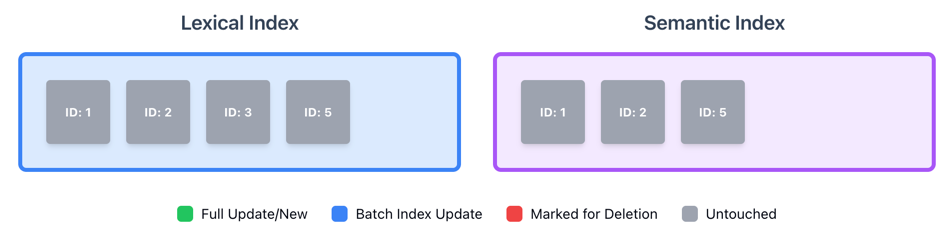
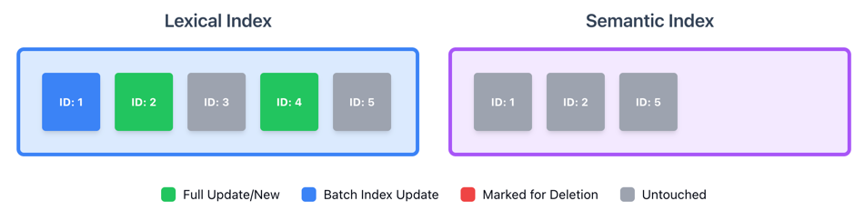
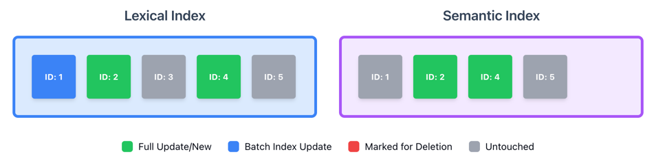
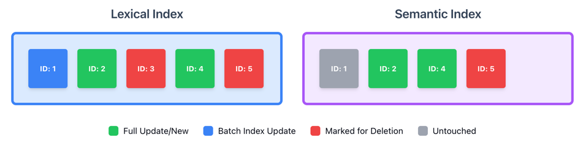
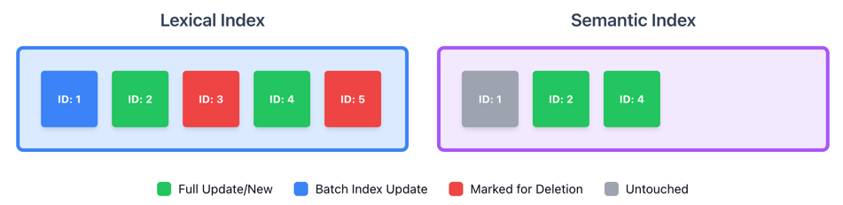
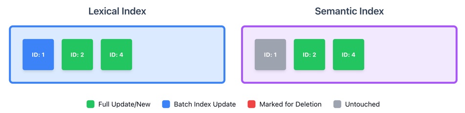

# Elasticsearch Ingestion

## Elasticsearch Integration

The Elasticsearch integration consists of two primary exporters that work together to maintain both lexical and semantic search indices:

1. **ElasticsearchLexicalExporter** - Handles traditional full-text search indexing with hash-based change detection
2. **ElasticsearchSemanticExporter** - Manages semantic search indices using inference models for vector embeddings

These exporters are coordinated by the `ElasticsearchMarkdownExporter` class, which implements the `IMarkdownExporter` interface.

### Architecture Overview

Both exporters inherit from the abstract `ElasticsearchExporter<TChannelOptions, TChannel>` base class (defined in `src/Elastic.Markdown/Exporters/Elasticsearch/ElasticsearchExporter.cs`), which provides:

- **Channel-based ingestion**: Uses the `Elastic.Channels` library for high-performance buffered writes to Elasticsearch
- **Configurable concurrency**: Respects the `IndexNumThreads` setting to optimize throughput
- **Error handling**: Callbacks for export failures, server rejections, and retries
- **Progress tracking**: Logs buffer exports at configured intervals

### Hash-Based Change Detection

The lexical exporter implements an intelligent hash-based upsert strategy (`ScriptedHashBulkUpsertLookup`) that:

1. Computes a hash from the document's URL, body content, and headings
2. On index, compares the computed hash with the stored hash
3. If hashes match: Only updates the `batch_index_date` field (minimal overhead)
4. If hashes differ: Performs a full document update with new `last_updated` timestamp

This approach allows us to incrementally synchronize only the changed documents and deletions over to our semantic index.

### Shutdown and Synchronization Logic

The `StopAsync` method in `ElasticsearchMarkdownExporter`  orchestrates a complex multi-phase synchronization sequence:

#### Phase 1: Drain and Finalize Lexical Index

```csharp
var stopped = await _lexicalChannel.StopAsync(ctx);
```

This calls the base `ElasticsearchExporter.StopAsync` method, which performs three critical operations:

1. **Drain in-flight exports** (`WaitForDrainAsync`): Waits for all buffered documents to be flushed to Elasticsearch
2. **Refresh the index** (`RefreshAsync`): Makes all indexed documents immediately searchable
3. **Apply aliases** (`ApplyAliasesAsync`): Swaps index aliases to point to the newly created time-stamped index

#### Phase 2: Semantic Index Bootstrap

```csharp
if (!semanticIndexHead.ApiCallDetails.HasSuccessfulStatusCode)
{
    // Bootstrap semantic index if it doesn't exist
    await _semanticChannel.Channel.BootstrapElasticsearchAsync(...);
    await _transport.PutAsync<StringResponse>(semanticIndex, ...);
    await _semanticChannel.Channel.ApplyAliasesAsync(ctx);
}
```

If the semantic index doesn't exist yet, it's created and configured with the appropriate inference model settings.

#### Phase 3: Incremental Sync - Updates

```csharp
_reindex updates: '{SourceIndex}' => '{DestinationIndex}'
```

Uses Elasticsearch's `_reindex` API to copy **only changed documents** from the lexical index to the semantic index:

- **Query filter**: `last_updated >= _batchIndexDate`
- **Result**: Only documents that were actually modified (not just batch-tracked) are synced
- This triggers semantic embedding generation for new/changed content

#### Phase 4: Incremental Sync - Deletions

```csharp
_reindex deletions: '{SourceIndex}' => '{DestinationIndex}'
```

Uses `_reindex` with a script to propagate deletions:

- **Query filter**: `batch_index_date < _batchIndexDate` (documents not in current batch)
- **Script**: `ctx.op = "delete"` - converts reindex operations to deletions
- **Result**: Documents removed from the documentation are deleted from semantic index

#### Phase 5: Cleanup Lexical Index

```csharp
await DoDeleteByQuery(lexicalWriteAlias, ctx);
```

Removes stale documents from the lexical index using `_delete_by_query`:

- **Query filter**: `batch_index_date < _batchIndexDate`
- **Result**: Lexical index only contains documents from the current batch

### Task Monitoring

Both `DoReindex` and `DoDeleteByQuery` methods use Elasticsearch's task API to monitor long-running operations:

1. Submit the operation with `wait_for_completion=false` to get a task ID
2. Poll the `/_tasks/{taskId}` endpoint every 5 seconds
3. Log progress metrics: total documents, created, updated, deleted, batches, and elapsed time
4. Continue until `completed: true`

This provides real-time visibility into large-scale index operations without blocking the application.

### Index Naming Strategy

Both exporters use time-stamped index names with write aliases:

- **Lexical**: `{prefix}-lexical-{namespace}-{timestamp}` with alias `{prefix}-lexical-{namespace}`
- **Semantic**: `{prefix}-semantic-{namespace}-{timestamp}` with alias `{prefix}-semantic-{namespace}`

The `-latest` formatted alias (e.g., `...-{yyyy.MM.dd.HHmmss}`) is used as a write alias during the current indexing operation, then swapped to the read alias upon completion. This enables zero-downtime reindexing.

### Error Handling

The `StopAsync` sequence includes comprehensive error tracking:

- Failed drains, refreshes, or alias operations emit global errors via `IDiagnosticsCollector`
- The lexical channel stop must succeed (`stopped == true`) or an exception is thrown
- Task failures during reindex/delete operations are logged and recorded as global errors

This ensures that indexing problems are visible and prevent silent data corruption.

## Indexing Flow Visualization

::::{stepper}


::::{stepper}

:::{step} Initial state: Both indexes contain existing documents


:::
:::{step} Lexical Index processing 



* ID 1: Hash matches → Only batch_index_date updated (blue)
* ID 2: Hash changed → Full upsert with new last_updated (green)
* ID 3: No incoming data → Untouched (gray)
* ID 4: New document → Insert (green)
* ID 5: Not included in current batch → Untouched (gray)

:::

:::{step} Sync updates to Semantic Index



* Copy documents from Lexical Index where last_updated >= 2024-10-15
* Only IDs 2 and 4 synced (ID 1 has old last_updated date)

:::

:::{step} Mark deletions in both indexes



* Lexical Index: Mark IDs 3 and 5 (batch_index_date < 2024-10-15) as red
* Semantic Index: Sync deletion of ID 5 from Lexical Index, mark as red

:::

:::{step} Delete from Semantic Index first



* Remove ID 5 from Semantic Index
* Lexical Index still has IDs 3 and 5 marked for deletion

:::

:::{step}  Complete deletion and final sync



* Delete IDs 3 and 5 from Lexical Index
* Semantic Index remains as-is (batch_index_date not updated there)
* Both indexes now synchronized with same document IDs
:::
::::