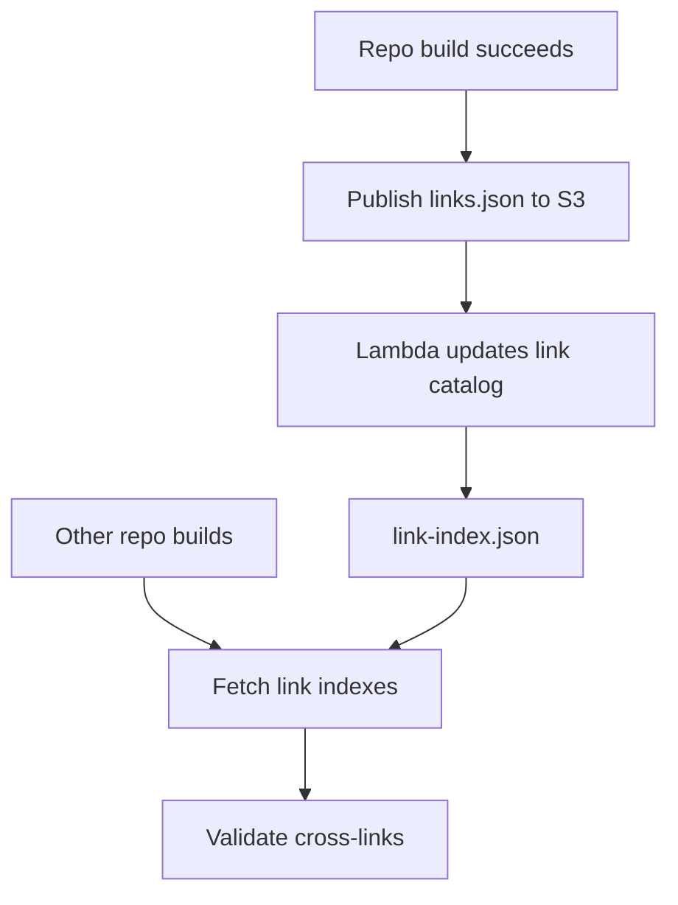

# Link infrastructure

:::{warning}
Old development note — likely to be deleted or substantially rewritten.
:::

{{dbuild}} uses a distributed link infrastructure to enable cross-repo linking without requiring repos to build together. This page covers the full publish→validate lifecycle.

## Overview

The link infrastructure has four components: the **link service** (S3 + CloudFront), **link indexes** (per-repo `links.json`), the **link catalog** (a manifest of all indexes), and **cross-link resolution** (both outbound and inbound validation).



## Link service

The link service is an S3 bucket fronted by CloudFront. It stores link indexes for every repo and branch.

**URL structure:**

```
https://elastic-docs-link-index.s3.us-east-2.amazonaws.com/{org}/{repo}/{branch}/links.json
```

For example:

```
https://elastic-docs-link-index.s3.us-east-2.amazonaws.com/elastic/elasticsearch/main/links.json
```

**Publishing process:**

1. {{dbuild}} generates `links.json` during build
2. CI publishes the file to S3 on successful builds
3. An S3 event triggers a Lambda that updates the link catalog

The CloudFront CDN ensures low-latency fetches from any region during cross-link validation.

## Link index

A **link index** (`links.json`) is generated per repo/branch during build. It contains all linkable resources: pages, headings, and anchors.

**Generation:** The file is written to `.artifacts/docs/html/links.json` as part of the build output.

**Contents:** Each entry maps a relative path to its linkable targets — the page itself plus any heading anchors within it. This allows {{dbuild}} to validate not just that a page exists, but that a specific anchor on that page exists.

**Example entry structure:**

```json
{
  "reference/api.md": {
    "anchors": ["overview", "request-body", "response-codes"]
  },
  "getting-started.md": {
    "anchors": ["prerequisites", "installation"]
  }
}
```

The link index is the source of truth for what a repo exposes as linkable content.

## Link catalog

The **link catalog** (`link-index.json`) lives at the S3 bucket root. It's a manifest listing all available link indexes with metadata.

**Contents:** For each repo/branch, it records:
- The S3 path to `links.json`
- Commit SHA at time of publish
- ETAG for cache invalidation
- Timestamps (created, last updated)

**Maintenance:** A Lambda function triggers on S3 `PutObject` events. When a new `links.json` is published, the Lambda updates the catalog entry for that repo/branch.

**Usage:** The assembler reads the catalog to discover which repos have published link indexes. This lets it coordinate builds — fetching all relevant indexes before validating cross-links across the full documentation set.

## Cross-link resolution

Cross-links use a URI scheme with the target repo name as the protocol:

```markdown
[Elasticsearch API reference](elasticsearch://reference/api.md)
[Specific section](kibana://setup/install.md#docker)
```

**Requirements:**

Repos must declare their cross-link dependencies in `docset.yml`:

```yaml
cross_links:
  - elasticsearch
  - kibana
```

**Resolution process:**

1. {{dbuild}} encounters a cross-link during parsing
2. It fetches the target repo's `links.json` from the link service
3. It looks up the path (and optional anchor) in the index
4. If found, it resolves to the appropriate URL for the build context
5. If not found, it emits a validation error

In isolated builds, resolved URLs point to the live documentation site. In assembler builds, they resolve to local paths within the unified output.

## Inbound link validation

Inbound validation answers: "will my changes break links from other repos?"

**Commands:**

```bash
# Validate all inbound links to this repo
docs-builder inbound-links validate-all

# Validate a specific link reference
docs-builder inbound-links validate-link-reference <reference>
```

**Common scenarios:**

- **Renaming a page** — other repos may link to the old path. Run `validate-all` to discover which repos would break.
- **Removing an anchor** — a heading change can break fragment links from other repos.
- **Reorganizing structure** — moving files between directories invalidates existing cross-links.

When inbound validation fails, it reports which repos and files contain the broken references, so you can coordinate fixes or add redirects.
