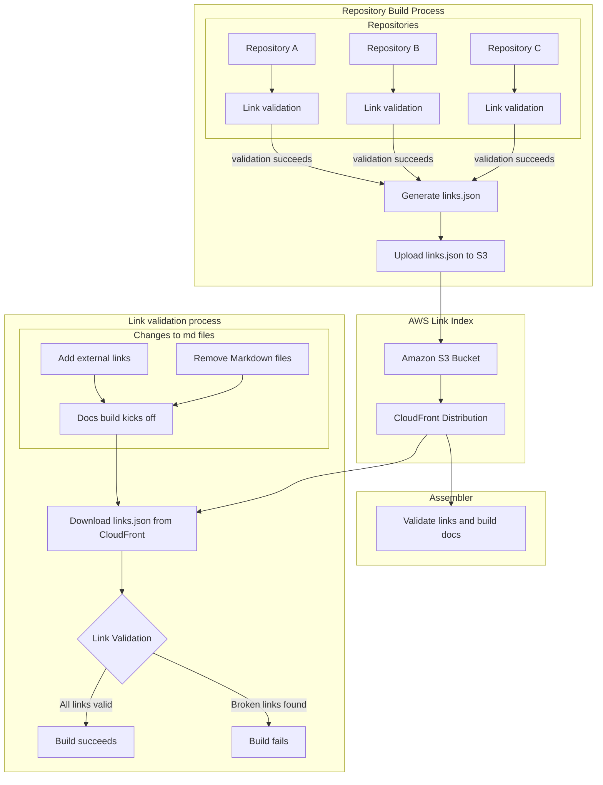

# Link validation

:::{warning}
Old development note — likely to be deleted or substantially rewritten.
:::

* See the [RFC](https://docs.google.com/document/d/1fZNeJCVLKu19s4WIKkkqrHyE9YlWQHNed94Y_V7ofRI/edit?tab=t.0#heading=h.z8tixe192fr4).
* Infrastructure lives in [docs-infra](https://github.com/elastic/docs-infra).

