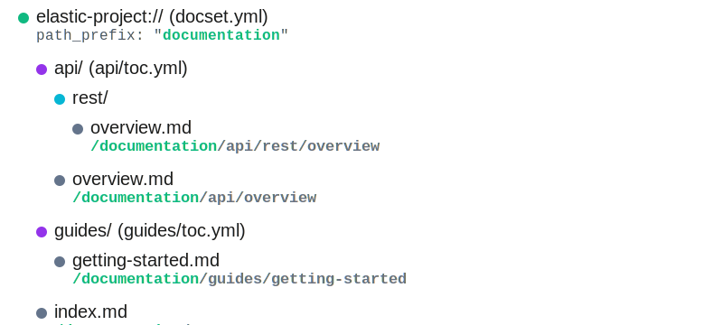
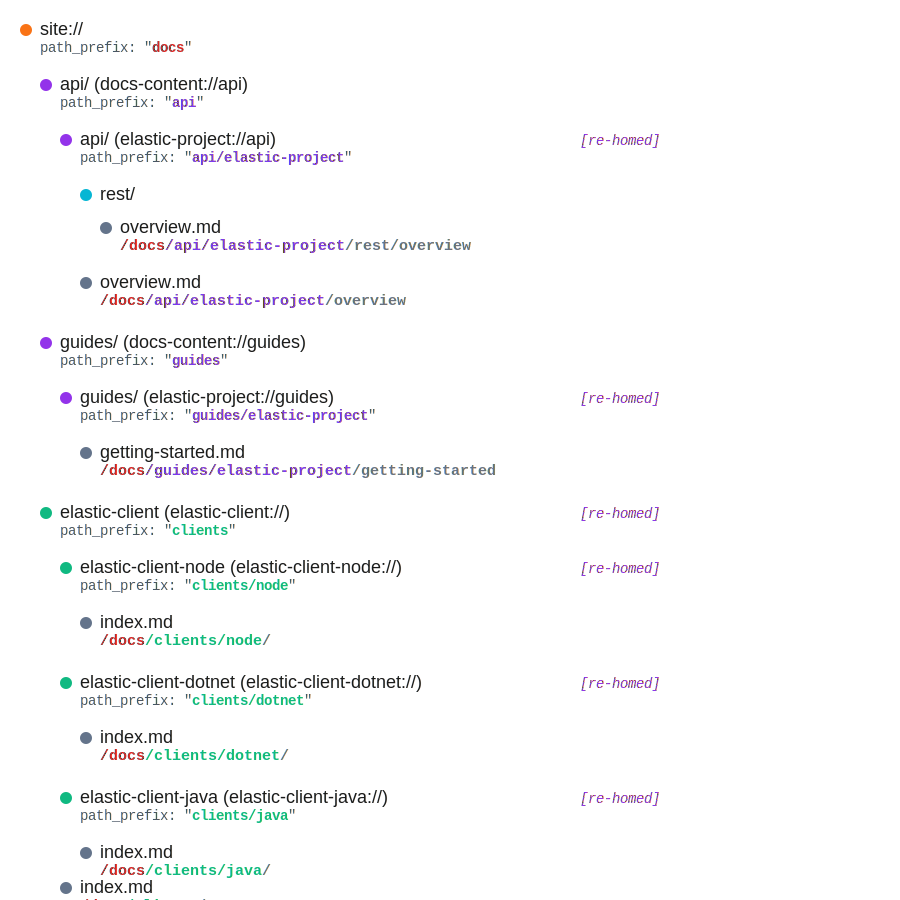

# Visual Walkthrough

This document provides a visual tour of navigation structures in both isolated and assembler builds, showing how the same documentation can be represented differently depending on the build mode.

## Navigation Node Icons

Throughout this walkthrough, we use these icons to represent different node types:

-  **DocumentationSetNavigation** - Root of a documentation repository
-  **TableOfContentsNavigation** - A nested `toc.yml` section
-  **FolderNavigation** - A directory with markdown files
-  **FileNavigationLeaf** - An individual markdown file
-  **SiteNavigation** - Root of an assembled site (assembler builds only)

## Isolated Builds

When building a single repository's documentation (e.g., `docs-builder isolated build`), the navigation is rooted at  **DocumentationSetNavigation**.

### What's in an Isolated Build?

An isolated build processes one `docset.yml` file, which defines the table of contents for that repository. This table of contents can include:

**Direct Children:**
-  **file:** - Individual markdown files
-  **folder:** - Directories containing markdown files
-  **toc:** - Nested `toc.yml` files for subsections

**Example docset.yml:**
```yaml
project: elastic-project
toc:
  - file: index.md                    # FileNavigationLeaf
  - folder: getting-started           # FolderNavigation
  - toc: api                          # TableOfContentsNavigation → api/toc.yml
  - toc: guides                       # TableOfContentsNavigation → guides/toc.yml
```

### Visual Example: Isolated Build Tree

Imagine we have an `elastic-project` repository with the following structure:



**What we see in this diagram:**

1. **Root:**  `elastic-project://`
   - This is the root of the entire navigation
   - Identifier: `elastic-project://`
   - URL: `/` (or custom base path)

2. **Index File:**  `index.md`
   - The landing page for the documentation
   - URL: `/`

3. **Nested TOCs:**  `api/` and `guides/`
   - Each represents a `toc.yml` file
   - Creates a scope for child navigation items
   - Identifiers: `elastic-project://api`, `elastic-project://guides`
   - URLs: `/api/`, `/guides/`

4. **Child Files:**  Under each TOC
   - Individual markdown files in those sections
   - URLs relative to parent TOC: `/api/overview/`, `/guides/getting-started/`

### Key Characteristics of Isolated Builds

**Navigation Root:**
- All nodes point to  as their `NavigationRoot`
- This is the ultimate parent in the tree

**URL Structure:**
- All URLs are relative to the documentation set root
- Default: starts at `/`
- Can be customized with `--canonical-base-url`

**Identifiers:**
- Docset: `{repository}://` (e.g., `elastic-project://`)
- Nested TOCs: `{repository}://{path}` (e.g., `elastic-project://api`)

**Home Provider:**
- DocumentationSetNavigation is its own home provider
- PathPrefix: `""` (empty, or custom base URL)
- All children inherit this provider

**Purpose:**
- Fast iteration for documentation teams
- Test documentation in isolation
- No dependencies on other repositories
- Validate links, structure, and content

---

## Assembler Builds

When building a unified site from multiple repositories (e.g., `docs-builder assemble`), the navigation is rooted at  **SiteNavigation**.

### What's in an Assembler Build?

An assembler build combines multiple isolated builds into a single site, defined by `config/navigation.yml`.

**Key Differences from Isolated:**
- Multiple repositories combined into one navigation tree
- Custom URL prefixes for each section (`path_prefix`)
-  SiteNavigation as the ultimate root
- Navigation items are **re-homed** to use new URL prefixes

### What Can Be Referenced?

In `navigation.yml`, you can reference:

1. **Entire Documentation Sets:** 
   - Syntax: `{repository}://`
   - Example: `elastic-project://`, `kibana://`, `elasticsearch://`

2. **Nested Table of Contents:** 
   - Syntax: `{repository}://{path/to/toc}`
   - Example: `elastic-project://api`, `kibana://setup`

**You cannot directly reference:**
- Individual files
- Folders
- Virtual files

These are automatically included as children of their parent TOC or docset.

### Visual Example: Splitting a Docset

Let's take the same `elastic-project` from the isolated build and split it across the site:

**Isolated Build Had:**
```
elastic-project://
├── /api/
└── /guides/
```

**Assembler Navigation (navigation.yml):**
```yaml
toc:
  - toc: docs-content://elasticsearch
    children:
      # Pull elastic-project's API section
      - toc: elastic-project://api
        path_prefix: elasticsearch/api

      # Pull elastic-project's Guides section
      - toc: elastic-project://guides
        path_prefix: elasticsearch/guides
```

**What This Means:**
- The `api` section moves from `/api/` → `/elasticsearch/api/`
- The `guides` section moves from `/guides/` → `/elasticsearch/guides/`
- Same files, same structure, different URLs

### Visual Example: Composing Multiple Repositories

Here's a more complex example showing multiple repositories assembled into one site:

 **Site Structure (navigation.yml):**
```
Site Root
├── Elasticsearch Section
│   ├── elastic-project://api → /elasticsearch/api
│   └── elastic-project://guides → /elasticsearch/guides
│
├── Kibana Section
│   └── kibana:// → /kibana
│
├── Logstash Section
│   └── logstash:// → /logstash
│
└── Client Libraries
    ├── elastic-client-node:// → /clients/node
    ├── elastic-client-dotnet:// → /clients/dotnet
    └── elastic-client-java:// → /clients/java
```

**Corresponding navigation.yml:**
```yaml
toc:
  # Elasticsearch section
  - toc: elasticsearch
    children:
      - toc: elastic-project://api
        path_prefix: elasticsearch/api
      - toc: elastic-project://guides
        path_prefix: elasticsearch/guides

  # Kibana section
  - toc: kibana://
    path_prefix: kibana

  # Logstash section
  - toc: logstash://
    path_prefix: logstash

  # Client libraries
  - toc: clients
    children:
      - toc: elastic-client-node://
        path_prefix: clients/node
      - toc: elastic-client-dotnet://
        path_prefix: clients/dotnet
      - toc: elastic-client-java://
        path_prefix: clients/java
```

### Visual Example: Fully Resolved Assembler Build

When the assembler processes `navigation.yml`, it creates this structure:



**What we see in this diagram:**

1. **Ultimate Root:**  `site://`
   - Root of the entire assembled site
   - Identifier: `site://`
   - All nodes ultimately point here as `NavigationRoot`

2. **Re-homed Documentation Sets:** 
   - Each repository's docset is re-homed with a custom `path_prefix`
   - Example: `elastic-project://` moves from `/` → `/elasticsearch/`
   - Home provider updated to use new prefix

3. **Re-homed Nested TOCs:** 
   - Individual TOCs can be pulled out and placed independently
   - Example: `elastic-project://api` moves from `/api/` → `/elasticsearch/api/`
   - Separate from its parent docset in the site structure

4. **Child Files:** 
   - Files inherit the new path prefix from their parent
   - URLs automatically recalculate based on new home provider
   - No code changes needed - it's dynamic!

### Key Characteristics of Assembler Builds

**Navigation Root:**
- All nodes point to  as their `NavigationRoot`
- This is the ultimate parent for the entire site

**URL Structure:**
- URLs use custom `path_prefix` from `navigation.yml`
- Example: `/elasticsearch/api/overview/`, `/kibana/setup/install/`
- Prefixes must be unique across the site

**Re-homing Process:**
- Each referenced node gets a new home provider
- New provider has custom `PathPrefix` and `NavigationRoot = SiteNavigation`
- One line of code: `node.HomeProvider = new NavigationHomeProvider(pathPrefix, siteNav)`
- All descendant URLs update automatically (O(1) operation!)

**Identifiers:**
- Site: `site://`
- Docsets: `{repository}://` (unchanged from isolated)
- TOCs: `{repository}://{path}` (unchanged from isolated)
- Identifiers don't change - they're stable across build modes

**Purpose:**
- Unified navigation across multiple repositories
- Organize docs by product/feature, not repository
- Custom URL structure independent of repository structure
- Single site with consistent navigation

---

## Comparing Build Modes

### Same Content, Different URLs

Here's how the same file appears in different builds:

**File:** `elastic-project/api/overview.md`

**Isolated Build:**
```
DocumentationSetNavigation (elastic-project://)
  └── TableOfContentsNavigation (elastic-project://api)
      └── FileNavigationLeaf (api/overview.md)
          Url: /api/overview/
          NavigationRoot: DocumentationSetNavigation
          HomeProvider.PathPrefix: ""
```

**Assembler Build:**
```
SiteNavigation (site://)
  └── TableOfContentsNavigation (elastic-project://api) RE-HOMED!
      └── FileNavigationLeaf (api/overview.md)
          Url: /elasticsearch/api/overview/  ← Different!
          NavigationRoot: SiteNavigation  ← Different!
          HomeProvider.PathPrefix: "/elasticsearch/api"  ← Different!
```

**Key Insight:** Same node objects, different URLs. No tree reconstruction!

### Flexibility in Assembly

The assembler gives you complete freedom to reorganize:

**Scenario 1: Keep Docset Together**
```yaml
- toc: elastic-project://
  path_prefix: elasticsearch
```
Result: All of `elastic-project` under `/elasticsearch/`

**Scenario 2: Split Docset Apart**
```yaml
- toc: elastic-project://api
  path_prefix: reference/api

- toc: elastic-project://guides
  path_prefix: learn/guides
```
Result: API under `/reference/api/`, guides under `/learn/guides/`

**Scenario 3: Nest Docsets**
```yaml
- toc: products
  children:
    - toc: elasticsearch://
      path_prefix: products/elasticsearch
    - toc: kibana://
      path_prefix: products/kibana
```
Result: Products organized hierarchically

### Navigation Requirements

**Both Builds:**
- Every node must have a unique URL
- Navigation must form a tree (no cycles)
- Root nodes must have an index file

**Isolated Only:**
- Root is always DocumentationSetNavigation
- URLs relative to docset root

**Assembler Only:**
- Root is always SiteNavigation
- `path_prefix` required for each reference (except narrative repo)
- `path_prefix` values must be unique across the site
- Must declare all referenced docsets/TOCs

---

## Working with the Visual Structure

### Adding Files to Navigation

**In isolated build (docset.yml):**
```yaml
toc:
  - file: new-guide.md  # Adds FileNavigationLeaf
```
Result:  at `/new-guide/`

**In assembler build:**
The file is automatically included as a child of its parent TOC/docset. No changes needed to `navigation.yml`.

### Adding a Nested TOC

**In isolated build (docset.yml):**
```yaml
toc:
  - toc: new-section  # References new-section/toc.yml
```
Result:  at `/new-section/`

**In assembler build (navigation.yml):**
```yaml
toc:
  - toc: elastic-project://new-section
    path_prefix: elasticsearch/new-section
```
Result:  at `/elasticsearch/new-section/`

### Moving Content in Assembly

Want to reorganize the site? Just update `path_prefix` in `navigation.yml`:

**Before:**
```yaml
- toc: elastic-project://api
  path_prefix: api
```
URLs: `/api/overview/`, `/api/rest/`

**After:**
```yaml
- toc: elastic-project://api
  path_prefix: reference/elasticsearch/api
```
URLs: `/reference/elasticsearch/api/overview/`, `/reference/elasticsearch/api/rest/`

No changes to the repository, no code changes, just configuration!

---

## Phantom Nodes

Sometimes you want to reference a docset/TOC in configuration but not include it in the assembled navigation. These are **phantoms**.

**Example (navigation.yml):**
```yaml
phantoms:
  - source: plugins://
  - source: cloud://monitoring
```

**What This Means:**
- `plugins://` and `cloud://monitoring` are acknowledged to exist
- They're not included in the site navigation tree
- Cross-links to them won't trigger "undeclared navigation" warnings
- Useful for:
  - Work-in-progress sections
  - Legacy content being phased out
  - External content that's referenced but not hosted

**Visual Representation:**
```
SiteNavigation (site://)
├── elasticsearch:// (included, solid line)
├── kibana:// (included, solid line)
└── plugins:// (phantom, dotted line - not in tree)
```

---

## Common Patterns

### Pattern 1: Product-Centric Organization

```yaml
toc:
  - toc: elasticsearch
    children:
      - toc: es-guide://
        path_prefix: elasticsearch/guide
      - toc: es-reference://
        path_prefix: elasticsearch/reference

  - toc: kibana
    children:
      - toc: kibana-guide://
        path_prefix: kibana/guide
      - toc: kibana-reference://
        path_prefix: kibana/reference
```

Each product has guide and reference sections under a common prefix.

### Pattern 2: Audience-Centric Organization

```yaml
toc:
  - toc: getting-started
    children:
      - toc: es-guide://getting-started
        path_prefix: getting-started/elasticsearch
      - toc: kibana-guide://getting-started
        path_prefix: getting-started/kibana

  - toc: advanced
    children:
      - toc: es-reference://advanced
        path_prefix: advanced/elasticsearch
      - toc: kibana-reference://advanced
        path_prefix: advanced/kibana
```

Content organized by user journey, pulling from multiple repositories.

### Pattern 3: Client Libraries Collection

```yaml
toc:
  - toc: clients
    children:
      - toc: java-client://
        path_prefix: clients/java
      - toc: dotnet-client://
        path_prefix: clients/dotnet
      - toc: python-client://
        path_prefix: clients/python
```

All client libraries under one section, each with its own prefix.

---

## Troubleshooting Visual Issues

### "Why isn't my TOC showing up?"

Check if:
1. It's referenced in `navigation.yml` with a `path_prefix`
2. The identifier matches exactly (case-sensitive!)
3. It's not declared as a phantom
4. The parent docset is built and available

### "Why are URLs wrong?"

Check:
1. `path_prefix` in `navigation.yml` is correct
2. No duplicate `path_prefix` values
3. HomeProvider was set correctly during re-homing
4. Cache hasn't gone stale (HomeProvider ID changed?)

### "Why can't I reference a file directly?"

You can't! The assembler only works with:
-  Entire docsets (`repo://`)
-  Nested TOCs (`repo://path`)

Files are automatically included as children of their parent.

---

## Summary

**Isolated Builds:**
- Single repository
-  DocumentationSetNavigation as root
- URLs relative to `/`
- Fast iteration, no dependencies

**Assembler Builds:**
- Multiple repositories
-  SiteNavigation as root
- Custom `path_prefix` for each section
- Flexible organization across repository boundaries

**The Magic:**
- Same node objects in both builds
- URLs calculated dynamically from HomeProvider
- Re-homing is O(1) - just change the provider reference
- No tree reconstruction needed

For implementation details, see:
- [Assembler Process](assembler-process.md) - How assembly works
- [Home Provider Architecture](home-provider-architecture.md) - How re-homing works
- [Node Types](node-types.md) - Details on each node type
