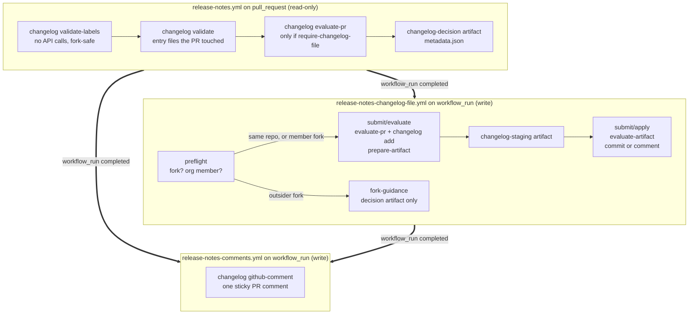
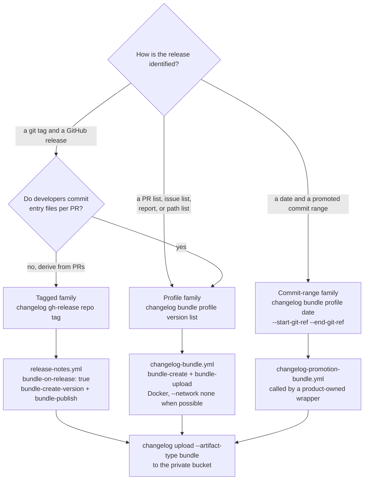
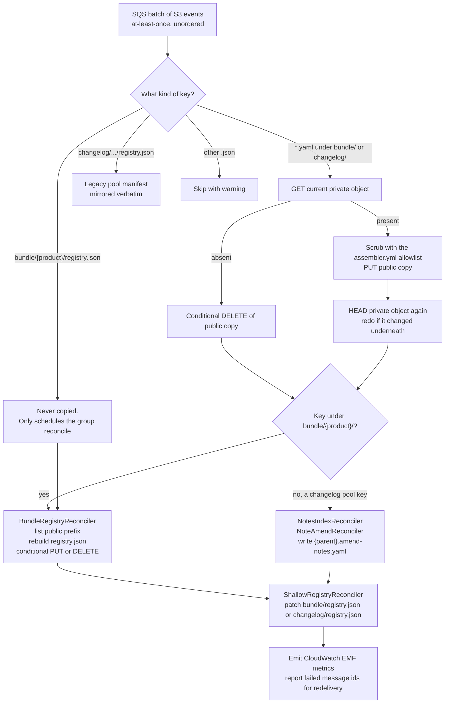
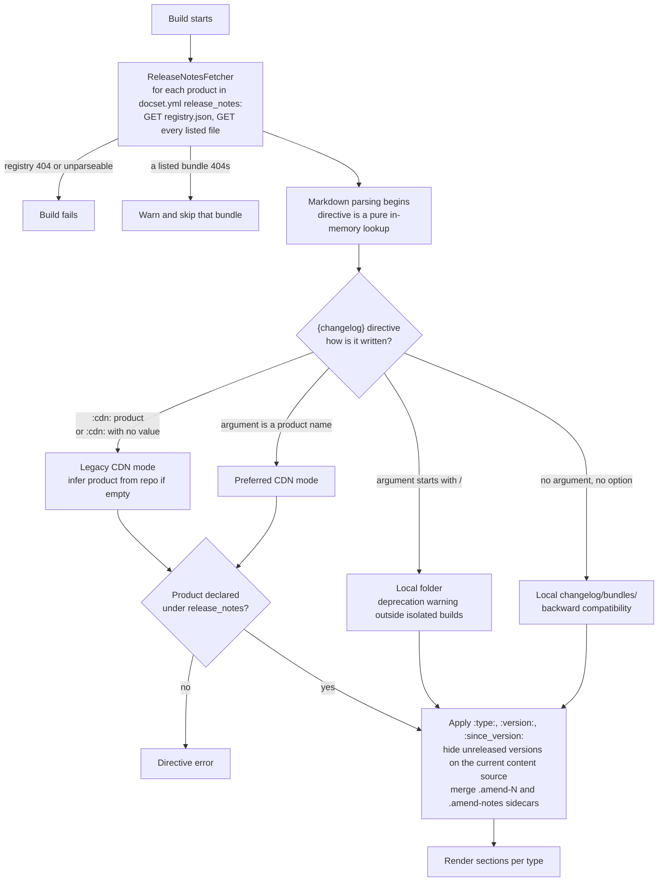
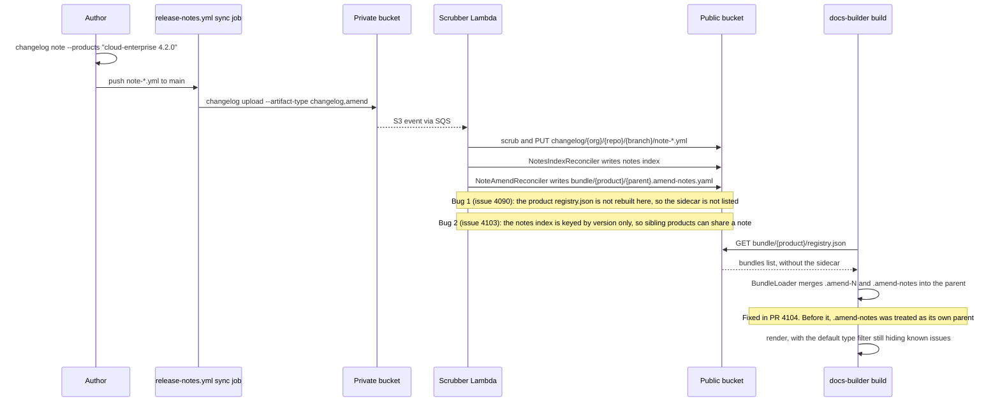
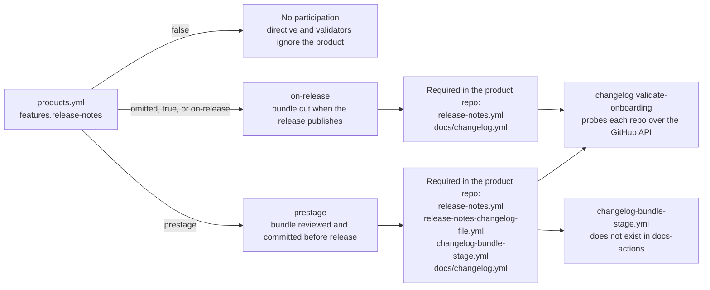
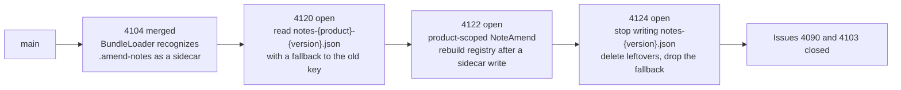

# Release notes automation: a handover guide

This page is for the person who takes over the release notes automation. It explains what the feature does, how the parts connect, where the code is, and what is not finished. It shows the state of `elastic/docs-builder` and `elastic/docs-actions` on 2026-09-17.

The user documentation is under [Release notes](/data/release-notes/index.md) and the [changelog CLI reference](/cli/changelog/index.md). This page does not repeat that documentation. It tells you how to read it. It also tells you where it is out of date.

## The idea in one paragraph

Each notable change gets one small YAML file. This file is a changelog entry. At release time, the tool collects the entries that shipped into one YAML file. This file is a bundle. CI uploads the bundle to a private S3 bucket. A Lambda function removes private references from the bundle and copies it to a public bucket behind a CDN. A docs page renders the bundle with the `{changelog}` directive. No text on the page is written by hand. A CLI command can also write the same content as Markdown, AsciiDoc, or GitHub-flavored Markdown files.

The design goal is simple. The team wants one source of truth for what shipped. The team wants one place where private references are removed. The team does not want copies of release notes in docs repositories.



```mermaid
flowchart LR
    PR["Pull request<br/>labels + title + body"]:::plain
    Entry["Changelog entry<br/>docs/changelog/*.yaml"]:::note
    Bundle["Bundle<br/>docs/releases/*.yaml"]:::note
    Private["Private S3 bucket<br/>full metadata"]:::important
    Lambda["Scrubber Lambda<br/>scrub + reconcile registry"]:::warning
    Public["Public S3 + CloudFront<br/>bundle/{product}/registry.json"]:::success
    Page["{changelog} directive<br/>rendered docs page"]:::success
    Files["changelog render<br/>Markdown / AsciiDoc / GFM"]:::plain

    PR -->|"changelog add (CI)"| Entry
    Entry -->|"changelog upload"| Private
    Entry -->|"changelog bundle / gh-release"| Bundle
    Bundle -->|"changelog upload"| Private
    Private -->|"S3 event via SQS"| Lambda
    Lambda --> Public
    Public -->|"prefetch at build start"| Page
    Bundle -.-> Files
```

## Three artifacts, two trees

Keep three artifacts and two S3 trees in mind when you read the code.

| Artifact | Shape | Who writes it | Where it goes |
|---|---|---|---|
| Changelog entry | One YAML file for each change. Fields: `type`, `title`, `products`, `prs`, `issues`, `description`, `areas`, `feature-id`, `highlight`. Notes use `note-*.yml` and have `products[].versions`. | Developers, or CI for them | Repo folder `docs/changelog/`, then S3 key `changelog/{org}/{repo}/{branch}/{file}` |
| Bundle | One YAML file for each release. Each entry is copied inline, with a `file` block for provenance. Can have `description`, `release-date`, `hide-features`, and `git_ref`. | `changelog bundle` or `changelog gh-release` in CI | Repo folder `docs/releases/`, then S3 key `bundle/{product}/{repo}-{product}-{version}.yaml` |
| Amend sidecar | `{parent}.amend-{N}.yaml` with `entries` and `exclude-entries`. The Lambda owns `{parent}.amend-notes.yaml`. | `changelog bundle-amend`, or the Lambda for notes | Next to the parent bundle |

The private bucket is `elastic-docs-v3-changelog-bundles-private`. The public bucket is `elastic-docs-v3-changelog-bundles`. CloudFront serves the public bucket. Only the CI uploader writes to the private bucket. Only the scrubber Lambda writes to the public bucket. This rule is the complete security model. Read [Changelog bundle registry](./changelog-bundle-registry.md) for the consistency model.

The two trees are different. The bundle tree is grouped by product. The Lambda rebuilds one `registry.json` for each product from the public listing. The changelog tree is grouped by authoring repository. It has no maintained index. Old CLI versions wrote a pool `registry.json`. The Lambda still copies those files. New code does not read them. New code gets `{pr}.yaml` directly.

## Where the code is

Most code is in `elastic/docs-builder`. The GitHub Actions are in `elastic/docs-actions`. The AWS infrastructure is in `docs-infra`. You cannot see `docs-infra` from this repository.

| Concern | Location |
|---|---|
| CLI surface, one method for each subcommand | `src/tooling/docs-builder/Commands/ChangelogCommand.cs` (about 2600 lines) |
| Business logic | `src/services/Elastic.Changelog/` with the folders `Creation`, `Bundling`, `Rendering`, `Uploading`, `Scrubbing`, `Reconciliation`, `Evaluation`, `GitHub`, `GithubRelease`, `Backfill`, `Onboarding`, and `AllowlistIdentity` |
| Entry and bundle models | `src/Elastic.Documentation/ReleaseNotes/` |
| `changelog.yml` schema and loader | `src/Elastic.Documentation.Configuration/Changelog/` |
| CDN fetchers, registry model, bundle loader, amend merger | `src/Elastic.Documentation.Configuration/ReleaseNotes/` |
| The `{changelog}` directive | `src/Elastic.Markdown/Myst/Directives/Changelog/ChangelogBlock.cs` |
| Scrubber Lambda entry point | `src/infra/docs-lambda-changelog-scrubber/Program.cs`. It is a thin adapter over `ScrubberProcessor`. |
| Lambda build and deploy | `.github/workflows/build-changelog-scrubber-lambda.yml` and the `deploy-changelog-scrubber-lambda-prod` job in `release.yml` |
| `products.yml` feature flags | `config/products.yml` and `src/Elastic.Documentation.Configuration/Products/Product.cs` |
| Example config | `config/changelog.example.yml` |
| Reusable workflows | `docs-actions/.github/workflows/changelog-*.yml` and `release-notes*.yml` |
| Composite actions | `docs-actions/changelog/*` |

The largest file is `Bundling/ChangelogBundlingService.cs`. It has about 2400 lines. It decides where entries come from. It applies profiles and rules. It writes the bundle. Read it from start to end before you change the bundling code.

The tests are good. `tests/Elastic.Changelog.Tests` has about 1200 test cases in 93 files. The directive tests are in `tests/Elastic.Markdown.Tests/Directives/Changelog*`. The CDN fetcher tests are in `tests/Elastic.Documentation.Configuration.Tests/ReleaseNotes`. Run them with `dotnet test tests/Elastic.Changelog.Tests/`. There are no integration tests for this area.

## The lifecycle, from start to end

This section follows one change from a pull request to a published page. It uses the shapes that CI runs today.

### A pull request opens

The consumer repository runs the `release-notes.yml` reusable workflow on `pull_request`. The workflow has read-only permissions. It runs three gates:

1. `changelog validate-labels` checks that the labels map to a type. If configured, it also checks for a product. It makes no API calls. It is safe for forks.
2. `changelog validate` checks each entry file that the PR changed. It checks the YAML, the required fields, and that PR numbers in file names exist in the repository.
3. `changelog evaluate-pr` runs only when `require-changelog-file` is set. It detects bot loops and manual edits.

Each gate writes a small `metadata.json` decision file. The workflow uploads it as the `changelog-decision` artifact.

A second workflow, `release-notes-changelog-file.yml`, runs on `workflow_run` after the first workflow completes. It has write permissions, because `workflow_run` uses the base branch context. It evaluates the PR again with fresh API data. It runs `changelog add` with the `CHANGELOG_*` environment variables. Then it commits the entry to the PR branch, or it posts the entry as a comment. The evaluate step and the apply step are separate composite actions. An artifact connects them. The commands `changelog prepare-artifact` and `changelog evaluate-artifact` exist only for that handoff.

A third workflow, `release-notes-comments.yml`, downloads the decision artifact. It calls `changelog github-comment` to post or update one sticky comment on the PR.

The three workflows have different trust levels. The read-only workflow runs in the PR context. The two write workflows run on `workflow_run`. Artifacts carry state across that boundary.



Two older workflow names, `changelog-validate.yml` and `changelog-submit.yml`, do the same job. The onboarding validator accepts both shapes. New consumers must use the `release-notes*` shape.

Fork PRs are special. The upstream token cannot push to a fork branch. A fork PR from an Elastic organization member gets the entry as a comment. A fork PR from a person outside Elastic is skipped. That person gets guidance only. The organization membership check uses a short-lived token from Vault. It depends on `elastic/ci-gh-actions`. The docs-actions README says that the upload workflow regenerates fork entries at merge time. That code was removed on 2026-08-31 in docs-actions pull request 319. Today, a fork PR entry that was never committed is not uploaded. That README paragraph is out of date.

### The pull request merges

On `push` to the default branch, the `sync` job in `release-notes.yml` runs `changelog upload --artifact-type changelog,amend`. It authenticates to AWS with GitHub OIDC. The IAM role name starts with `elastic-docs-v3-changelog-`. The upload is incremental. It compares content hashes and skips files that did not change. The `--skip-etag-check` flag uploads all files again. This flag is the only repair tool. Each upload sends an S3 event. The Lambda then reconciles the group again.

Each consumer repository needs an IAM role in `docs-infra`. A person in docs engineering creates that role by hand. The docs say "contact the docs-engineering team". That team is now you.

### A release happens

There are three bundle families. Select the correct family for the product. Do not mix them.



**Tagged releases** use `changelog gh-release`. The `bundle` job in `release-notes.yml` runs when `bundle-on-release` is true. It uses the `bundle-create-version` and `bundle-publish` composite actions. The command asks GitHub for the previous tag with the `generate-notes` endpoint. It lists the commits in the range with the compare API. It resolves each commit to its PR. For each PR, it first looks on the CDN for a committed entry at `changelog/{org}/{repo}/{branch}/{pr}.yaml`. If the entry exists, the command uses it as is. If not, the command builds an entry from the PR title, the labels, and the release-note text in the body. Release body parsing was removed on 2026-09-15 in pull request 4092. The `ReleaseNoteParser` class is still in the code. No production path calls it. This repository uses the tagged family for its own release notes in `.github/workflows/changelog-publish.yml`.

**Profile releases** use `changelog bundle <profile> <version> [report|list]`. Profiles are under `bundle.profiles` in `changelog.yml`. The source of truth can be a PR list, an issue list, a Buildkite promotion report, a path list, or a `products` pattern that matches local files. The `changelog-bundle.yml` reusable workflow runs the command in Docker. It uses `--network none` when the plan step reports that no network is needed. The plan step is `changelog bundle --plan`. It writes `output_path`, `mode`, `needs_network`, and `needs_github_token` as step outputs.

**Date-promotion releases** use the same command with `--start-git-ref` and `--end-git-ref`. This is the shape for serverless, Cloud Hosted, and Cloud Enterprise. The promotion pipeline gives two commit hashes to a wrapper workflow in the product repository. The wrapper calls `changelog-promotion-bundle.yml`. The version is always the UTC date. The bundle records the end ref as `git_ref`. The `--dry-run` flag prints a Markdown report. The report lists each PR and the source of its entry. Read that report before you trust a new wiring. See [The status of serverless release notes](#serverless-status) for what runs today.

Each family resolves each PR the same way. A committed entry in the CDN pool wins. If there is none, the command builds one from the PR title, labels, and release-note text. A PR that the command cannot fetch is reported as missing. It is never dropped without a message.

All three families end with `changelog upload --artifact-type bundle`. The bundle is written under `bundle/{product}/` for each product that it declares.

Old bundles in the private bucket can contain `# PRIVATE:` sentinels. Pull request 4105, merged on 2026-09-16, stopped link removal at bundle time. It marked `bundle.link_allow_repos` obsolete. The private bucket now holds full metadata, because an Elasticsearch indexing pipeline needs it. Several documentation pages still describe `link_allow_repos` as important. They are wrong. The `changelog init` command still writes it into new configs.

### The Lambda scrubs and reconciles

An S3 event on the private bucket goes to SQS. The Lambda reads a batch of messages. It treats each event as a signal that a key can have changed. It never treats the event as an instruction. For each key, it reads the current private object. If the object exists, the Lambda scrubs it and writes the public copy. If the object does not exist, the Lambda deletes the public copy. Then it rebuilds the product `registry.json` from the public listing. It also updates the shallow map for the tree. For a note upload, `NotesIndexReconciler` updates a notes index. `NoteAmendReconciler` writes or refreshes `{parent}.amend-notes.yaml` for each bundle that already shipped.



The allowlist comes from `config/assembler.yml`. The build embeds this file in the Lambda binary. Each reference repository that is not marked `private: true` is allowed. Sixteen repositories are marked private today. A change to `assembler.yml` changes what can appear on the public CDN. The release workflow deploys the Lambda again. It attaches a `changelog-scrubber-allowlist.json` identity file to the GitHub release. The `changelog scrubber-allowlist` command reads that identity. Backfill plans pin it.

Writes use S3 conditional requests with retries. A message that fails goes to a dead-letter queue. Alerts and a redrive runbook are tracked in `docs-eng-team`. They are not finished. There is no operator CLI to reconcile or verify. That was a deliberate decision.

### A docs build renders the page

A docset that wants CDN release notes declares each product under `release_notes` in `docset.yml`. At build start, before any Markdown is parsed, `ReleaseNotesFetcher` gets `bundle/{product}/registry.json` for each declared product. It also gets each listed file. If a registry cannot be fetched, the build fails. If one listed bundle returns 404, the build writes a warning and continues.

The `{changelog}` directive selects from the prefetched set. The preferred syntax is `:::{changelog} elasticsearch`. The `:cdn:` option is the old spelling. It still works. An argument that starts with `/` means a local folder. In non-isolated builds it gives a deprecation warning. A bare `:::{changelog}` with no argument still reads the local `changelog/bundles/` folder. Three `TODO` comments in `ChangelogBlock.cs` describe the removal of the local path after all consumers migrate.



Two behaviors are easy to miss. On production, the `current` content source hides each bundle with a version newer than the product's current release in `versions.yml`. On staging, the `next` content source shows it. This rule lets prestage products upload before release day. Date-based products are never filtered. Second, the default `:type:` hides breaking changes, deprecations, and known issues. A new known-issue note does not appear on a page unless the page asks for that type.

### A late note arrives

Some content has no PR. Examples are a known issue, a security advisory, and a correction after release. The `changelog note` command writes a `note-{slug}.yml` file with `products[].versions`. The upload is the same as for other entries. If the release bundle already shipped, the Lambda writes `{parent}.amend-notes.yaml`. The note then reaches the page without a new bundle. The `.amend-notes` suffix is reserved. Do not create such files by hand.

This path is the least stable part of the system. See [What is in progress](#what-is-in-progress). The sequence below shows the intended path. It marks the two places where the path breaks on `main` today.



## Configuration files

Four configuration files control the behavior. Know which file owns which decision.

`changelog.yml` in the consumer repository owns authoring and bundling. Its sections are `filename`, `products`, `extract`, `lifecycles`, `pivot`, `rules`, and `bundle`. The `pivot` section maps GitHub labels to types, areas, products, features, and the highlight flag. The `rules.create` section decides which PRs get entries. The `rules.bundle` section removes entries from bundles. It has three modes. The [configuration reference](/data/release-notes/configure-ref.md#rules-bundle) explains them. Mode 3, per-product rules, has a "pass-through" case that surprises people. Read that section two times.

`config/products.yml` in this repository owns participation. The `features.release-notes` value can be `false`, `on-release`, or `prestage`. An omitted value means `on-release`. Only two playground products declare a path today. Each other product without `release-notes: false` is `on-release` by default. The `changelog validate-onboarding` command checks these products. It checks that their repositories have the required workflow files and a `changelog.yml`.

`docset.yml` in the consumer repository owns rendering. The `release_notes` list declares the products that the build gets from the CDN. Open pull request 4116 also uses this list to limit the products that a repository can name in its entries.

`config/assembler.yml` in this repository owns scrubbing, through the `private: true` flag. The docs-builder CLAUDE.md marks this file as high risk for this reason.

## The CLI surface

Twenty subcommands are under `docs-builder changelog`. Group them by audience.

| Audience | Commands |
|---|---|
| Authors | `init`, `add`, `note`, `unpack` |
| Release coordinators | `bundle`, `bundle-amend`, `remove`, `gh-release`, `render`, `upload` |
| CI internals, called by docs-actions | `evaluate-pr`, `validate-labels`, `validate`, `prepare-artifact`, `evaluate-artifact`, `github-decision`, `github-comment` |
| Operators | `validate-onboarding`, `scrubber-allowlist`, `backfill` |

Only `remove` has a destructive intent attribute. `upload` writes to production S3. It is not marked destructive, because it only adds or overwrites objects. No command deletes from S3. Issue 4072 tracks that gap.

When you change a command, regenerate `docs/cli-schema.json`:

```bash
dotnet run --project src/tooling/docs-builder -- __schema > docs/cli-schema.json
```

The pages under `docs/cli/changelog/` are hand-written additions to that schema.

## Two onboarding paths

The release-notes onboarding RFC in `docs-eng-team` defines two paths. The `ReleaseNotesPath` enum in the code has the same two values.



An **on-release** product cuts its bundle when the release is published. It needs one workflow file, `release-notes.yml`, with `bundle-on-release: true`. This is the simple path for tagged products such as agents and SDKs. The playground repository `docs-playground-release-notes-tagged` uses it.

A **prestage** product reviews and commits its bundle before release day. The onboarding validator requires `release-notes.yml`, `release-notes-changelog-file.yml`, and `changelog-bundle-stage.yml`. The last file does not exist in docs-actions as a reusable workflow. The validator requires it. Nothing provides it. The playground repository `docs-playground-release-notes-changelogs` uses this path. If a real product onboards as prestage, this is the first thing that breaks.

## Who can write to the S3 buckets

A common question is what stops a person outside Elastic from running `changelog upload` against the buckets. The answer is: nothing in `docs-builder` itself. The gate is AWS IAM and the GitHub OIDC identity. The gate lives in `docs-infra`.

**The CLI has no gate of its own.** The `changelog upload` command creates a plain `AmazonS3Client()`. The AWS SDK finds credentials in the environment. Any person can download the binary and run the command. Without valid credentials, the first `PutObject` call fails with an access-denied error. The bucket is private. There is no anonymous write path. The command is not marked as destructive or as needing authentication in the CLI metadata. That mark would help clarity. It would not enforce anything.

**The IAM role for each repository is the real gate.** In CI, the `aws/auth` action builds a role name. The name is a fixed prefix plus the SHA-256 hash of `GITHUB_REPOSITORY`. The action assumes the role through GitHub OIDC. Two conditions must be true. The role must exist. A person in docs engineering creates it in `docs-infra` for one specific repository. The trust policy of the role must accept the OIDC token. The token has a `sub` claim such as `repo:elastic/kibana:ref:refs/heads/main`. A fork or a repository in another organization makes a different hash. It points at a role that does not exist. If a person guesses the hash, the `sub` claim still names their own repository. A correct trust policy rejects it. A person outside Elastic cannot reach the private bucket from their own repository.

**Fork pull requests cannot reach it.** The upload action stops unless the ref is a branch push. The `release-notes.yml` workflow runs its `sync` job only on `push` events. Fork PRs run under `pull_request`. GitHub gives them a read-only token. The validate and submit split exists to keep write permissions out of the PR context.

The only way for external content to reach the bucket is a merge by an Elastic member. That is the intended design. The review gate is the content gate.

**Three things to check in `docs-infra`.** The upload is keyed by what the caller passes and what the YAML says. It is not keyed by who calls. A bundle goes under `bundle/{product}/` for the product in the YAML. Any onboarded repository with a role can write bundles for any product. Entry keys use `--owner` and `--repo` from the workflow. I could not confirm that the IAM policy limits each role to its own `changelog/elastic/{repo}/` prefix. The upload docs describe prefix limits as an option. That suggests the limit is not applied. Pull request 4116 adds a product allowlist at PR validation time. Nothing checks at upload time. The scrubber removes only private links. Titles and descriptions pass through. A bad upload becomes public text on each docs page that declares that product.

Verify three items when you get access to `docs-infra`:

1. The `sub` condition in the trust policy.
2. Whether the trust policy limits the ref to `refs/heads/main` or accepts any branch.
3. Whether the S3 policy of each role is limited to the repository's own prefix.

Those answers decide whether the risk is "a person outside Elastic" or "any employee with push access to any onboarded repository". Today the code protects only against the first.

## The status of serverless release notes [serverless-status]

A second common question is whether serverless release notes are still manual. The answer is: not fully manual, but not automated from start to end. The tooling half exists. The trigger half is not visible from these repositories. The evidence says that a person still cuts the dated bundle.

**What exists for serverless.** Serverless is the reason the date-promotion family exists. Two pull requests from `cotti` on 2026-08-13 added commit-range bundling and the `git_ref` field. The same day, docs-actions got `changelog-promotion-bundle.yml`, first as a stub and then with a real body. In the design, a serverless quality gate gives two commit hashes to a wrapper workflow in the product repository. docs-builder derives the PR list from that range. The version is the UTC date. The bundle uploads. The `{changelog} cloud-serverless` directive merges the Elasticsearch, Kibana, and Cloud bundles that share one date into one section. The `{repo}-{product}-{version}.yaml` names from early September exist so those three repositories can publish the same product and date without conflict.

**What is not visible.** The wrapper workflows would be in `elasticsearch`, `kibana`, and `cloud`. The dispatch would come from their Buildkite quality gates or argocd pipelines. Those repositories are outside the scope of this analysis. The header comment in the promotion workflow describes those callers in a prescriptive way. It reads as an integration contract, not as a description of a running system. The public CDN registry for `cloud-serverless` could not be read during this analysis. A bundle with a `git_ref` field would prove that automation ran.

**What the evidence says.** Pull request 3848 describes the state before it as "unblocked manually" through pull request 3783. Pull request 3783, merged on 2026-08-10, let a release coordinator bundle from a hand-written path list against entries that exist only on the CDN. Before that, coordinators for the `cloud` repository downloaded files by hand. On 2026-08-27, `lcawl` filed issue 3956 while running `changelog add` against a `docs/temp/prs.txt` list for `cloud-serverless 2026-08-27`. That is a writer who assembles a serverless release by hand from a PR list. The docs still show the older path too: render a Kibana serverless bundle to Markdown snippets and include them in the `docs-content` page. The `elastic/cloud` repository could not resolve to its three products until pull request 4022 on 2026-09-03. Automated bundling from that repository could not work before that date.

Pull request 4065 from 2026-09-09 shows a `{changelog}` block with `:cdn: cloud-serverless`. It renders a full page of real content with highlights. Bundles for the product exist on the CDN. The rendering side works.

**The current read.** As of 2026-09-17, Kibana is not onboarded. The current maintainer names Kibana as the first team to onboard after the system is stable. So the Kibana entries on the CDN come from tests or hand runs, not from the PR workflows. A person cuts the dated serverless bundle with a path list or a PR list and uploads it. Known-issue notes for serverless hit the broken late-note path until the four-PR stack lands. The promotion-triggered automation is designed and tested. It is probably not wired.

Three checks settle this question when you have access:

1. Search the three product repositories for a workflow that calls `changelog-promotion-bundle.yml`.
2. Get `bundle/cloud-serverless/registry.json` from the CDN and open the newest bundles. A `git_ref` field means automation. No `git_ref` field means a hand-cut list.
3. Open the serverless release notes page source in `docs-content`. Check whether it is a `{changelog}` block or hand-written Markdown with includes.

## What is live, and what is not

Be honest about maturity. The code is complete in many areas. The production use is small.

The pipeline works from start to end for this repository's own release notes and for the two playground repositories. The `elastic/cloud` repository is the first real multi-product consumer. Its Cloud Enterprise page is where the late-note bugs were found. The serverless date-promotion shape has a reusable workflow. Its real wiring depends on product pipelines that this team does not control.

The Release Notes Explorer is a placeholder page with one sentence. No code exists for it.

The `--target elasticsearch` option on `changelog upload` is accepted. It writes a warning and uploads nothing. The reason to keep full metadata in the private bucket is an Elasticsearch indexing pipeline. That pipeline does not exist in this repository yet.

The `changelog backfill` command parses forty published release-notes pages into entries and bundles. It is for the migration of old content. It writes to disk only. Nothing has been published from it. Its output layout, `bundles/{version}.yaml`, predates the `{repo}-{product}-{version}.yaml` convention.

The persistent disk cache for CDN bundles does not exist. The registry design page lists it as a follow-up. Each cold build reads from the CDN.

## What is in progress [what-is-in-progress]

As of 2026-09-17, `lcawl` has a stack of four pull requests that fix the late-note path. Phase one merged as 4104. Phases two to four are 4120, 4122, and 4124. Each later phase is based on the branch of the phase before it. They must merge in order.



Together, these pull requests make the notes index product-scoped instead of version-scoped. They make the Lambda rebuild the product registry after it writes an amend-notes sidecar. They make `BundleLoader` recognize `.amend-notes.yaml` as a sidecar. Issues 4090 and 4103 describe the root causes. Until the stack merges, a note uploaded after a bundle shipped does not appear on CDN pages. A note for one product can leak into the amend sidecar of a sibling product when both share a version string.

Pull request 4125 lets `bundle-amend` replace the intro description of a bundle without a new bundle. Pull request 4065 splits "Features and enhancements" into two sections and adds `keep-feature-descriptions`. Pull request 4116 limits entry products to what the repository declares. Pull request 4075 adds `--overwrite` to upload. Pull request 3995 removes two outputs from `evaluate-artifact` that docs-actions still reads. If that one merges, `submit/apply/action.yml` must change in the same week.

`Mpdreamz` is the other main contributor. Reviews go to `akira28`. Most recent code was written with AI assistance. The PR bodies say so. The test suite makes that safe. Keep it that way.

## Priorities from the current maintainer

On 2026-09-17, the current maintainer described three areas where help is most useful. They are listed here in order of urgency. The maintainer noted that the team leads can override this order.

**A stable baseline that must not change.** Teams that use the tooling have had broken release-notes processes. Changes landed in docs-builder or docs-actions without a warning to the teams. There is no contract today that says "if you change X in docs-builder, you must also fix Y in docs-actions". An internal skill repository, `elastic-docs-skills-internal`, has a `changelog-tool` skill that tries to document the contract. It does not scale to other people or to CI checks. The maintainer compared this to the wider Elastic breaking-changes problem.

The two repositories have several points where such a contract is needed. Every docs-actions changelog action uses `docs-builder-version: edge`. The composite actions read named step outputs from `evaluate-pr`, `validate-labels`, `evaluate-artifact`, and `bundle --plan`. They pass boolean flags as presence switches. They read `metadata.json` fields such as `status` and `gate`. Pull request 3995 is an example. It removes outputs that `submit/apply/action.yml` still reads. Possible first steps are a list of the step outputs and metadata fields that docs-actions consumes, a test in docs-builder that fails when one of them changes, and a release-notes label or changelog type for breaking changes to the CLI contract.

**Help with the open gaps, in particular the changelog note path.** The issue list in `docs-content-internal` issue 188 names the most urgent items. All the broken `changelog note` functionality is on that list. The maintainer wrote issues and added AI-generated plans to them. The other main contributor works on the core pipeline and the GitHub Actions. That leaves one person to fix bugs that affect current rollouts. Help can be as small as a discussion of alternative solutions that another person then implements. The rate of change makes it hard for one person to find and fix the bugs.

**Onboarding of teams, but not yet.** The maintainer does not want to onboard more teams until the system is stable and well tested. The plan is to turn the feature on in `docs-content` first. Writers can then learn the tool, find more bugs, and perhaps publish docs-specific release notes. After that, Kibana is the first team to onboard. Experience with rollouts to many repositories is useful at that point. The other main contributor is more optimistic about how soon that can happen.

These three areas match the gaps in this page. The stable baseline is the answer to the stale docs and the `edge` pin. The note path is the four-PR stack. The onboarding work is the prestage gap and the missing `changelog-bundle-stage.yml` workflow.

## Known gaps and stale documentation

These are the places where the documentation, the code, and the actions disagree today.

The `link_allow_repos` setting is obsolete in code. The bundle guide, the configuration reference, the bundle command reference, and the `changelog init` template still describe it as important. Issue 3956 tracks a related problem. The `changelog add` docs and help text still show a version in `--products`. The command now rejects that.

The docs-actions changelog README still describes fork-PR regeneration at merge time. That code was removed.

The onboarding validator requires the `changelog-bundle-stage.yml` workflow. That workflow does not exist.

The `elastic/docs-internal-workflows` repository still depends on the frozen `bundle-create` and `bundle-upload` composite actions. New consumers must use `bundle-create-version` and `bundle-publish`. You cannot delete the frozen ones until that repository migrates.

Each docs-actions changelog action uses `docs-builder-version: edge`. Consumers run the most recent merge to `main`. This makes iteration fast. It makes rollback hard. The comment in this repository's `changelog-publish.yml` says "pin to a released version once one ships with it". Nobody has.

Issue 4072 asks for a way to unpublish a note. Issue 2973 asks for profiles that do not need a version argument. Both are small. Both remove real friction.

The DLQ alerts and the redrive runbook for the Lambda are tracked in `docs-eng-team`. They are not done. Today, a bundle that fails scrubbing disappears without a message to the operator.

## Things that cause problems

The Nullean.Argh CLI framework treats each boolean option as a presence switch. `--can-commit false` sets the value to true. The composite actions build argument arrays for this reason. Copy that pattern.

S3 events arrive at least one time and in any order. Do not write Lambda code that acts on the event type. Always read the current state.

A missing registry means "unpublished". It fails the build of a declared consumer. An empty registry never exists. The Lambda deletes the registry instead of writing an empty one. Do not change that.

Profile bundle names are `{repo}-{product}-{version}.yaml`. This lets two repositories publish the same product and version. If the repository cannot be resolved, the name becomes `{product}-{version}.yaml`. Then collisions are possible. Set `bundle.repo`.

The directive does not list S3. It reads the registry. If a file exists in the bucket and not in the registry, the page does not show it. Any private-bucket event under that product prefix repairs the registry.

The `changelog remove` command deletes local files only. Bundles are self-contained, so this is safe. The command does not touch S3.

This repository is a shallow clone in remote sessions. `git log` shows about fifty commits. Use GitHub for older history.

## How to work on it

Run `./build.sh unit-test` before you push. Run `dotnet test tests/Elastic.Changelog.Tests/` while you iterate. Run `dotnet curb format .` to fix formatting. Never use `--no-verify`.

When you change rendering, update `docs/syntax/changelog.md`. When you change a command, update `docs/cli/changelog/cmd-*.md` and regenerate the schema. When you change the CDN or Lambda contract, update `docs/development/changelog-bundle-registry.md`. That page is the closest thing to a design document. People trust it.

To test the Lambda locally, build the Docker image. The instructions are in `src/infra/docs-lambda-changelog-scrubber/README.md`. The reconcilers take an `IAmazonS3` client. The tests use a `FakeS3` in `tests/Elastic.Changelog.Tests/Reconciliation/`. Add your scenario there first.

To test a consumer from start to end, use the two playground repositories. They exist for this purpose.

To point a local build at a staging CDN, set `DOCS_BUILDER_CHANGELOG_CDN`. The `bundle-fetch` action passes `cdn-base-url` through the same variable.

## A suggested first week

Spend the first day on reading, not on changes. Read [Changelog bundle registry](./changelog-bundle-registry.md), then `ScrubberProcessor.cs`, then `ChangelogBundlingService.cs`. Read the three `release-notes*.yml` reusable workflows in docs-actions. Follow one PR through them.

On the second day, run the playground. Open a PR in `docs-playground-release-notes-changelogs`. Watch the three workflows. Read the sticky comment. Then publish a release in `docs-playground-release-notes-tagged`. Find the bundle on the CDN.

On the third day, review the open pull request stack for the late-note path. It touches the Lambda, the loader, and the directive at the same time. It shows the seams of the system faster than anything else.

On the fourth day, start the baseline contract. List each step output and metadata field that docs-actions reads from docs-builder. That list is the first version of the contract the maintainer asked for.

After that, fix the documentation debt. The `link_allow_repos` pages and the fork-PR paragraph are low risk and clearly useful. The work touches each user-facing page one time.

You inherit a system that is well tested, in active development, and used in few places. The hard part is not the code. The hard part is to decide which of the unfinished edges to finish first, and to keep the docs honest while you do it.
