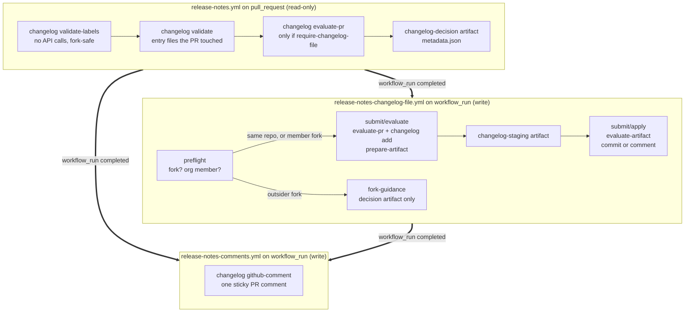
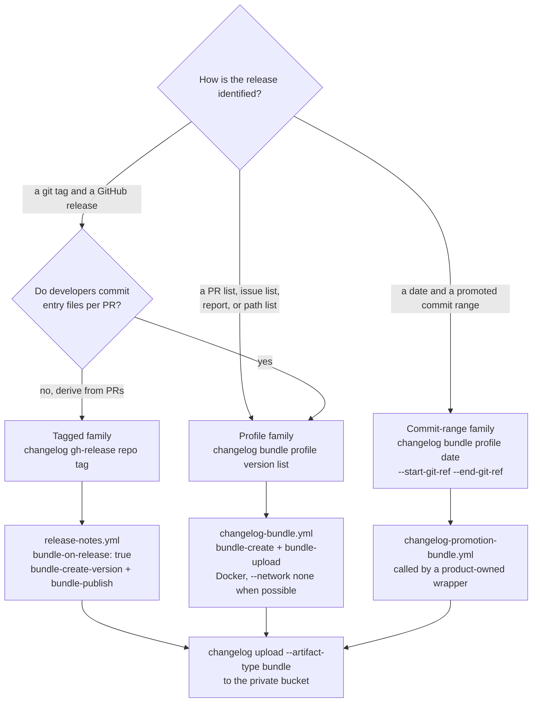
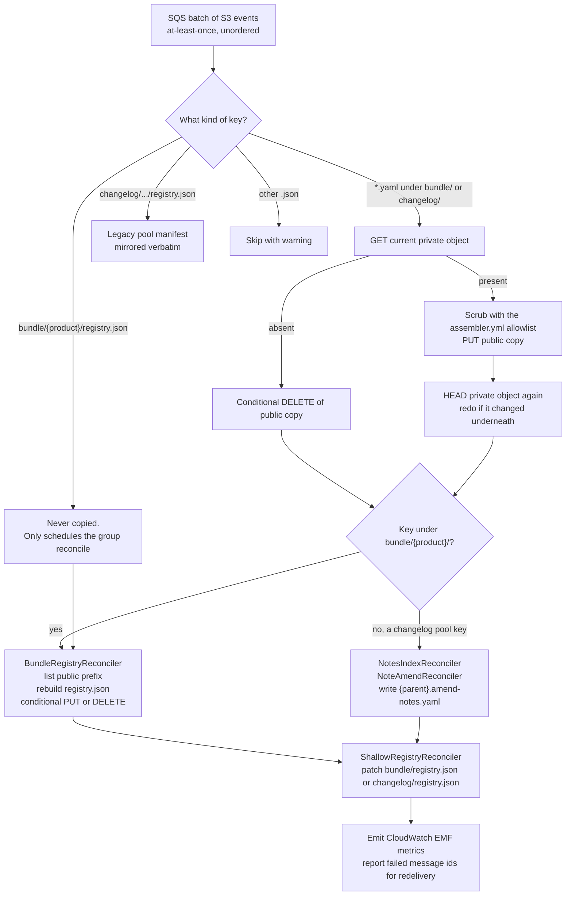
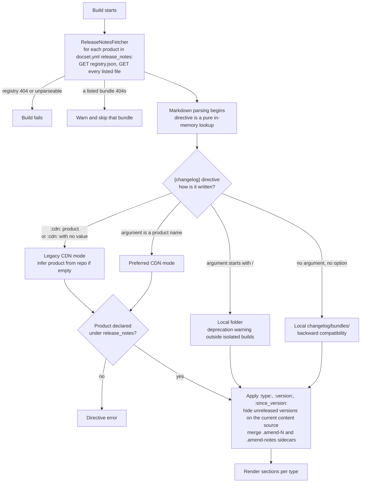
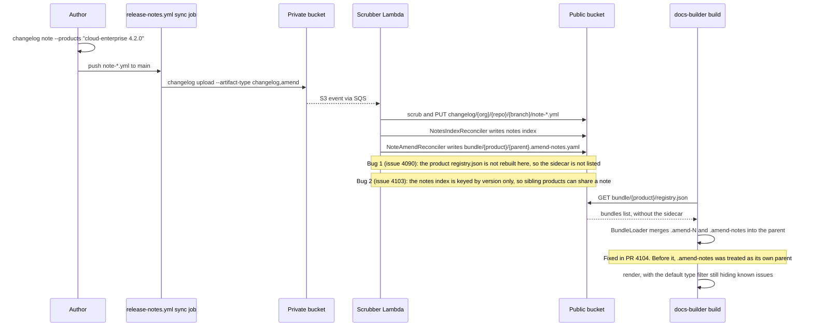
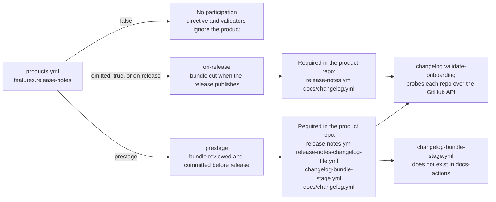
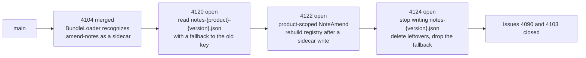

# Release notes automation: a handover guide

This page is for the person who takes over the release notes automation. It explains what the feature is, how the moving parts fit together, where the code lives, and what is not finished. It reflects the state of `elastic/docs-builder` and `elastic/docs-actions` on 2026-09-17.

The user-facing documentation lives under [Release notes](/data/release-notes/index.md) and the [changelog CLI reference](/cli/changelog/index.md). This page does not repeat it. It tells you how to read it, and where it is already out of date.

## The idea in one paragraph

Every notable change gets a small YAML file, called a changelog entry. At release time, the entries that shipped are collected into one self-contained YAML file, called a bundle. The bundle is uploaded to a private S3 bucket. A Lambda function scrubs private references from it and copies it to a public bucket behind a CDN. A docs page then renders the bundle with the `{changelog}` directive. Nothing on the page is hand-written. The same pipeline can also produce Markdown, AsciiDoc, or GitHub-flavored Markdown files with a CLI command.

The design goal behind the churn you will see in the history is simple. The team wants one source of truth for "what shipped", one place where scrubbing happens, and no vendored copies of release notes in docs repositories.

```mermaid
flowchart LR
    PR["Pull request<br/>labels + title + body"]:::plain
    Entry["Changelog entry<br/>docs/changelog/*.yaml"]:::note
    Bundle["Bundle<br/>docs/releases/*.yaml"]:::note
    Private["Private S3 bucket<br/>full metadata"]:::important
    Lambda["Scrubber Lambda<br/>scrub + reconcile registry"]:::warning
    Public["Public S3 + CloudFront<br/>bundle/{product}/registry.json"]:::success
    Page["{changelog} directive<br/>rendered docs page"]:::success
    Files["changelog render<br/>Markdown / AsciiDoc / GFM"]:::plain

    PR -->|"changelog add (CI)"| Entry
    Entry -->|"changelog upload"| Private
    Entry -->|"changelog bundle / gh-release"| Bundle
    Bundle -->|"changelog upload"| Private
    Private -->|"S3 event via SQS"| Lambda
    Lambda --> Public
    Public -->|"prefetch at build start"| Page
    Bundle -.-> Files
```

## Three artifacts, two trees

You will read the code more easily if you keep three artifacts and two S3 trees in mind.

| Artifact | Shape | Who writes it | Where it lands |
|---|---|---|---|
| Changelog entry | One YAML file per change. Fields: `type`, `title`, `products`, `prs`, `issues`, `description`, `areas`, `feature-id`, `highlight`. Notes use `note-*.yml` and carry `products[].versions`. | Developers, or CI on their behalf | Repo folder `docs/changelog/`, then S3 `changelog/{org}/{repo}/{branch}/{file}` |
| Bundle | One YAML file per release. Every entry is embedded inline, with a `file` block for provenance. Can carry `description`, `release-date`, `hide-features`, `git_ref`. | `changelog bundle` or `changelog gh-release` in CI | Repo folder `docs/releases/`, then S3 `bundle/{product}/{repo}-{product}-{version}.yaml` |
| Amend sidecar | `{parent}.amend-{N}.yaml` with `entries` and `exclude-entries`. `{parent}.amend-notes.yaml` is reserved for the Lambda. | `changelog bundle-amend`, or the Lambda for notes | Next to the parent bundle |

The private bucket is `elastic-docs-v3-changelog-bundles-private`. The public bucket is `elastic-docs-v3-changelog-bundles`, served by CloudFront. Only the CI uploader writes to the private bucket. Only the scrubber Lambda writes to the public bucket. That invariant is the whole security story. Read [Changelog bundle registry](./changelog-bundle-registry.md) for the full consistency model.

The two trees behave differently. The bundle tree is product-scoped and has a per-product `registry.json` that the Lambda reconciles from the public listing. The changelog tree is authoring-repo-scoped and has no maintained index anymore. Older CLI versions wrote a pool `registry.json`, and the Lambda still mirrors those verbatim, but new code probes `{pr}.yaml` directly instead.

## Where the code lives

Almost everything is in `elastic/docs-builder`. The GitHub Actions glue is in `elastic/docs-actions`. The AWS infrastructure is in `docs-infra`, which you cannot see from this repository.

| Concern | Location |
|---|---|
| CLI surface, one method per subcommand | `src/tooling/docs-builder/Commands/ChangelogCommand.cs` (about 2600 lines) |
| Business logic | `src/services/Elastic.Changelog/` with folders `Creation`, `Bundling`, `Rendering`, `Uploading`, `Scrubbing`, `Reconciliation`, `Evaluation`, `GitHub`, `GithubRelease`, `Backfill`, `Onboarding`, `AllowlistIdentity` |
| Entry and bundle models | `src/Elastic.Documentation/ReleaseNotes/` |
| `changelog.yml` schema and loader | `src/Elastic.Documentation.Configuration/Changelog/` |
| CDN fetchers, registry model, bundle loader and amend merger | `src/Elastic.Documentation.Configuration/ReleaseNotes/` |
| The `{changelog}` directive | `src/Elastic.Markdown/Myst/Directives/Changelog/ChangelogBlock.cs` |
| Scrubber Lambda entry point | `src/infra/docs-lambda-changelog-scrubber/Program.cs`. It is a thin adapter over `ScrubberProcessor`. |
| Lambda build and deploy | `.github/workflows/build-changelog-scrubber-lambda.yml` and the `deploy-changelog-scrubber-lambda-prod` job in `release.yml` |
| `products.yml` feature flags | `config/products.yml` and `src/Elastic.Documentation.Configuration/Products/Product.cs` |
| Example config | `config/changelog.example.yml` |
| Reusable workflows | `docs-actions/.github/workflows/changelog-*.yml` and `release-notes*.yml` |
| Composite actions | `docs-actions/changelog/*` |

The biggest single file is `Bundling/ChangelogBundlingService.cs` at about 2400 lines. It decides where entries come from, applies profiles and rules, and writes the bundle. Read it once from top to bottom before you change anything in bundling.

Tests are strong. `tests/Elastic.Changelog.Tests` has about 1200 test cases across 93 files. The directive tests live in `tests/Elastic.Markdown.Tests/Directives/Changelog*`. The CDN fetchers and serialization have their own tests under `tests/Elastic.Documentation.Configuration.Tests/ReleaseNotes`. Run them with `dotnet test tests/Elastic.Changelog.Tests/`. There are no integration tests for this area.

## The lifecycle, end to end

This section follows one change from pull request to published page. It uses the shapes that CI actually runs today.

### A pull request opens

The consumer repository runs the `release-notes.yml` reusable workflow on `pull_request`. It has read-only permissions. It runs three gates. `changelog validate-labels` checks that the labels map to a type and, if configured, a product. It makes no API calls, so it is safe for forks. `changelog validate` checks any entry files the PR touched for YAML validity, required fields, and that filename PR numbers exist in the repository. `changelog evaluate-pr` runs only when `require-changelog-file` is set. It is the richer check with bot-loop detection and manual-edit detection. Each gate writes a small `metadata.json` decision file, uploaded as the `changelog-decision` artifact.

A second workflow, `release-notes-changelog-file.yml`, runs on `workflow_run` after the first completes. It has write permissions because `workflow_run` uses the base branch context. It re-evaluates the PR with fresh API data, runs `changelog add` with the `CHANGELOG_*` environment variables, and either commits the entry to the PR branch or posts it as a comment. The evaluate step and the apply step are separate composite actions with an artifact between them. `changelog prepare-artifact` and `changelog evaluate-artifact` exist only for that handoff.

A third workflow, `release-notes-comments.yml`, downloads the decision artifact and calls `changelog github-comment` to post or update one sticky comment on the PR.

The three workflows are split by trust level. The read-only one runs in the PR context. The two write-capable ones run on `workflow_run`, which uses the base branch's code and permissions. Artifacts carry state across that boundary.

Two older workflow names, `changelog-validate.yml` and `changelog-submit.yml`, do the same job. The onboarding validator accepts both shapes. New consumers should use the `release-notes*` shape.

Fork PRs deserve a note. The upstream token cannot push to a fork branch. A fork PR from an Elastic org member gets the entry as a comment. A fork PR from an outsider is skipped and gets guidance only. The org-membership check uses a Vault-issued ephemeral token, so it depends on `elastic/ci-gh-actions`. The docs-actions README still says that fork entries are regenerated at merge time by the upload workflow. That regeneration was removed on 2026-08-31 in docs-actions pull request 319. Today a fork PR entry that was never committed is not uploaded. Treat that README paragraph as stale.

### The pull request merges

On `push` to the default branch, the `sync` job in `release-notes.yml` runs `changelog upload --artifact-type changelog,amend`. It authenticates to AWS with GitHub OIDC and a role whose name starts with `elastic-docs-v3-changelog-`. The upload is incremental by content hash. Unchanged files are skipped. `--skip-etag-check` forces a re-upload and is the only "repair" lever that exists, because every upload emits an S3 event that makes the Lambda reconcile the group again.

Every consumer repository needs an IAM role provisioned in `docs-infra`. That is a manual step owned by docs engineering. The docs say "contact the docs-engineering team". That team is now you.

### A release happens

There are three bundle families. Pick the right one for the product and do not mix them.

Every family resolves each PR the same way. A checked-in entry in the CDN pool wins. Otherwise the command synthesizes one from the PR title, labels, and release-note text. A PR it cannot fetch is reported as missing, never dropped in silence.

**Tagged releases** use `changelog gh-release`. The `bundle` job in `release-notes.yml` runs when `bundle-on-release` is true, through the `bundle-create-version` and `bundle-publish` composite actions. The command asks GitHub for the previous tag with the `generate-notes` endpoint, lists the commits in the range with the compare API, and resolves each commit to its PR. For each PR it first probes the CDN for a checked-in entry at `changelog/{org}/{repo}/{branch}/{pr}.yaml`. If it finds one, it uses it verbatim. Otherwise it synthesizes an entry from the PR title, labels, and release-note text in the body. Release body parsing was removed on 2026-09-15 in pull request 4092. The `ReleaseNoteParser` class is still in the tree but no production path calls it. This repository uses this family for its own release notes through `.github/workflows/changelog-publish.yml`.

**Profile releases** use `changelog bundle <profile> <version> [report|list]`. Profiles live under `bundle.profiles` in `changelog.yml`. The source of truth can be a PR list, an issue list, a Buildkite promotion report, a path list, or a `products` pattern that matches local files. The `changelog-bundle.yml` reusable workflow runs this in Docker with `--network none` when the plan step says no network is needed. The plan step is `changelog bundle --plan`. It emits `output_path`, `mode`, `needs_network`, and `needs_github_token` as step outputs.

**Date-promotion releases** use the same command with `--start-git-ref` and `--end-git-ref`. This is the serverless, Cloud Hosted, and Cloud Enterprise shape. The promotion pipeline hands two commit hashes to a product-owned wrapper workflow, which calls `changelog-promotion-bundle.yml`. The version is always the UTC date. The bundle records the end ref as `git_ref`. The `--dry-run` flag prints a Markdown report of every PR and where its entry came from. Use that report before you trust a new wiring.

All three families end with `changelog upload --artifact-type bundle`. The bundle is written under `bundle/{product}/` for every product it declares.

Bundles from older docs-builder versions in the private bucket may contain `# PRIVATE:` sentinels. Pull request 4105, merged 2026-09-16, stopped bundle-time scrubbing and marked `bundle.link_allow_repos` obsolete. The private bucket now holds full metadata because an Elasticsearch indexing pipeline wants it. Several documentation pages still describe `link_allow_repos` as important. They are wrong now. The `changelog init` command still seeds it into new configs.

### The Lambda scrubs and reconciles

An S3 event on the private bucket goes to SQS. The Lambda reads the message batch and treats each event as "this key may have changed", never as an instruction. For each key it reads the current private object. If present, it scrubs and writes the public copy. If absent, it deletes the public copy. It then rebuilds the product `registry.json` from the public listing and patches the shallow per-tree map. For a note upload, `NotesIndexReconciler` updates a notes index and `NoteAmendReconciler` writes or refreshes `{parent}.amend-notes.yaml` for any bundle that already shipped.

The allowlist comes from `config/assembler.yml`, embedded in the Lambda binary at build time. Every reference repository not marked `private: true` is allowed. Sixteen repositories are marked private today. Editing `assembler.yml` therefore changes what can appear on the public CDN, and the release workflow redeploys the Lambda and attaches a `changelog-scrubber-allowlist.json` identity to the GitHub release. `changelog scrubber-allowlist` reads that identity so backfill plans can pin it.

Writes use S3 conditional requests with retries. A message that cannot be processed lands in a dead-letter queue. Alerting and a redrive runbook are tracked in `docs-eng-team` and are not finished. There is no operator CLI to reconcile or verify. That was a deliberate decision.

### A docs build renders the page

A docset that wants CDN release notes declares each product under `release_notes` in `docset.yml`. At build start, before any Markdown is parsed, `ReleaseNotesFetcher` fetches `bundle/{product}/registry.json` and every listed file for every declared product. A registry that cannot be fetched fails the build. A listed bundle that returns 404 is a warning.

The `{changelog}` directive is then a selector over that prefetched set. The preferred syntax is `:::{changelog} elasticsearch`. The `:cdn:` option is the legacy spelling and still works. A `/`-prefixed argument means a local folder and emits a deprecation warning in non-isolated builds. A bare `:::{changelog}` with no argument still falls back to the local `changelog/bundles/` folder. There are three `TODO` comments in `ChangelogBlock.cs` about removing the local path once every consumer migrates.

Two behaviors are easy to miss. On production, the `current` content source hides any bundle whose version is newer than the product's current release in `versions.yml`. On staging, the `next` content source shows it. This is what lets prestage products upload before release day. Date-based products are never filtered. Second, the default `:type:` hides breaking changes, deprecations, and known issues. A new known-issue note will not appear on a page unless the page asks for it.

### A late note arrives

Some content has no PR: a known issue, a security advisory, a post-release correction. `changelog note` writes a `note-{slug}.yml` with `products[].versions`. It uploads like any entry. If the release bundle already shipped, the Lambda generates `{parent}.amend-notes.yaml` so the note reaches the page without a rebundle. The `.amend-notes` suffix is reserved. Do not create such files by hand.

This path is the least stable part of the system right now. See [What is in flight](#what-is-in-flight). The sequence below shows the intended path and marks the two places where it breaks on `main` today.

## Configuration surfaces

Four configuration files shape the behavior. Know which one owns which decision.

`changelog.yml` in the consumer repository owns authoring and bundling. Its sections are `filename`, `products`, `extract`, `lifecycles`, `pivot`, `rules`, and `bundle`. The `pivot` section maps GitHub labels to types, areas, products, features, and the highlight flag. The `rules.create` section decides which PRs get entries. The `rules.bundle` section filters entries out of bundles and has three modes that the [configuration reference](/data/release-notes/configure-ref.md#rules-bundle) explains carefully. Mode 3, per-product rules, has a "pass-through" case that surprises people. Read that section twice.

`config/products.yml` in this repository owns participation. The `features.release-notes` value can be `false`, `on-release`, or `prestage`. Omitted means `on-release`. Only two playground products declare a path explicitly today. Every other product without `release-notes: false` is implicitly `on-release`. `changelog validate-onboarding` walks these products and checks that their repositories have the required workflow files and a `changelog.yml`.

`docset.yml` in the consumer repository owns rendering. The `release_notes` list declares which products the build prefetches from the CDN. An open pull request, 4116, also uses this list to restrict which products a repository may name in its entries.

`config/assembler.yml` in this repository owns scrubbing, through the `private: true` flag. The docs-builder CLAUDE.md flags this as a high-blast-radius file for exactly this reason.

## The CLI surface

Twenty subcommands hang off `docs-builder changelog`. Group them by audience.

| Audience | Commands |
|---|---|
| Authors | `init`, `add`, `note`, `unpack` |
| Release coordinators | `bundle`, `bundle-amend`, `remove`, `gh-release`, `render`, `upload` |
| CI internals, called by docs-actions | `evaluate-pr`, `validate-labels`, `validate`, `prepare-artifact`, `evaluate-artifact`, `github-decision`, `github-comment` |
| Operators | `validate-onboarding`, `scrubber-allowlist`, `backfill` |

Only `remove` carries a destructive intent attribute. `upload` writes to production S3 but is not tagged destructive, because it only ever adds or overwrites objects. There is no command that deletes from S3. That gap is open as issue 4072.

When you change any command, regenerate `docs/cli-schema.json` with `dotnet run --project src/tooling/docs-builder -- __schema > docs/cli-schema.json`. The command reference pages under `docs/cli/changelog/` are hand-written supplements to that schema.

## Two onboarding paths

The release-notes onboarding RFC in `docs-eng-team` defines two paths. The code mirrors them in the `ReleaseNotesPath` enum.

An **on-release** product cuts its bundle when the release is published. It needs one workflow file, `release-notes.yml`, with `bundle-on-release: true`. This is the low-touch path for tagged products such as agents and SDKs. The playground repository `docs-playground-release-notes-tagged` exercises it.

A **prestage** product reviews and commits its bundle before release day. The onboarding validator requires `release-notes.yml`, `release-notes-changelog-file.yml`, and a `changelog-bundle-stage.yml`. The last file does not exist in docs-actions as a reusable workflow. The validator requires it, but nothing provides it. The playground repository `docs-playground-release-notes-changelogs` exercises this path. If a real product onboards as prestage, this is the first thing that breaks.

## What is live, and what is not

Be honest with yourself about maturity here. The code is thorough. The production footprint is small.

The pipeline works end to end for this repository's own release notes and for the two playground repositories. The `elastic/cloud` repository is the first real multi-product consumer, and its Cloud Enterprise page is where the late-note bugs were found. The cloud-serverless date-promotion shape has a reusable workflow, but it started as a no-op on 2026-08-13 and its real wiring depends on product pipelines you do not control.

The Release Notes Explorer is a placeholder page with one sentence. No code exists for it.

The `--target elasticsearch` option on `changelog upload` is accepted and logs a warning. It does not upload anything. The motivation for keeping full metadata in the private bucket is an Elasticsearch indexing pipeline that does not yet exist in this repository.

The `changelog backfill` command parses forty published release-notes pages into entries and bundles for the historical migration. It writes to disk only. Nothing has been published from it yet, and its output layout, `bundles/{version}.yaml`, predates the `{repo}-{product}-{version}.yaml` naming convention.

The persistent disk cache for CDN bundles, listed as a follow-up in the registry design page, does not exist. Every cold build fetches from the CDN.

## What is in flight

As of 2026-09-17, `lcawl` has a stack of four pull requests that fix the late-note path. Phase one merged as 4104. Phases two to four are 4120, 4122, and 4124. Each later phase is based on the branch of the one before it, so they must merge in order.

 Together they make the notes index product-scoped instead of version-scoped, make the Lambda rebuild the product registry after it writes an amend-notes sidecar, and make `BundleLoader` recognize `.amend-notes.yaml` as a sidecar. The root causes are written up in issues 4090 and 4103. Until the stack merges, a note uploaded after a bundle shipped does not appear on CDN pages, and a note for one product can leak into a sibling product's amend sidecar when both share a version string.

Pull request 4125 lets `bundle-amend` replace a bundle's intro description without rebundling. Pull request 4065 splits "Features and enhancements" into two sections and adds `keep-feature-descriptions`. Pull request 4116 restricts entry products to what the repository declares. Pull request 4075 adds `--overwrite` to upload. Pull request 3995 removes two outputs from `evaluate-artifact` that docs-actions still reads. If that one merges, `submit/apply/action.yml` must change in the same week.

`Mpdreamz` is the other main contributor. Reviews go to `akira28`. Most of the recent code was written with AI assistance and says so in the PR body. The test suite is what makes that safe. Keep it that way.

## Known gaps and stale documentation

These are the places where the documentation, the code, and the actions disagree today.

The `link_allow_repos` setting is obsolete in code but still documented as important in the bundle guide, the configuration reference, the bundle command reference, and the `changelog init` template. Issue 3956 tracks a related staleness problem where `changelog add` docs and help text still show a version in `--products`, which the command now rejects.

The docs-actions changelog README still describes fork-PR regeneration at merge time. That code was removed.

The `changelog-bundle-stage.yml` workflow is required by the onboarding validator and does not exist.

The `elastic/docs-internal-workflows` repository still depends on the frozen `bundle-create` and `bundle-upload` composite actions. New consumers should use `bundle-create-version` and `bundle-publish`. You cannot delete the frozen ones until that repository migrates.

Every docs-actions changelog action pins `docs-builder-version: edge`. Consumers run whatever merged to `main` most recently. This makes iteration fast and makes rollback hard. The comment in this repository's own `changelog-publish.yml` says "pin to a released version once one ships with it". Nobody has.

Issue 4072 asks for a way to unpublish a note. Issue 2973 asks for profiles that do not need a version argument. Both are small and would remove real friction.

The DLQ alerting and redrive runbook for the Lambda is tracked in `docs-eng-team` and not done. Today a bundle that fails scrubbing disappears silently from the operator's point of view.

## Things that will bite you

The Nullean.Argh CLI framework treats every boolean option as a presence switch. Passing `--can-commit false` sets it to true. The composite actions build argument arrays for this reason. Copy that pattern.

S3 events are at-least-once and unordered. Never write Lambda code that acts on the event type. Always read current state.

A missing registry means "unpublished" and fails a declared consumer's build. An empty registry never exists. The Lambda deletes rather than empties. Do not change that.

Profile bundle names are `{repo}-{product}-{version}.yaml` so that two repositories can publish the same product and version. If the repository cannot be resolved, the name falls back to `{product}-{version}.yaml` and collisions are possible. Set `bundle.repo`.

The directive does not list S3. It reads the registry. If a file exists in the bucket and not in the registry, the page does not show it. Any private-bucket event under that product prefix repairs the registry.

The `changelog remove` command only deletes local files. Bundles are self-contained, so this is safe. It does not touch S3.

This repository is a shallow clone in remote sessions. `git log` shows about fifty commits. Use GitHub for history older than a week.

## How to work on it

Run `./build.sh unit-test` before you push. Run `dotnet test tests/Elastic.Changelog.Tests/` while you iterate. Use `dotnet curb format .` to fix formatting. Never use `--no-verify`.

When you change rendering, update `docs/syntax/changelog.md`. When you change a command, update `docs/cli/changelog/cmd-*.md` and regenerate the schema. When you change the CDN or Lambda contract, update `docs/development/changelog-bundle-registry.md`. That page is the closest thing to a design document and people trust it.

To test the Lambda locally, build the Docker image with the instructions in `src/infra/docs-lambda-changelog-scrubber/README.md`. The reconcilers take an `IAmazonS3` client and are tested against a `FakeS3` in `tests/Elastic.Changelog.Tests/Reconciliation/`. Add your scenario there first.

To test a consumer end to end, use the two playground repositories. They exist for this purpose.

To point a local build at a staging CDN, set `DOCS_BUILDER_CHANGELOG_CDN`. The `bundle-fetch` action passes `cdn-base-url` through the same variable.

## A suggested first week

Spend the first day reading, not changing. Read [Changelog bundle registry](./changelog-bundle-registry.md), then `ScrubberProcessor.cs`, then `ChangelogBundlingService.cs`. Read the three `release-notes*.yml` reusable workflows in docs-actions and trace one PR through them.

On the second day, run the playground. Open a PR in `docs-playground-release-notes-changelogs`, watch the three workflows, and read the sticky comment. Then publish a release in `docs-playground-release-notes-tagged` and find the bundle on the CDN.

On the third day, review the open pull request stack for the late-note path. It touches the Lambda, the loader, and the directive at once. Understanding it will teach you the seams faster than anything else.

After that, pick the documentation debt. Fixing the `link_allow_repos` pages and the fork-PR paragraph is low risk, clearly valuable, and lets you touch every user-facing page once.

You are inheriting a system that is well tested, actively developed, and thinly deployed. The hard part is not the code. It is deciding which of the many half-finished edges to finish first, and keeping the docs honest while you do it.
