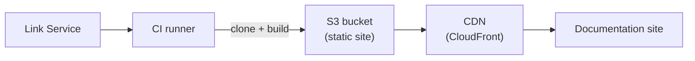

# Assembler infrastructure

This page describes the infrastructure required to run assembler builds in production. If you're only contributing content to an existing assembled site, you don't need this — it's for teams setting up their own assembler deployment.

## Components

An assembler deployment consists of:

### CI runner

The assembler build runs as a CI job (typically GitHub Actions). It needs:

- **Compute** — sufficient CPU/memory to clone and build all repositories. Assembler builds are parallelized but can be resource-intensive for large doc sets.
- **Network access** — to clone repositories and fetch link indexes from the link service.
- **Credentials** — GitHub tokens for cloning private repositories, S3/cloud credentials for deployment.

### Static site hosting

The assembler produces a static HTML site that can be hosted on any static file server:

- **S3 + CloudFront** — the typical production setup. The build output is synced to an S3 bucket, served through a CloudFront distribution.
- **GitHub Pages** — suitable for smaller assembled sites.
- **Any static host** — Netlify, Vercel, nginx, etc.

### Link service

The [link service](../../development/link-infrastructure.md) stores link indexes published by individual repository builds. The assembler uses the link catalog to determine which repositories and commits to clone.

Required infrastructure:
- **S3 bucket** — stores `links.json` files and the `link-index.json` catalog
- **CloudFront** — CDN for fast global access
- **Lambda function** — updates the link catalog when new link indexes are published (triggered by S3 events)

### Redirect handling

Assembler builds support server-side redirects via `_redirects.yml`. The deployment target must support redirect rules — typically implemented through CloudFront functions or equivalent edge compute.

## Build pipeline

A typical assembler CI pipeline:

1. **Schedule or trigger** — run on a schedule (e.g. every 15 minutes) or on push to the config repository
2. **Clone** — `docs-builder assembler clone` fetches all configured repositories at the commits specified in the link catalog
3. **Build** — `docs-builder assembler build` processes all documentation sets and assembles the site
4. **Deploy** — sync the output to the hosting target (e.g. `aws s3 sync`)
5. **Invalidate cache** — clear the CDN cache for updated paths

## Configuration repository

The assembler configuration files (`assembler.yml`, `navigation.yml`, `versions.yml`, `products.yml`) are typically maintained in a dedicated configuration repository or embedded in the {{dbuild}} binary. Changes to these files control which repositories are included and how they're organized.

See [assembler configuration](./configure/index.md) for details on each file.
