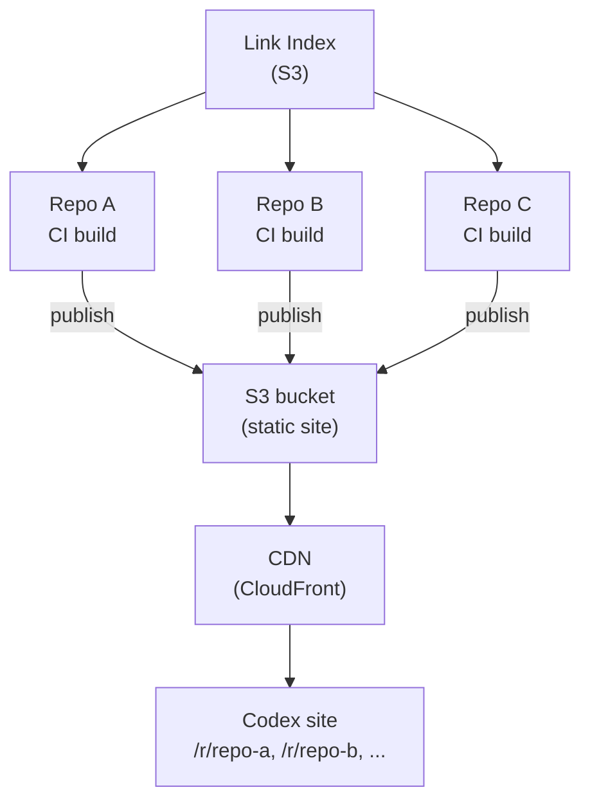

# Codex infrastructure

This page describes the infrastructure required to run a codex environment in production. If you're only contributing documentation to an existing codex environment, you don't need this — it's for teams setting up their own codex deployment.

## Components

A codex deployment consists of:

### Static site hosting

Each repository publishes independently to the same hosting target:

- **S3 bucket** — each repo's output is written to its own prefix (`/r/<repo-name>/`)
- **CloudFront** — CDN fronting the S3 bucket for the codex domain
- **Landing page** — auto-generated from the environment configuration and registered repositories

### Link index

A codex environment maintains its own link index (separate from the assembler's public link service). Repositories register in the link index when their CI build succeeds, which is how the codex environment discovers available documentation.

Required infrastructure:
- **Link index repository or S3 bucket** — stores per-repo link indexes
- **CI integration** — the `update-link-index` workflow job publishes link indexes after successful builds

### CI workflows

Each repository needs two GitHub Actions workflows:

- **Preview workflow** — builds and deploys PR previews on pull requests
- **Cleanup workflow** — tears down preview environments when PRs close

See [GitHub Actions](../../integrations/docs-actions.md) for reusable workflows provided by `elastic/docs-actions`.

### Repository permissions

Each repository that publishes to the codex environment needs:

- **OIDC token permissions** — to authenticate with the cloud provider for deployment
- **Token policies** — read access to the repository, write access to the link index

## Environment configuration repository

The environment configuration (`environment.yml`, group definitions) is maintained in a dedicated repository. Changes to this configuration require redeployment of the codex platform.

See [codex configuration](./configure/index.md) for the configuration format.
