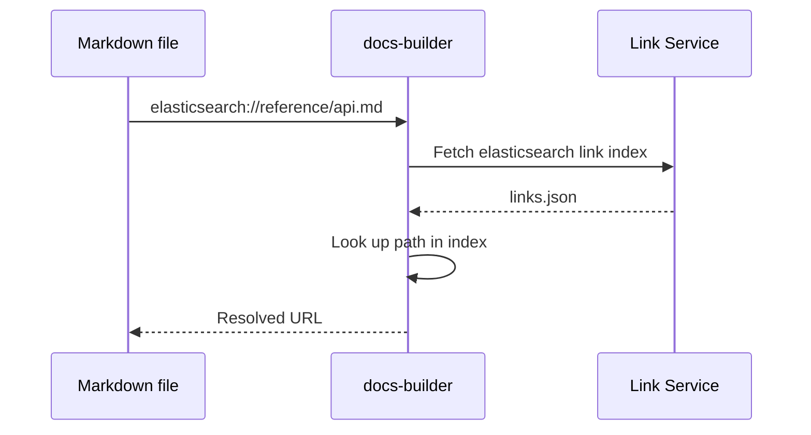

# Cross-links

All build modes — [isolated](./isolated/index.md), [assembler](./assembler/index.md), and [codex](./codex/index.md) — support cross-linking between documentation sets. Cross-links let you reference pages in other repositories using a validated, portable syntax instead of hardcoded URLs.

## Syntax

```markdown
[Getting started with Elasticsearch](elasticsearch://reference/getting-started.md)
```

The format is `<repository>://<path-to-file>`. The repository name matches the GitHub repository name without the org prefix. You can also link to specific headings:

```markdown
[Query DSL](elasticsearch://reference/query-dsl.md#match-query)
```

## Declaring dependencies

Before using cross-links, declare the target repositories in your `docset.yml`:

```yaml
cross_links:
  - elasticsearch
  - kibana
  - docs-content
```

This tells {{dbuild}} to fetch the link index for each listed repository so it can validate your cross-links at build time — even during local development.

:::{tip}
Only list repositories you actually link to. Each entry adds a link-index fetch during builds.
:::

## How validation works



1. **Fetch** — downloads the target repository's link index from the link service
2. **Look up** — checks that the referenced path (and anchor, if specified) exists in the index
3. **Resolve** — replaces the cross-link with the correct URL for the current build mode
4. **Error** — produces a build error if the target doesn't exist

The resolved URL depends on context — in isolated builds it points to the live site, in assembler builds it resolves to the local path within the unified output.

## Inbound link validation

You can check whether changes to your documentation would break links **from** other repositories:

```bash
docs-builder inbound-links validate-link-reference
docs-builder inbound-links validate-all
```

This downloads all published link indexes and checks if any of them reference pages you've moved or deleted. Common scenarios:

- **Renaming a page** — other repos may link to the old path
- **Removing a heading** — a heading change can break fragment links from other repos
- **Reorganizing structure** — moving files between directories invalidates existing cross-links

When inbound validation fails, it reports which repos and files contain the broken references, so you can coordinate fixes or add [redirects](./redirects.md).

For how all of this is enabled by the distributed build model, see [distributed builds](./distributed-builds.md).
