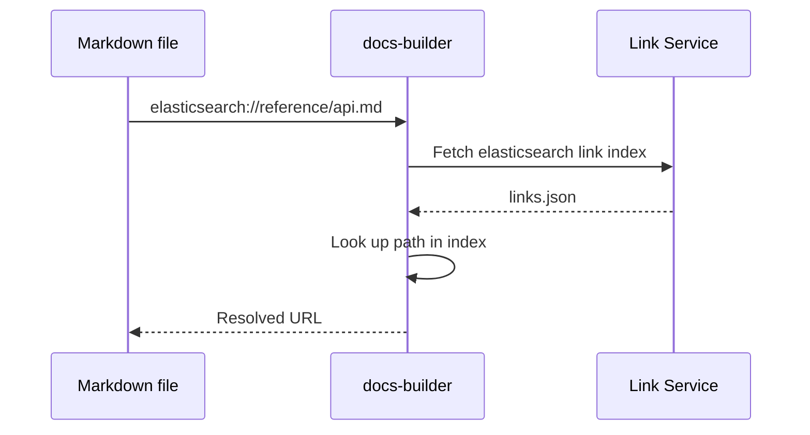
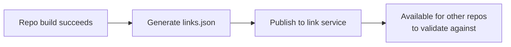

# Cross-links

All build modes — [isolated](./isolated/index.md), [assembler](./assembler/index.md), and [codex](./codex/index.md) — support cross-linking between documentation sets. Cross-links let you reference pages in other repositories using a validated, portable syntax instead of hardcoded URLs.

## Syntax

```markdown
[Getting started with Elasticsearch](elasticsearch://reference/getting-started.md)
```

The format is `<repository>://<path-to-file>`. The repository name matches the GitHub repository name without the org prefix. You can also link to specific headings:

```markdown
[Query DSL](elasticsearch://reference/query-dsl.md#match-query)
```

## Declaring dependencies

Before using cross-links, declare the target repositories in your `docset.yml`:

```yaml
cross_links:
  - elasticsearch
  - kibana
  - docs-content
```

This tells {{dbuild}} to fetch the [link index](#link-index) for each listed repository so it can validate your cross-links at build time — even during local development.

:::{tip}
Only list repositories you actually link to. Each entry adds a link-index fetch during builds.
:::

## How validation works

Cross-links are validated at build time:



1. **Fetch** — downloads the target repository's link index from the link service
2. **Look up** — checks that the referenced path (and anchor, if specified) exists in the index
3. **Resolve** — replaces the cross-link with the correct URL for the current build mode
4. **Error** — produces a build error if the target doesn't exist

## The link index

Every successful documentation build produces a `links.json` file — the **link index** — containing all linkable resources in that repository: pages, headings, and anchors.



The link index is only published when the build succeeds and **all links validate**. This means a failing build in one repository can never pollute the link index that other repositories depend on. Each repository's published link index represents a known-good state.

### Link service

Link indexes are stored in a central link service (S3 + CloudFront) at predictable URLs:

```
https://elastic-docs-link-index.s3.us-east-2.amazonaws.com/{org}/{repo}/{branch}/links.json
```

### Link catalog

A **link catalog** (`link-index.json`) at the service root lists all available link indexes with metadata (commit SHA, timestamps). This is maintained automatically by a Lambda function triggered on S3 events — no manual intervention needed.

## Build resilience

The link infrastructure provides resilience across the distributed build system:

- **Isolation** — a broken build in one repo doesn't affect other repos. They continue to validate against the last known-good link index.
- **Fallback** — assembler builds use the commit SHAs from the link catalog to clone specific known-good versions of each repository.
- **Eventual consistency** — when a repo fixes a broken link target, other repos' next build will pick up the updated link index.

## Inbound link validation

You can also check whether changes to your documentation would break links **from** other repositories:

```bash
docs-builder inbound-links validate-link-reference
docs-builder inbound-links validate-all
```

This downloads all published link indexes and checks if any of them reference pages you've moved or deleted.

For the full technical details of the link infrastructure, see the [development notes](../development/link-infrastructure.md).
