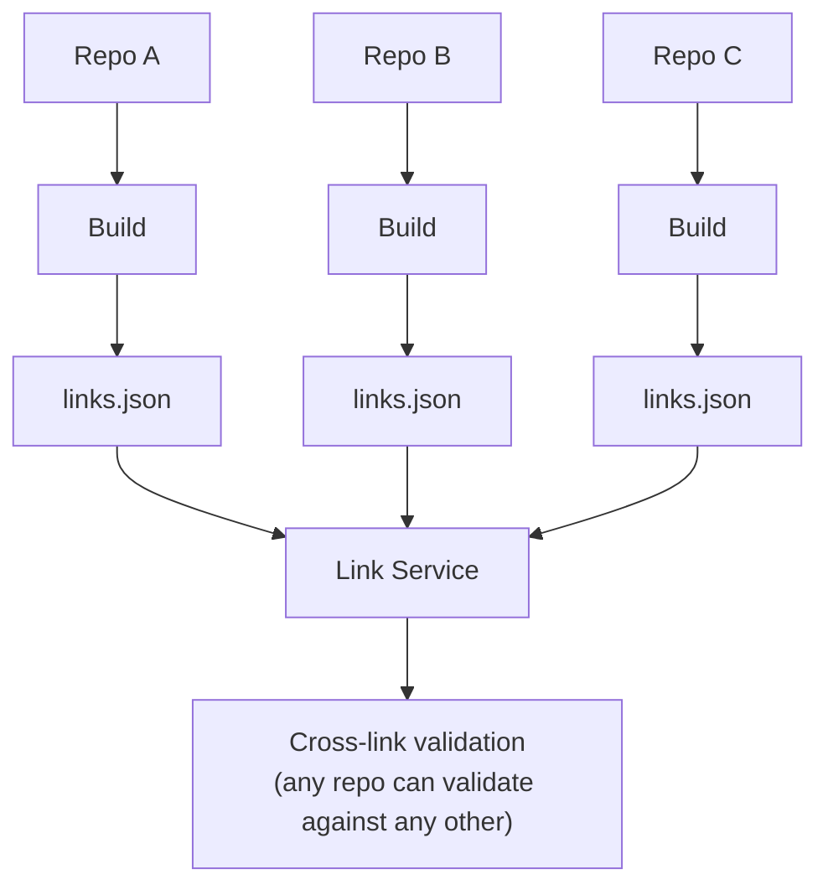
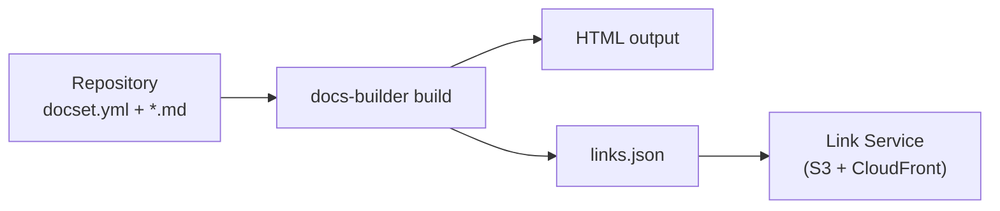
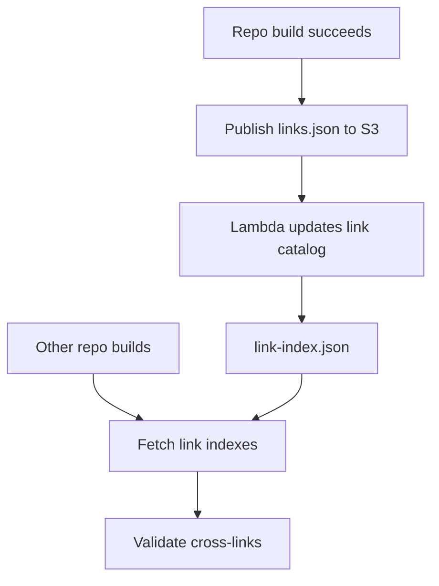

# Distributed builds

{{dbuild}} is a distributed build system — repositories build their documentation independently, and the results are composed into unified sites. No repo blocks another from building or deploying.

## How it works



Each time a documentation build succeeds, it publishes a **link index** (`links.json`) — a manifest of every page and anchor in that repository. Other repositories validate their [cross-links](./cross-links.md) against these published indexes.

## The link index

Every successful build produces a `links.json` containing all linkable resources: pages, headings, and anchors.



The link index is **only published when the build succeeds and all links validate**. A failing build can never pollute the link index that other repositories depend on. Each published link index represents a known-good state.

### Contents

Each entry maps a relative path to its linkable targets — the page itself plus heading anchors. This allows {{dbuild}} to validate not just that a page exists, but that a specific anchor on that page exists.

### Link service

Link indexes are stored in a central link service (S3 + CloudFront) at predictable URLs:

```
https://elastic-docs-link-index.s3.us-east-2.amazonaws.com/{org}/{repo}/{branch}/links.json
```

The CloudFront CDN ensures low-latency fetches from any region during cross-link validation.

### Link catalog

A **link catalog** (`link-index.json`) at the service root lists all available link indexes with metadata (commit SHA, timestamps). It is maintained automatically by a Lambda function triggered on S3 events when new link indexes are published.

The assembler uses the catalog to discover which repos have published link indexes and to determine which commits to clone for each repository.

### Publish lifecycle



## Build resilience

The distributed model provides resilience:

- **Isolation** — a broken build in one repo doesn't affect other repos. They continue to validate against the last known-good link index.
- **Fallback** — assembler builds use commit SHAs from the link catalog to clone specific known-good versions of each repository.
- **Eventual consistency** — when a repo fixes a broken link target, other repos' next build picks up the updated link index.

## Assembler and codex

Both [assembler](./assembler/index.md) and [codex](./codex/index.md) builds compose over many isolated builds:

- **Assembler** — clones all repos, builds each independently, composes global navigation, and deploys as one site
- **Codex** — each repo publishes independently to a shared domain; the codex environment aggregates them on the landing page

In both cases, the individual repository builds are isolated — the link index is what ties them together.
