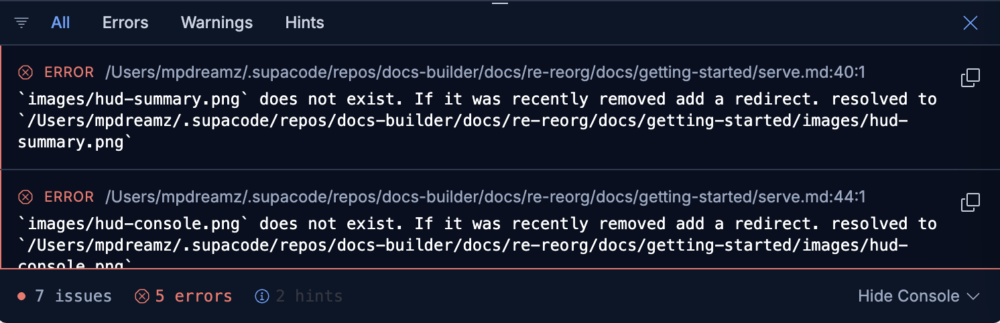

# Serve and preview your docs

{{dbuild}} includes a local development server that renders your documentation and reloads in real time as you edit. This is the fastest way to preview your work.

## Start the server

From the root of a repository containing a `docset.yml`:

```bash
docs-builder serve
```

This starts a local server at [http://localhost:3000](http://localhost:3000). Open it in your browser to see your documentation.

## Real-time hot reload

The development server watches your documentation directory and reflects changes instantly — no manual rebuild needed. This applies to:

- **Content changes** — editing, adding, or deleting Markdown files
- **Navigation changes** — modifying `docset.yml` or `toc.yml` (see [content set configuration](../documentation/isolated/configure/content-set/index.md) and [navigation](../documentation/isolated/configure/content-set/navigation.md))
- **File moves** — renaming or relocating files within your docs tree
- **Configuration changes** — updating frontmatter, substitutions, or other `docset.yml` settings

Every change triggers an automatic reload in the browser. You never need to restart the server during a normal authoring session.

## On-demand compilation with background diagnostics

{{dbuild}} `serve` uses a two-pronged approach to give you both speed and completeness:

1. **On-demand page rendering** — when you navigate to a page, it is compiled and served right then. This keeps page loads fast because only the page you're viewing needs to be built.

2. **Full background build** — simultaneously, a complete build runs in the background across your entire documentation set. This surfaces diagnostics for all pages — not just the one you're looking at.

The result is a diagnostics HUD that appears at the bottom of your browser window:


Click **Show Console** to expand the full diagnostics panel with detailed error locations and messages:



The HUD surfaces errors and warnings ahead of time — broken links, missing files, invalid directives — so you can fix issues before they reach CI. This significantly shortens the development cycle compared to waiting for a full build to complete.

## Tips

- **Port conflicts** — if port 3000 is in use, pass `--port <number>` to pick a different one.
- **Cross-link validation** — even in local serve mode, cross-repository links are validated against published link indexes. See [isolated builds](../documentation/isolated/index.md) for details.
- **API docs** — API Explorer content is generated on startup. Use `--skip-api` for faster iteration when you're not working on API reference pages.
