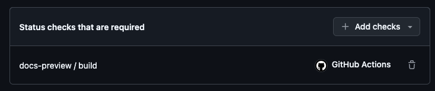
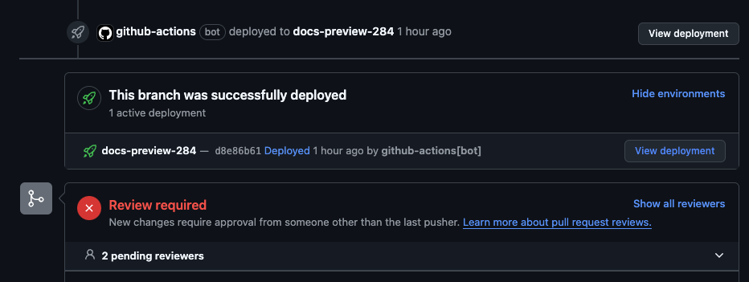

# How to set up docs previews

This guide will help you set up docs previews for your GitHub repository.

## GitHub Workflows

The docs preview system consists of three GitHub Workflows:
- `docs-build.yml`: Build the docs on a PR
- `docs-deploy.yml`: Deploy the docs to our preview environment
- `docs-cleanup.yml`: Cleanup the docs after a PR is merged or closed


### Build

This workflow is triggered when a PR is opened. The underlying reusable workflow, builds the documentation and uploads it as an artifact.
If the `path-pattern` intput does not match any changes in the PR, the workflow will skip the build, but still set a green status check.
This way you only build and deploy the docs when there are changes to the docs and you can still set it as a required status check.


::::{dropdown} .github/workflows/docs-build.yml
:open:

```yaml
---
name: docs-build # The naming is important, don't change it

on:
  pull_request: ~

jobs:
docs-preview:
  uses: elastic/docs-builder/.github/workflows/preview-build.yml
  with:
    path-pattern: docs/** # The path to your docs folder.
  permissions: # Only needs read permissions.
    contents: read
    pull-requests: read
```

::::

### Deploy

This workflow is triggered when the `docs-build` workflow is completed. The underlying reusable workflow, downloads the artifact and deploys the docs to our preview environment.


::::{dropdown} .github/workflows/docs-deploy.yml
:open:

```yaml
---
name: docs-deploy

on:
  workflow_run:
    workflows: [docs-build] # The name of the docs-build workflow.
    types:
      - completed

jobs:
  docs-preview:
    uses: elastic/docs-builder/.github/workflows/preview-deploy.yml
    permissions:
      contents: none # No need to read the code.
      id-token: write
      deployments: write
      actions: read
```

::::

### Cleanup

This workflow is triggered when a PR is either merged or closed. The underlying reusable workflow, deletes the docs from the preview environment.

::::{dropdown} .github/workflows/docs-cleanup.yml
:open:

```yaml
---
name: docs-cleanup

on:
  pull_request_target: # We are using the pull_request_target event, but the code is never checked out.
    types:
      - closed

jobs:
  docs-preview:
    uses: elastic/docs-builder/.github/workflows/preview-cleanup.yml
    permissions:
      contents: none # We don't even grant read permissions, because the code is never checked out.
      id-token: write
      deployments: write
```

::::

## Required Status Checks

To ensure that the docs are always in a deployable state, we need to set up required status checks.

In this case only the `docs-build` workflow is required, which will produce a status check named `docs-preview / build`.




## Deployments

If the `docs-build` workflow is successful, the `docs-deploy` workflow will create a deployment visible in the GitHub UI on your PR.


