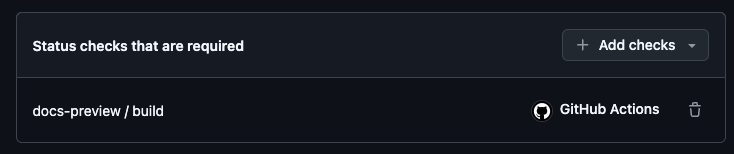
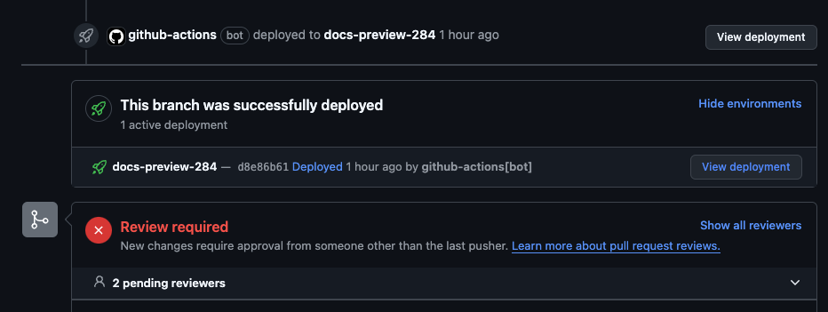

# How to set up docs previews

This guide will help you set up docs previews for your GitHub repository.

Reusable workflows live in [`elastic/docs-actions`](https://github.com/elastic/docs-actions). Pin them to **`@v1`** so the docs team can ship updates independently of [`elastic/docs-builder`](https://github.com/elastic/docs-builder). Reference repos: [elastic/elastic-otel-rum-js](https://github.com/elastic/elastic-otel-rum-js), [elastic/ecs-logging-nodejs](https://github.com/elastic/ecs-logging-nodejs).

## GitHub workflows

The integration uses **three** workflows:

- [`docs-build.yml`](#build) — Required checks: validate and build docs in an unprivileged context (`pull_request`, `push`, `merge_group`).
- [`docs-deploy.yml`](#deploy) — Runs after `docs-build` completes (`workflow_run`). Handles preview deployment, PR comments, and org checks; never checks out untrusted code before gating.
- [`docs-preview-cleanup.yml`](#preview-cleanup) — Removes preview artifacts when a PR is closed (`pull_request_target`).

This follows GitHub’s [recommended two-phase approach](https://securitylab.github.com/resources/github-actions-preventing-pwn-requests/) for fork PRs: the **build** workflow uses `pull_request` (not `pull_request_target`) for the main validation path.


### Build

This workflow runs on pull requests, pushes to your default branch (and optionally release branches), and merge queue events. The reusable workflow builds the documentation and uploads artifacts for the deploy phase.

If the `path-pattern` input does not match any changes in the PR, the workflow can skip the heavy build while still reporting a successful status check, so you can keep **docs-build** as a required check. The default path pattern is `docs/**` (see [optional inputs](#optional-workflow-inputs)).

::::{tab-set}

:::{tab-item} .github/workflows/docs-build.yml

```yaml
---
name: docs-build

on:
  pull_request:
    types: [opened, synchronize, reopened]
  push:
    branches:
      - main <1>
  merge_group: ~

permissions:
  contents: read
  pull-requests: read

jobs:
  build:
    uses: elastic/docs-actions/.github/workflows/docs-build.yml@v1 <2>
```

1. Adjust to your default branch (`main`, `master`, etc.).
2. Reusable workflow: [`elastic/docs-actions/.github/workflows/docs-build.yml`](https://github.com/elastic/docs-actions/blob/main/.github/workflows/docs-build.yml)

:::

::::


### Deploy

This workflow runs when **docs-build** finishes. It downloads artifacts, deploys previews, manages GitHub deployments, and may post or update PR comments. It does **not** use `pull_request_target` on the PR head for the same event as the build; it is triggered via `workflow_run` after the build workflow completes.

::::{tab-set}

:::{tab-item} .github/workflows/docs-deploy.yml

```yaml
---
name: docs-deploy

on:
  workflow_run:
    workflows: [docs-build]
    types: [completed]

permissions:
  contents: read
  deployments: write
  id-token: write
  pull-requests: write
  actions: read

jobs:
  deploy:
    uses: elastic/docs-actions/.github/workflows/docs-deploy.yml@v1 <1>
```

1. Reusable workflow: [`elastic/docs-actions/.github/workflows/docs-deploy.yml`](https://github.com/elastic/docs-actions/blob/main/.github/workflows/docs-deploy.yml)

:::

::::


### Preview cleanup

This workflow runs when a PR is **closed** (merged or not). It deletes preview content from the preview environment.

:::{note}
Using `pull_request_target` here is intentional. As in GitHub’s guidance, this workflow should **not** check out the PR head for arbitrary code execution with elevated secrets. The reusable cleanup workflow follows that model.
:::

::::{tab-set}

:::{tab-item} .github/workflows/docs-preview-cleanup.yml

```yaml
---
name: docs-preview-cleanup

on:
  pull_request_target:
    types:
      - closed

jobs:
  cleanup:
    uses: elastic/docs-actions/.github/workflows/docs-preview-cleanup.yml@v1 <1>
    permissions:
      contents: none <2>
      id-token: write
      deployments: write
```

1. Reusable workflow: [`elastic/docs-actions/.github/workflows/docs-preview-cleanup.yml`](https://github.com/elastic/docs-actions/blob/main/.github/workflows/docs-preview-cleanup.yml)
2. No permission to read repository contents from the workflow token as provided here; adjust only if your org policy requires a different matrix.

:::

::::


### Fork pull requests

Contributors opening PRs from forks still get **build validation** from **docs-build**. Preview **deploy** for fork PRs may depend on membership checks in the deploy workflow. That logic is implemented in `docs-actions` (for example, [elastic/docs-actions#85](https://github.com/elastic/docs-actions/pull/85) — org membership is verified via the GitHub API; contributors do **not** need to change Elastic org visibility on their public profile for that check).


### Optional workflow inputs

Pass `with:` on the **`uses:`** line when you need non-default behavior (for example documentation outside `docs/`, [tagged branching](../../configure/content-sources.md), or Vale). Inputs are defined on each reusable workflow’s `workflow_call` interface — see the files under [`.github/workflows/`](https://github.com/elastic/docs-actions/tree/main/.github/workflows) in `docs-actions`.

Common cases:

- **`path-pattern`** — Glob for which paths count as doc changes (default `docs/**`). If you set it on **docs-build**, use the **same** values on **docs-deploy** so both phases agree.
- **`use-release-branches`** — Set to `true` on **both** build and deploy when you use semver release branches (for example `8.11`) and need link-index / build behavior on pushes that do not touch `docs/**`. See [CI configuration in *Content sources*](../../configure/content-sources.md).

Example fragment (only the job — combine with triggers and permissions from the tabs above):

```yaml
jobs:
  build:
    uses: elastic/docs-actions/.github/workflows/docs-build.yml@v1
    with:
      path-pattern: docs/**
      use-release-branches: true
```


## Required status checks

To keep docs in a deployable state, enable required status checks for the **docs-build** workflow. The check name is typically **`docs-build / build`** (workflow name + job id).




## Deployments

After **docs-build** succeeds, **docs-deploy** runs and can create or update a deployment in the GitHub UI for the PR.



If you previously required **`docs-preview / build`** or **`preview-build`**, update branch protection to require **`docs-build`** / **`docs-build / build`** instead.
