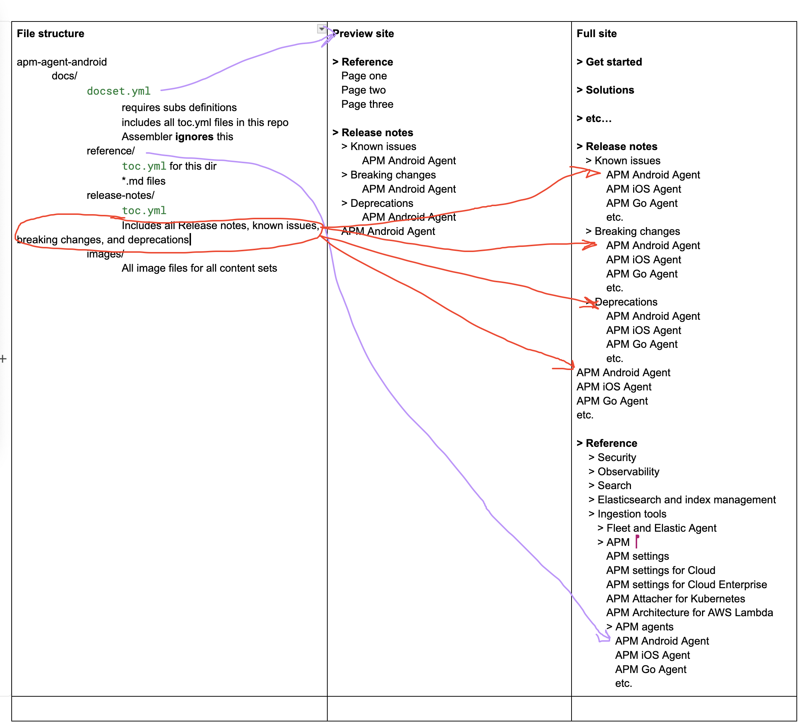

# Move Reference Docs from Asciidocalypse

:::{important}
This guide is only for technical writers tasked with moving content out of `elastic/asciidocalypse`.
:::

## How Reference Content Works

There are two use cases for building reference content in V3:
- **Preview builds**
- **Elastic.co/docs builds**

Some repositories, like `elastic-search-forwarder`, contain a single content set in the larger `elastic.co/docs` build. This means the structure of the content is the same for both preview builds and the final Elastic.co/docs build.

However, other repositories, like `apm-agent-android`, contain content that lives in multiple locations within the new `elastic.co/docs` IA:
- Reference docs
- Release notes
- Known issues
- Breaking changes
- Deprecations

### Directory Structure

Release notes do **not** require individual `toc.yml` files for each content set. The directory structure for `apm-agent-android` follows this format:

```md
apm-agent-android
    docs/
        docset.yml
            * Defines subs
            * Includes all `toc.yml` files in this repo
            * Ignored by the assembler
        reference/
            toc.yml (for this directory)
            All reference `.md` files go here
        release-notes/
            toc.yml (for this directory)
            All release notes, known issues, breaking changes, and deprecations go here
        images/
            All image files for all content sets
```

### Preview Site vs. Full Site Structure

For individual repository preview builds, **all** content in the `docs/` directory builds together, appearing as:

```md
> Reference
   Page one
   Page two
   Page three

> Release notes
   > Known issues
          APM Android Agent
   > Breaking changes
          APM Android Agent
   > Deprecations
          APM Android Agent
   APM Android Agent release notes
```

For the **full Elastic.co/docs site**, the assembler references the individual content set definitions (`toc.yml`) and organizes the content accordingly:



## How to Move Reference Content

### Step 1: Delete Existing AsciiDoc Files

:::{important}
Skip this step for **any Cloud repos** and the **search-ui repository**.
:::

Ensure you only delete **external documentation files**.  
- In some repositories, this means deleting the entire `/docs` directory.  
- In others, manually verify which files should be removed.  
- Use [`conf.yaml`](https://github.com/elastic/docs/blob/master/conf.yaml) to determine what should and shouldn't be removed.

### Step 2: Copy and Paste New Content

Move content from `asciidocalypse` to the correct directory in the target repo.  
Use [issue#130](https://github.com/elastic/docs-eng-team/issues/130) to determine the correct path structure.

### Step 3: Add the CI Check

- Example configuration:  
- File location:  

### Step 4: Wait for CI to Pass

Verify that all automated checks pass before proceeding.

### Step 5: Merge the PR

Once everything is confirmed working, merge the pull request.

### Step 6: Update the Tracking Issue

Update [issue#130](https://github.com/elastic/docs-eng-team/issues/130) to reflect the completed migration.
