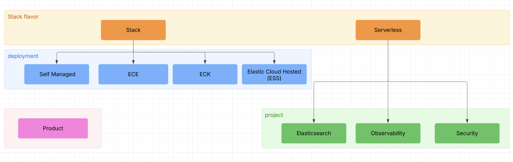

# Applies to

<!--
This page explains concrete usage of the applies_to tag. Cumulative authoring philosophy and guidance goes in contribute/cumulative-docs.md. 
-->


Starting with Elastic Stack 9.0, ECE 4.0, and ECK 3.0, documentation follows a [cumulative approach](../contribute/cumulative-docs.md): instead of creating separate pages for each product and release, we update a single page with product- and version-specific details over time.

To support this, source files use a tagging system to indicate:

* Which Elastic products and deployment models the content applies to.
* When a feature changes state relative to the base version.

This is what the `applies_to` metadata is for. It can be used at the page, section, or inline level to specify
applicability with precision.

## `applies_to` tags in the output

:::{include} /contribute/_snippets/tag-processing.md
:::

## When and where to use `applies_to`

The `applies_to` metadata can be added at different levels in the documentation:

* [Page-level](#page-annotations) metadata is **mandatory** and must be included in the frontmatter. This defines the
  overall applicability of the page across products, deployments, and environments.
* [Section-level](#section-annotations) annotations allow you to specify different applicability for individual sections
  when only part of a page varies between products or versions.
* [Inline](#inline-annotations) annotations allow fine-grained annotations within paragraphs or definition lists. This
  is useful for highlighting the applicability of specific phrases, sentences, or properties without disrupting the
  surrounding content.

### Dos and don’ts

✅ Use `applies_to` tags when features change state (`preview`, `beta`, `ga`, `deprecated`, `removed`) or when
availability differs across deployments and environments.

✅ Use `applies_to` tags to indicate which product or deployment type the content applies to. This is mandatory for every
page.

✅ Use `applies_to` tags when features change state in a specific update or release.

❌ Don't tag content-only changes like typos, formatting, or documentation updates that don't reflect feature lifecycle
changes.

❌ You don’t need to tag every section or paragraph. Only do so if the context or applicability changes from what has
been established earlier.

❌ If the product is not versioned (meaning all users are always on the latest version, like in serverless or cloud), you
do not need to tag a new GA feature.

For detailed guidance, refer to [](/contribute/cumulative-docs.md).

## Syntax

The `applies_to` metadata supports an [exhaustive list of keys](#structured-model).

When you write or edit documentation, only specify the keys that apply to that content.
Each key accepts values with the following syntax:

```
<key>: <lifecycle> [version]
```

Where:

- The [lifecycle](#lifecycle) is mandatory
- The [version](#version) is optional
- You can specify multiple states by separating them with a comma. For example: `stack: preview 9.1, ga 9.4`

Note that a key without any value doesn't show any badge in the output.

### Lifecycle

`applies_to` accepts the following lifecycle states:

* `preview`
* `beta`
* `deprecated`
* `removed`
* `unavailable`
* `ga`

### Version

Can be in either `major.minor` or `major.minor.patch` format

Versioned products require a `version` tag to be used with the `lifecycle` tag. See [Syntax](#syntax):

```
applies_to:
  stack: preview 9.1, ga 9.4
  deployment:
    ece: deprecated 9.2, removed 9.8
```

Unversioned products use `lifecycle` tags without a version:

```
applies_to:
  serverless:
    elasticsearch: beta
    observability: removed
```

## Examples

### Lifecycle examples

#### Unversioned products

:::{include} _snippets/unversioned-lifecycle.md
:::

#### Versioned products

:::{include} _snippets/versioned-lifecycle.md
:::

#### Identify multiple states for the same content

:::{include} /syntax/_snippets/multiple-lifecycle-states.md
:::

### Page annotations

All documentation pages **must** include an `applies_to` tag in the YAML frontmatter. Use YAML frontmatter to indicate each deployment target's availability and lifecycle status. For a complete list of supported keys and values, see the [frontmatter syntax guide](./frontmatter.md).

#### Page annotation examples

:::{include} _snippets/page-level-applies-examples.md
:::

### Section annotations

```yaml {applies_to}
stack: ga 9.1
deployment:
  eck: ga 9.0
  ess: beta 9.1
  ece: deprecated 9.2.0
serverless:
  security: unavailable
  elasticsearch: beta
  observability: deprecated
product: preview 9.5, deprecated 9.7
```

A header may be followed by an `{applies_to}` directive which will contextualize the applicability
of the section further.

:::{note}
the `{applies_to}` directive **MUST** be preceded by a heading directly.
:::

Note that this directive requires triple backticks since its content is literal. See
also [](index.md#literal-directives)

````markdown
```{applies_to}
stack: ga 9.1
```
````

In order to play even better with markdown editors the following is also supported:

````markdown
```yaml {applies_to}
stack: ga 9.1
```
````

This will allow the YAML inside the `{applies_to}` directive to be fully highlighted.

#### Section annotation examples

:::{include} _snippets/section-level-applies-examples.md
:::

### Inline annotations

Inline applies to can be placed anywhere using the following syntax

```markdown
This can live inline {applies_to}`section: <life-cycle> [version]`
```

An inline version example would be {applies_to}`stack: beta 9.1` this allows you to target elements more concretely
visually.

#### Inline annotation examples

* The whole page is generally applicable to Elastic Stack 9.0 and to Serverless, but one specific section isn’t applicable to Serverless (and there is no alternative):

  :::{include} _snippets/line-level-applies-example.md
  :::

A specialized `{preview}` role exists to quickly mark something as a technical preview. It takes a required version number
as an argument.

```markdown
Property {preview}`<version>`
:   definition body
```

## Structured model



The above model is projected to the following structured YAML.

```yaml
---
applies_to:
  stack:
  deployment:
    eck:
    ess:
    ece:
    self:
  serverless:
    security:
    elasticsearch:
    observability:
  product:
    ecctl:
    curator:
    apm_agent_android:
    apm_agent_dotnet:
    apm_agent_go:
    apm_agent_ios:
    apm_agent_java:
    apm_agent_node:
    apm_agent_php:
    apm_agent_python:
    apm_agent_ruby:
    apm_agent_rum:
    edot_ios:
    edot_android:
    edot_dotnet:
    edot_java:
    edot_node:
    edot_php:
    edot_python:
---
```


## Look and feel

### Block

```{applies_to}
stack: preview 9.1
serverless: planned

apm_agent_dotnet: ga 1.0.0
apm_agent_java: beta 1.0.0
edot_dotnet: preview 1.0.0
edot_python:
edot_node: ga 1.0.0
elasticsearch: preview 9.0.0
security: removed 9.0.0
observability: deprecated 9.0.0
```

### Inline

#### In text

Lorem ipsum dolor sit amet, consectetur adipiscing elit. Maecenas ut libero diam. Mauris sed eleifend erat,
sit amet auctor odio. Donec ac placerat nunc. {applies_to}`stack: preview` Aenean scelerisque viverra lectus
nec dignissim. Vestibulum ut felis nec massa auctor placerat. Maecenas vel dictum.

- {applies_to}`elasticsearch: preview` Lorem ipsum dolor sit amet, consectetur adipiscing elit. Maecenas ut libero diam. Mauris sed eleifend erat, sit amet auctor odio. Donec ac placerat nunc. 
- {applies_to}`observability: preview` Lorem ipsum dolor sit amet, consectetur adipiscing elit. Maecenas ut libero diam.
- {applies_to}`security: preview` Lorem ipsum dolor sit amet, consectetur adipiscing elit. Maecenas ut libero diam. Mauris sed eleifend erat, sit amet auctor odio. Donec ac placerat nunc. Aenean scelerisque viverra lectus nec dignissim. 

#### Stack

| `applies_to`                               | result                               |
|--------------------------------------------|--------------------------------------|
| `` {applies_to}`stack: ` ``                | {applies_to}`stack: `                |
| `` {applies_to}`stack: preview` ``         | {applies_to}`stack: preview`         |
| `` {applies_to}`stack: preview 8.18` ``    | {applies_to}`stack: preview 8.18`    |
| `` {applies_to}`stack: preview 9.0` ``     | {applies_to}`stack: preview 9.0`     |
| `` {applies_to}`stack: preview 9.1` ``     | {applies_to}`stack: preview 9.1`     |
| `` {applies_to}`stack: preview 99.0` ``    | {applies_to}`stack: preview 99.0`    |
| `` {applies_to}`stack: ga` ``              | {applies_to}`stack: ga`              |
| `` {applies_to}`stack: ga 8.18` ``         | {applies_to}`stack: ga 8.18`         |
| `` {applies_to}`stack: ga 9.0` ``          | {applies_to}`stack: ga 9.0`          |
| `` {applies_to}`stack: ga 9.1` ``          | {applies_to}`stack: ga 9.1`          |
| `` {applies_to}`stack: ga 99.0` ``         | {applies_to}`stack: ga 99.0`         |
| `` {applies_to}`stack: beta` ``            | {applies_to}`stack: beta`            |
| `` {applies_to}`stack: beta 8.18` ``       | {applies_to}`stack: beta 8.18`       |
| `` {applies_to}`stack: beta 9.0` ``        | {applies_to}`stack: beta 9.0`        |
| `` {applies_to}`stack: beta 9.1` ``        | {applies_to}`stack: beta 9.1`        |
| `` {applies_to}`stack: beta 99.0` ``       | {applies_to}`stack: beta 99.0`       |
| `` {applies_to}`stack: deprecated` ``      | {applies_to}`stack: deprecated`      |
| `` {applies_to}`stack: deprecated 8.18` `` | {applies_to}`stack: deprecated 8.18` |
| `` {applies_to}`stack: deprecated 9.0` ``  | {applies_to}`stack: deprecated 9.0`  |
| `` {applies_to}`stack: deprecated 9.1` ``  | {applies_to}`stack: deprecated 9.1`  |
| `` {applies_to}`stack: deprecated 99.0` `` | {applies_to}`stack: deprecated 99.0` |
| `` {applies_to}`stack: removed` ``         | {applies_to}`stack: removed`         |
| `` {applies_to}`stack: removed 8.18` ``    | {applies_to}`stack: removed 8.18`    |
| `` {applies_to}`stack: removed 9.0` ``     | {applies_to}`stack: removed 9.0`     |
| `` {applies_to}`stack: removed 9.1` ``     | {applies_to}`stack: removed 9.1`     |
| `` {applies_to}`stack: removed 99.0` ``    | {applies_to}`stack: removed 99.0`    |

#### Serverless

| `applies_to`                                    | result                                    |
|-------------------------------------------------|-------------------------------------------|
| `` {applies_to}`serverless: ` ``                | {applies_to}`serverless: `                |
| `` {applies_to}`serverless: preview` ``         | {applies_to}`serverless: preview`         |
| `` {applies_to}`serverless: ga` ``              | {applies_to}`serverless: ga`              |
| `` {applies_to}`serverless: beta` ``            | {applies_to}`serverless: beta`            |
| `` {applies_to}`serverless: deprecated` ``      | {applies_to}`serverless: deprecated`      |
| `` {applies_to}`serverless: removed` ``         | {applies_to}`serverless: removed`         |
