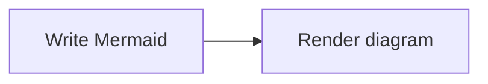
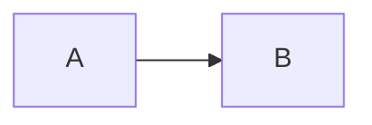
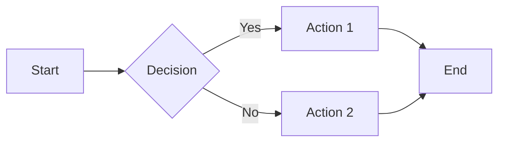
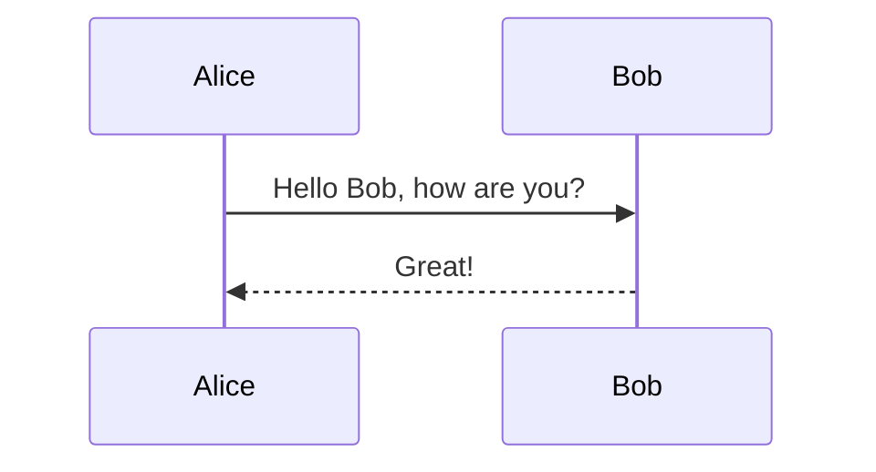
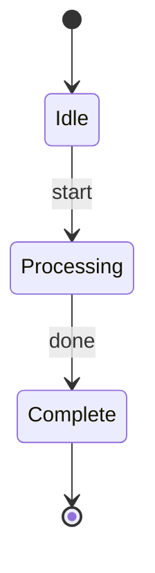
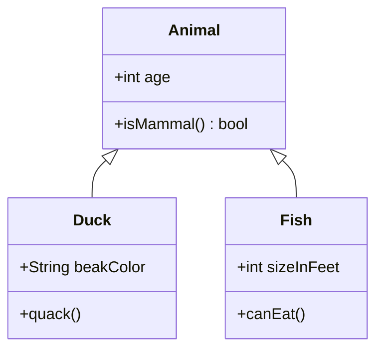
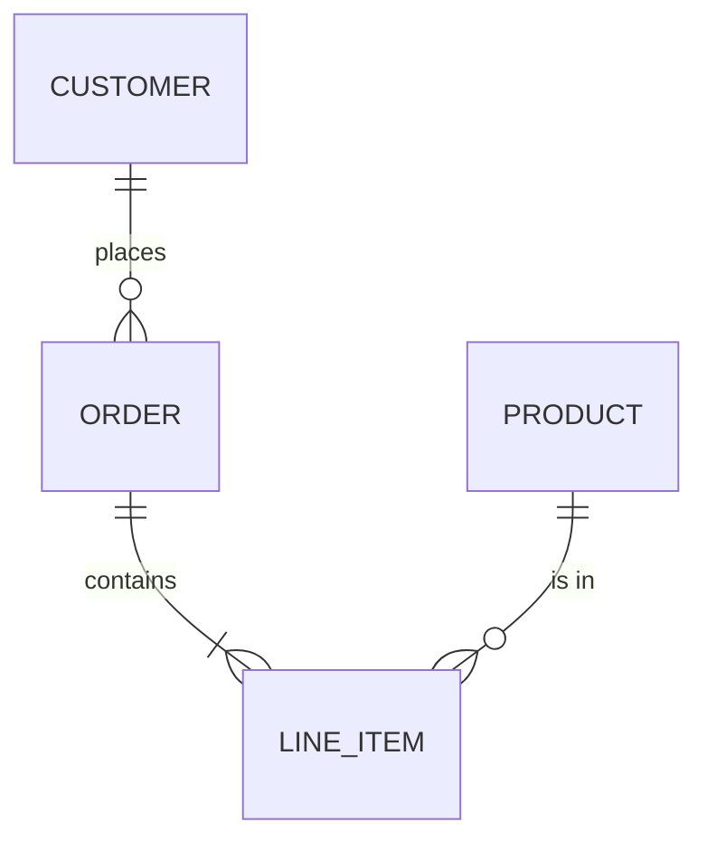
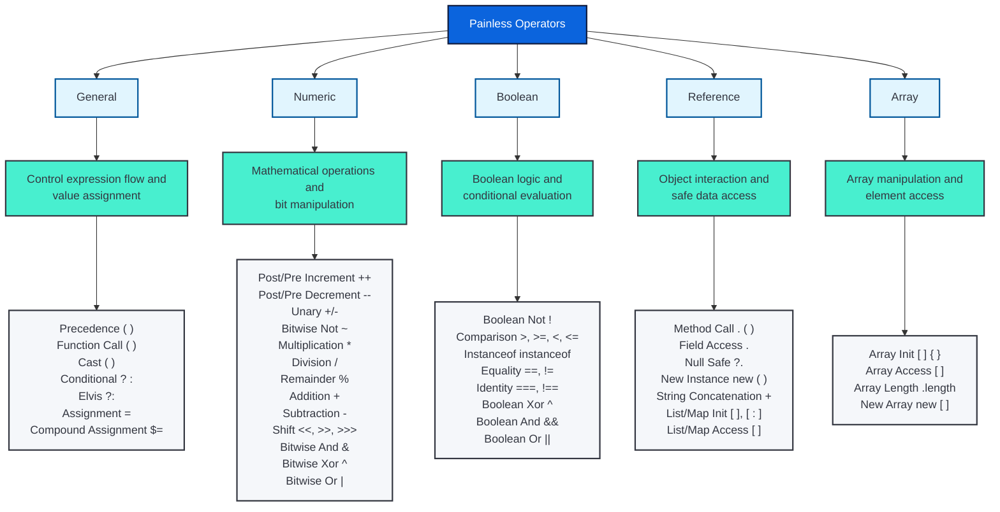

# Mermaid diagrams

You can create diagrams using [Mermaid](https://mermaid.js.org/) with standard fenced code blocks. Diagrams are rendered client-side in the browser.



## Basic usage

Use a fenced code block with `mermaid` as the language:

````markdown

````

## Supported diagram types

All [Mermaid diagram types](https://mermaid.js.org/intro/) are supported, including:

- Flowcharts
- Sequence diagrams
- State diagrams
- Class diagrams
- Entity relationship (ER) diagrams
- And more

## Examples

### Flowchart

:::::{tab-set}

::::{tab-item} Source
````markdown

````
::::

::::{tab-item} Rendered

::::

:::::

### Sequence diagram

:::::{tab-set}

::::{tab-item} Source
````markdown

````
::::

::::{tab-item} Rendered

::::

:::::

### State diagram

:::::{tab-set}

::::{tab-item} Source
````markdown

````
::::

::::{tab-item} Rendered

::::

:::::

### Class diagram

:::::{tab-set}

::::{tab-item} Source
````markdown

````
::::

::::{tab-item} Rendered

::::

:::::

### ER diagram

:::::{tab-set}

::::{tab-item} Source
````markdown

````
::::

::::{tab-item} Rendered

::::

:::::

### Complex flowchart

::::::{tab-set}

:::::{tab-item} Source
````markdown

````
:::::

:::::{tab-item} Rendered

:::::

::::::

## Interactive controls

Mermaid diagrams include interactive controls that appear when you hover over the diagram:

- **Zoom in/out**: Click the `+` and `-` buttons to zoom in or out. You can also hold `Ctrl` (or `Cmd` on macOS) and use the mouse wheel to zoom.
- **Reset**: Click the reset button to return to the default view.
- **Fullscreen**: Click the expand button to view the diagram in a fullscreen modal.
- **Pan**: Click and drag the diagram to pan around when zoomed in.

These controls are particularly useful for large or complex diagrams.

## Notes

- Diagrams require JavaScript to render. Users with JavaScript disabled will see the raw Mermaid code.
- For the full list of diagram types and syntax, see the [Mermaid documentation](https://mermaid.js.org/intro/).
