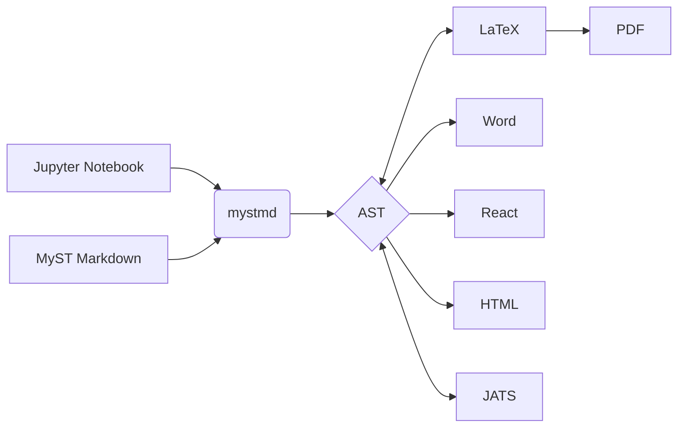
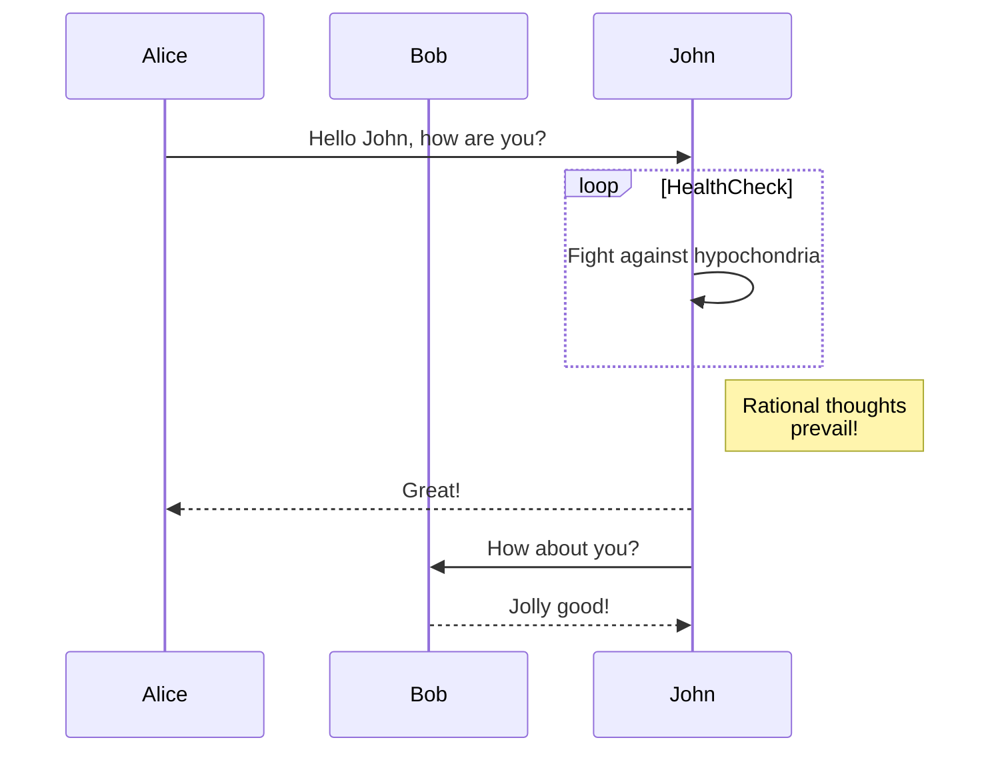
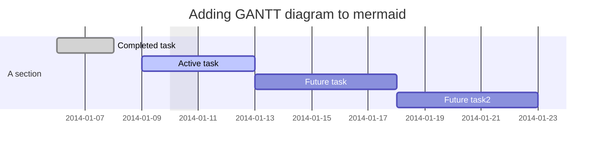
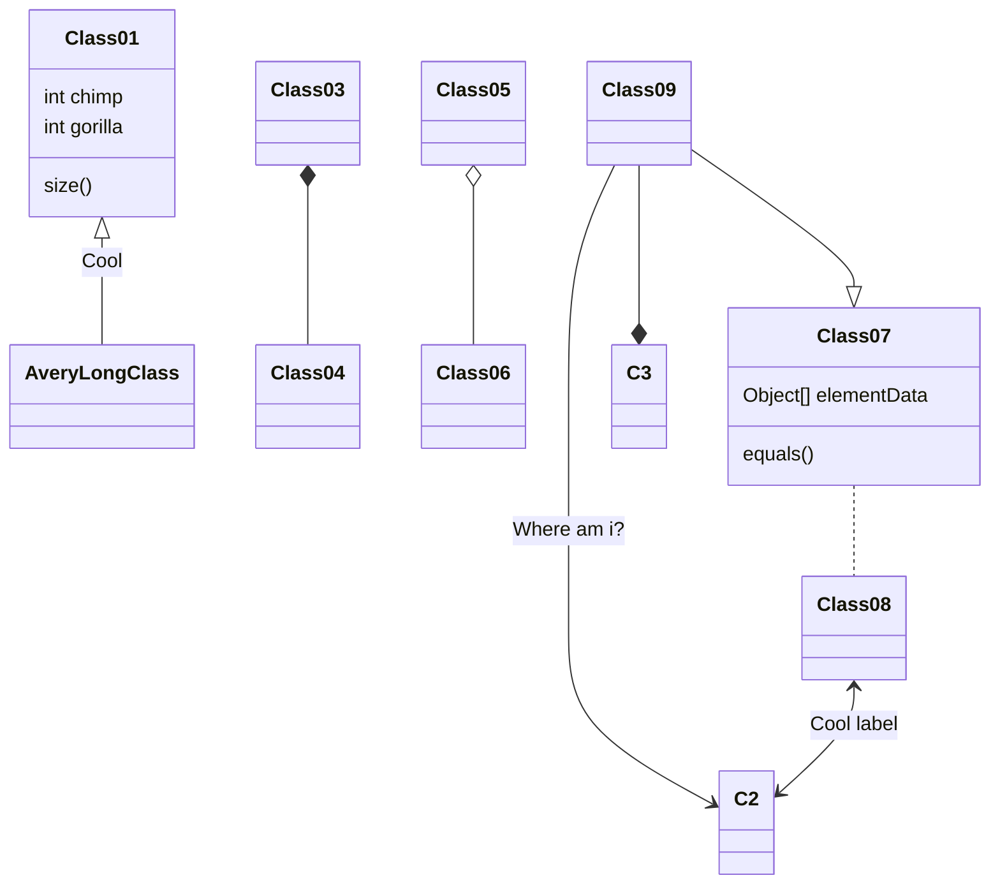

# Diagrams

You can create and embed diagrams using Mermaid.js, a docs-as-code diagramming tool.

Using Mermaid diagrams has several advantages:

- Diagrams as code: You can version and edit diagrams without having to use third-party tools.
- Easier contribution: External contributors can add or edit new diagrams easily.
- Consistent look and feel: All Mermaid diagrams are rendered using the same style.
- Improved accessibility: Text can be copied and read by a text-to-speech engine.

## Create Mermaid diagrams

To create a Mermaid, you can use the following editors:

- [Mermaid Live Editor](https://mermaid.live/): Instantly previews Mermaid diagrams.
- [Mermaid Chart](https://www.mermaidchart.com/app/dashboard): Visual editor for Mermaid.
- Create diagrams in Visual Studio Code and preview them using the [VS Code extension](https://docs.mermaidchart.com/plugins/visual-studio-code).
- Other tools, including AI tools, can generate Mermaid diagrams.

For reference documentation on the Mermaid language, refer to [mermaid.js](https://mermaid.js.org).

## Syntax guidelines

When creating Mermaid diagrams, keep these guidelines in mind:

- Use clear, descriptive node names.
- Use comments (`%% comment text`) to document complex diagrams.
- Break complex diagrams into smaller, more manageable ones.
- Use consistent naming conventions throughout your diagrams.

## Supported Diagram Types

Mermaid.js supports various diagram types to visualize different kinds of information:

- Flowcharts: Visualize processes and workflows.
- Sequence Diagrams: Show interactions between components over time.
- Gantt Charts: Illustrate project schedules and timelines.
- Class Diagrams: Represent object-oriented structures.
- Entity Relationship Diagrams: Model database structures.
- State Diagrams: Illustrate state machines and transitions.
- Pie Charts: Display proportional data.
- User Journey Maps: Visualize user experiences.

For a full list of supported diagrams, see the [Mermaid.js](https://mermaid.js.org/intro/) documentation.

### Flowcharts

This is an example flowchart made with Mermaid:

:::::{tab-set}

::::{tab-item} Output



::::

::::{tab-item} Markdown
````markdown

````
::::

:::::


### Sequence diagrams

This is an example sequence diagram made with Mermaid:

:::::{tab-set}

::::{tab-item} Output



::::

::::{tab-item} Markdown
````markdown

````
::::

:::::

### Gantt charts

This is an example Gantt chart made with Mermaid:

:::::{tab-set}

::::{tab-item} Output



::::

::::{tab-item} Markdown
````markdown

````
::::

:::::

### Class diagrams

This is an example class diagram made with Mermaid:

:::::{tab-set}

::::{tab-item} Output



::::

::::{tab-item} Markdown
````markdown

````
::::

:::::

## Troubleshooting

These are the most common issues when creating Mermaid diagrams and their solution:

- Syntax errors: Ensure proper indentation and syntax.
- Rendering issues: Check for unsupported characters or syntax.
- Performance: Simplify diagrams with many nodes for better performance.