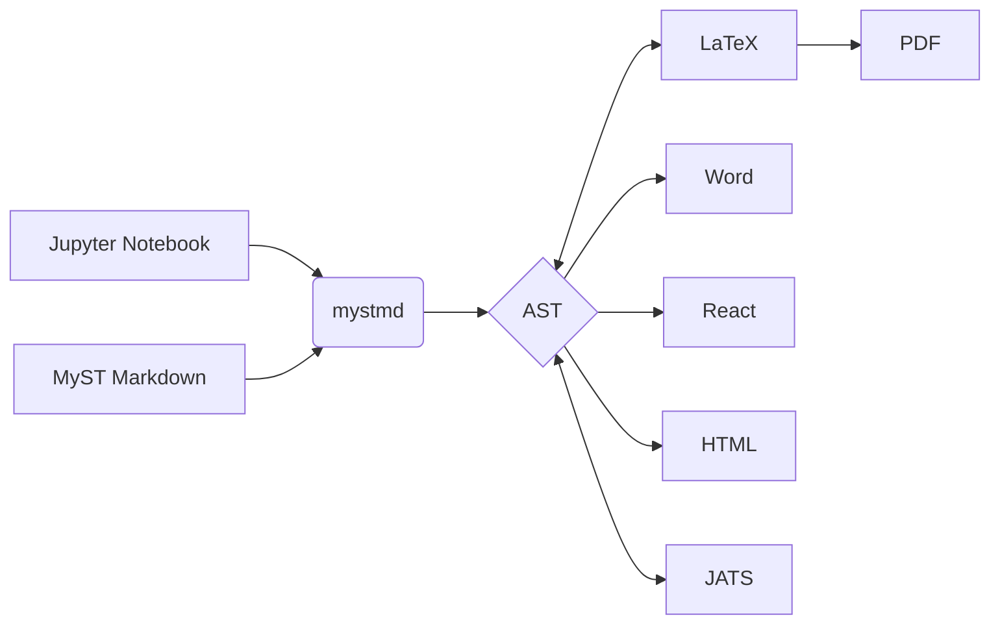

# Diagrams

You can embedd diagrams using [mermaid.js](https://mermaid.js.org)

## Flowcharts

:::::{tab-set}

::::{tab-item} Output

:::{mermaid} 
flowchart LR
A[Jupyter Notebook] --> C
B[MyST Markdown] --> C
C(mystmd) --> D{AST}
D <--> E[LaTeX]
E --> F[PDF]
D --> G[Word]
D --> H[React]
D --> I[HTML]
D <--> J[JATS]
:::

::::

::::{tab-item} Markdown
```markdown
:::{mermaid} 
flowchart LR
A[Jupyter Notebook] --> C
B[MyST Markdown] --> C
C(mystmd) --> D{AST}
D <--> E[LaTeX]
E --> F[PDF]
D --> G[Word]
D --> H[React]
D --> I[HTML]
D <--> J[JATS]
:::
```
::::

:::::




