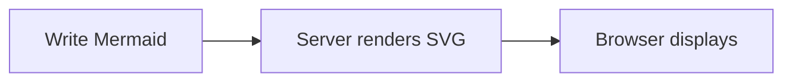
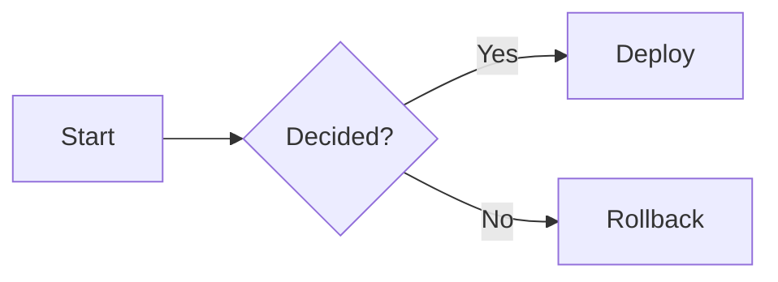
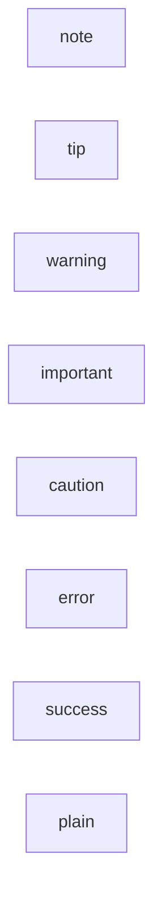
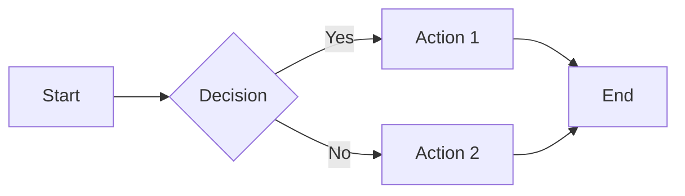
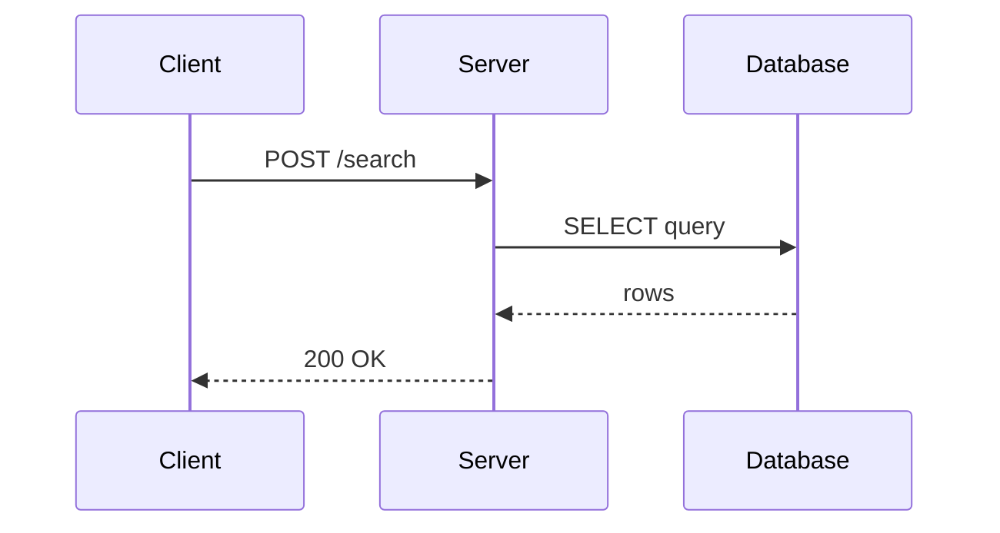
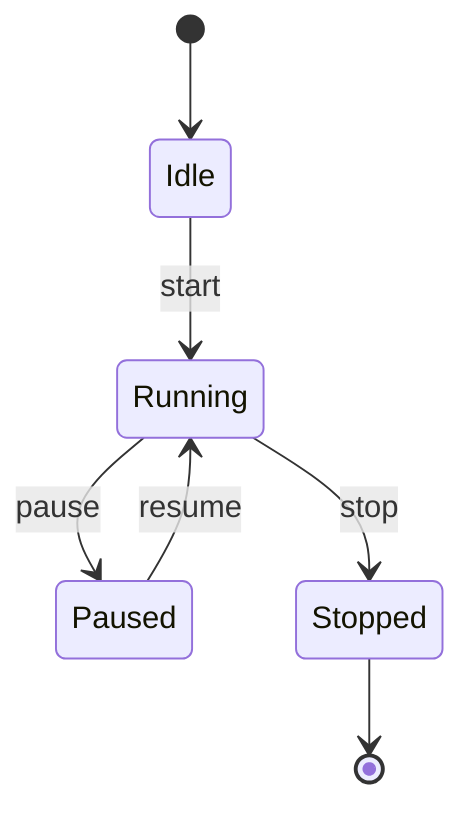
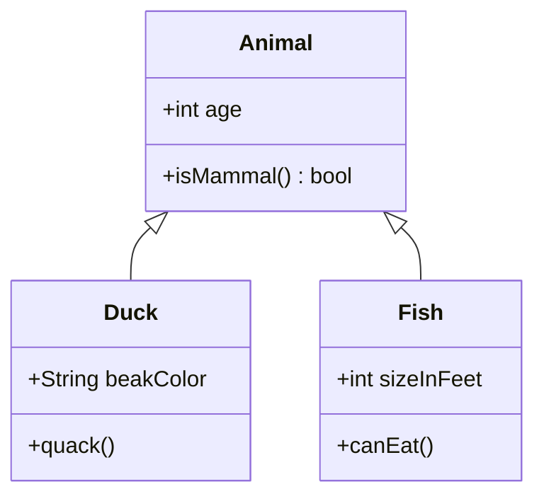
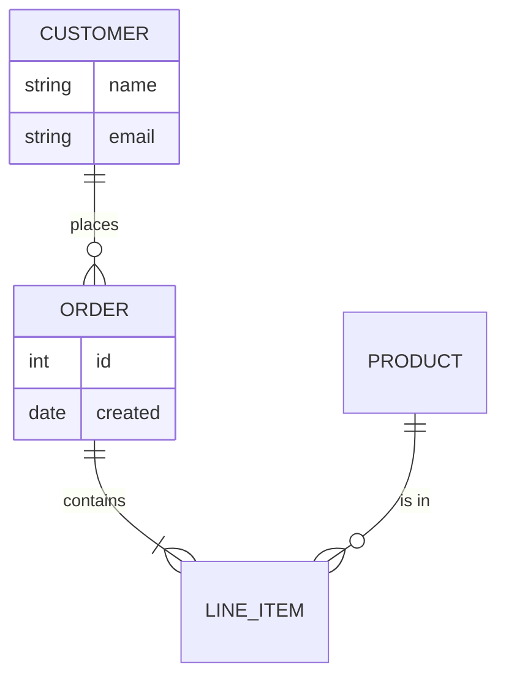
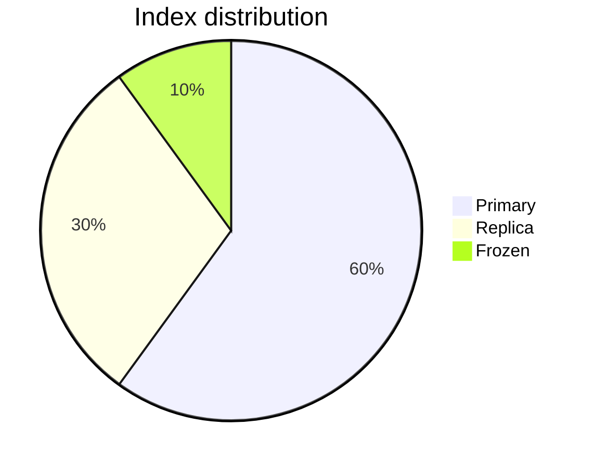
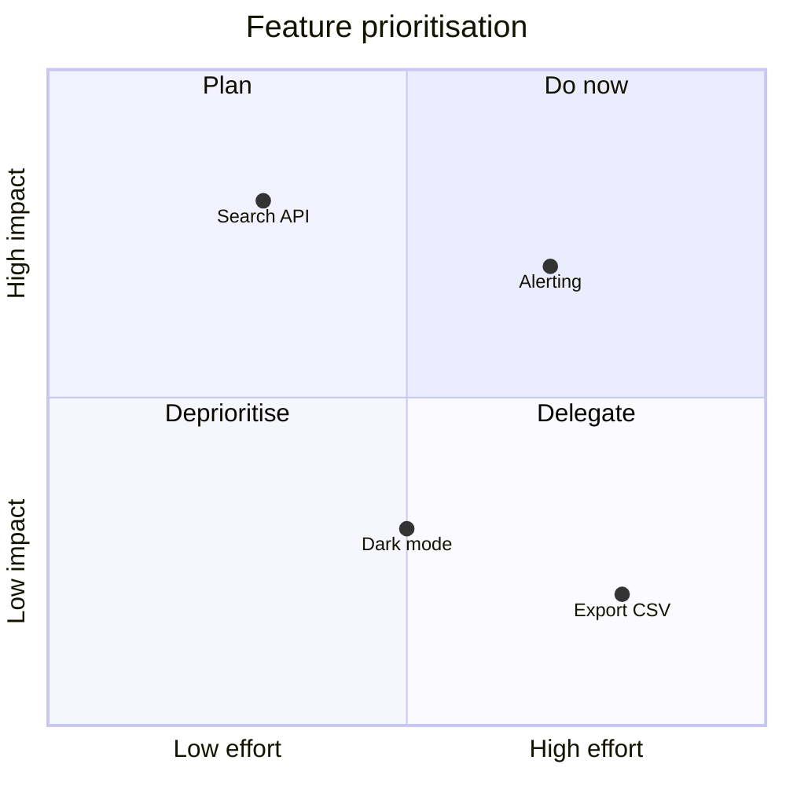

# Mermaid diagrams

Mermaid diagrams are rendered server-side to inline SVG at build time. No JavaScript runtime is required to display them.


```mermaid
flowchart LR
    A[Write Mermaid] --> B[Server renders SVG] --> C[Browser displays]
```

## Basic usage

Use a fenced code block with `mermaid` as the language:

````markdown

```mermaid
flowchart LR
A --> B
```
````

## Styling

Diagrams support a fixed set of semantic style classes that match the site's design system. Inline `classDef`, `style`, and `linkStyle` directives are not supported.

Apply a class to a node using the `:::classname` shorthand or the `class` statement:

````markdown

```mermaid
flowchart LR
    A[Start]:::note --> B{Decided?}:::warning
    B -->|Yes| C[Deploy]:::success
    B -->|No| D[Rollback]:::error
```
````


```mermaid
flowchart LR
    A[Start]:::note --> B{Decided?}:::warning
    B -->|Yes| C[Deploy]:::success
    B -->|No| D[Rollback]:::error
```

The available classes are:

| Class | Use for |
|---|---|
| `note` | Informational nodes, neutral context |
| `tip` | Recommended paths, positive guidance |
| `warning` | Caution required, review needed |
| `important` | Key nodes that must not be missed |
| `caution` | Destructive or risky actions |
| `error` | Failure states, invalid paths |
| `success` | Completion, healthy states |
| `plain` | De-emphasised or secondary nodes |

All eight classes in one diagram:


```mermaid
flowchart LR
    N[note]:::note
    T[tip]:::tip
    W[warning]:::warning
    I[important]:::important
    C[caution]:::caution
    E[error]:::error
    S[success]:::success
    P[plain]:::plain
```

## Diagram types

### Flowchart

:::::{tab-set}
:group: diagram-view

::::{tab-item} Source
:sync: source
````markdown

```mermaid
flowchart LR
    A[Start] --> B{Decision}
    B -->|Yes| C[Action 1]
    B -->|No| D[Action 2]
    C --> E[End]
    D --> E
```
````
::::

::::{tab-item} Rendered
:sync: rendered

```mermaid
flowchart LR
    A[Start] --> B{Decision}
    B -->|Yes| C[Action 1]
    B -->|No| D[Action 2]
    C --> E[End]
    D --> E
```
::::

::::{tab-item} Styled
:sync: styled

```mermaid
flowchart LR
    A[Start]:::note --> B{Decision}:::warning
    B -->|Yes| C[Action 1]:::tip --> E[End]:::success
    B -->|No| D[Action 2]:::error --> E
```
::::

:::::

### Sequence diagram

:::::{tab-set}
:group: diagram-view

::::{tab-item} Source
:sync: source
````markdown

```mermaid
sequenceDiagram
    participant C as Client
    participant S as Server
    participant D as Database
    C->>S: POST /search
    S->>D: SELECT query
    D-->>S: rows
    S-->>C: 200 OK
```
````
::::

::::{tab-item} Rendered
:sync: rendered

```mermaid
sequenceDiagram
    participant C as Client
    participant S as Server
    participant D as Database
    C->>S: POST /search
    S->>D: SELECT query
    D-->>S: rows
    S-->>C: 200 OK
```
::::

:::::

### State diagram

:::::{tab-set}
:group: diagram-view

::::{tab-item} Source
:sync: source
````markdown

```mermaid
stateDiagram-v2
    [*] --> Idle
    Idle --> Running: start
    Running --> Paused: pause
    Paused --> Running: resume
    Running --> Stopped: stop
    Stopped --> [*]
```
````
::::

::::{tab-item} Rendered
:sync: rendered

```mermaid
stateDiagram-v2
    [*] --> Idle
    Idle --> Running: start
    Running --> Paused: pause
    Paused --> Running: resume
    Running --> Stopped: stop
    Stopped --> [*]
```
::::

::::{tab-item} Styled
:sync: styled

```mermaid
stateDiagram-v2
    [*] --> Idle
    Idle --> Running: start
    Running --> Paused: pause
    Paused --> Running: resume
    Running --> Stopped: stop
    Stopped --> [*]
    class Idle plain
    class Running success
    class Paused warning
    class Stopped error
```
::::

:::::

### Class diagram

:::::{tab-set}
:group: diagram-view

::::{tab-item} Source
:sync: source
````markdown

```mermaid
classDiagram
    Animal <|-- Duck
    Animal <|-- Fish
    Animal : +int age
    Animal : +isMammal() bool
    Duck : +String beakColor
    Duck : +quack()
    Fish : +int sizeInFeet
    Fish : +canEat()
```
````
::::

::::{tab-item} Rendered
:sync: rendered

```mermaid
classDiagram
    Animal <|-- Duck
    Animal <|-- Fish
    Animal : +int age
    Animal : +isMammal() bool
    Duck : +String beakColor
    Duck : +quack()
    Fish : +int sizeInFeet
    Fish : +canEat()
```
::::

:::::

### ER diagram

:::::{tab-set}
:group: diagram-view

::::{tab-item} Source
:sync: source
````markdown

```mermaid
erDiagram
    CUSTOMER ||--o{ ORDER : places
    ORDER ||--|{ LINE_ITEM : contains
    PRODUCT ||--o{ LINE_ITEM : "is in"
    CUSTOMER {
        string name
        string email
    }
    ORDER {
        int id
        date created
    }
```
````
::::

::::{tab-item} Rendered
:sync: rendered

```mermaid
erDiagram
    CUSTOMER ||--o{ ORDER : places
    ORDER ||--|{ LINE_ITEM : contains
    PRODUCT ||--o{ LINE_ITEM : "is in"
    CUSTOMER {
        string name
        string email
    }
    ORDER {
        int id
        date created
    }
```
::::

:::::

### Pie chart

:::::{tab-set}
:group: diagram-view

::::{tab-item} Source
:sync: source
````markdown

```mermaid
pie title Index distribution
    "Primary" : 60
    "Replica" : 30
    "Frozen" : 10
```
````
::::

::::{tab-item} Rendered
:sync: rendered

```mermaid
pie title Index distribution
    "Primary" : 60
    "Replica" : 30
    "Frozen" : 10
```
::::

:::::

### Quadrant chart

:::::{tab-set}
:group: diagram-view

::::{tab-item} Source
:sync: source
````markdown

```mermaid
quadrantChart
    title Feature prioritisation
    x-axis Low effort --> High effort
    y-axis Low impact --> High impact
    quadrant-1 Do now
    quadrant-2 Plan
    quadrant-3 Deprioritise
    quadrant-4 Delegate
    Search API: [0.3, 0.8]
    Alerting: [0.7, 0.7]
    Dark mode: [0.5, 0.3]
    Export CSV: [0.8, 0.2]
```
````
::::

::::{tab-item} Rendered
:sync: rendered
```mermaid
quadrantChart
    title Feature prioritisation
    x-axis Low effort --> High effort
    y-axis Low impact --> High impact
    quadrant-1 Do now
    quadrant-2 Plan
    quadrant-3 Deprioritise
    quadrant-4 Delegate
    Search API: [0.3, 0.8]
    Alerting: [0.7, 0.7]
    Dark mode: [0.5, 0.3]
    Export CSV: [0.8, 0.2]
```
::::

:::::

### Timeline

:::::{tab-set}
:group: diagram-view

::::{tab-item} Source
:sync: source
````markdown
```mermaid
timeline
    title Elasticsearch major releases
    2010 : 0.x — initial release
    2014 : 1.0 — stable API
    2015 : 2.0 — performance
    2016 : 5.0 — unified stack
    2019 : 7.0 — cluster coordination
    2021 : 8.0 — security by default
```
````
::::

::::{tab-item} Rendered
:sync: rendered
```mermaid
timeline
    title Elasticsearch major releases
    2010 : 0.x — initial release
    2014 : 1.0 — stable API
    2015 : 2.0 — performance
    2016 : 5.0 — unified stack
    2019 : 7.0 — cluster coordination
    2021 : 8.0 — security by default
```
::::

:::::

### Git graph

:::::{tab-set}
:group: diagram-view

::::{tab-item} Source
:sync: source
````markdown
```mermaid
gitGraph
    commit id: "init"
    branch feature
    checkout feature
    commit id: "add search"
    commit id: "add filters"
    checkout main
    merge feature id: "merge PR"
    commit id: "tag v2.0"
```
````
::::

::::{tab-item} Rendered
:sync: rendered
```mermaid
gitGraph
    commit id: "init"
    branch feature
    checkout feature
    commit id: "add search"
    commit id: "add filters"
    checkout main
    merge feature id: "merge PR"
    commit id: "tag v2.0"
```
::::

:::::

### Mindmap

:::::{tab-set}
:group: diagram-view

::::{tab-item} Source
:sync: source
````markdown
```mermaid
mindmap
    root((Elastic Stack))
        Elasticsearch
            Indexing
            Search
            Aggregations
        Kibana
            Dashboards
            Alerting
        Logstash
        Beats
```
````
::::

::::{tab-item} Rendered
:sync: rendered
```mermaid
mindmap
    root((Elastic Stack))
        Elasticsearch
            Indexing
            Search
            Aggregations
        Kibana
            Dashboards
            Alerting
        Logstash
        Beats
```
::::

:::::

### Gantt chart

:::::{tab-set}
:group: diagram-view

::::{tab-item} Source
:sync: source
````markdown
```mermaid
gantt
    title Release schedule
    dateFormat  YYYY-MM-DD
    section Planning
    Requirements   :done,    req,  2024-01-01, 2024-01-15
    Design         :done,    des,  2024-01-10, 2024-01-25
    section Build
    Implementation :active,  imp,  2024-01-20, 2024-02-15
    Testing        :         test, 2024-02-10, 2024-02-28
    section Release
    Deploy         :         dep,  2024-03-01, 2024-03-05
```
````
::::

::::{tab-item} Rendered
:sync: rendered
```mermaid
gantt
    title Release schedule
    dateFormat  YYYY-MM-DD
    section Planning
    Requirements   :done,    req,  2024-01-01, 2024-01-15
    Design         :done,    des,  2024-01-10, 2024-01-25
    section Build
    Implementation :active,  imp,  2024-01-20, 2024-02-15
    Testing        :         test, 2024-02-10, 2024-02-28
    section Release
    Deploy         :         dep,  2024-03-01, 2024-03-05
```
::::

:::::

### User journey

:::::{tab-set}
:group: diagram-view

::::{tab-item} Source
:sync: source
````markdown
```mermaid
journey
    title Onboarding a new cluster
    section Install
        Download package: 5: Ops
        Configure nodes: 3: Ops
    section Connect
        Run health check: 4: Ops, Dev
        Ingest first data: 4: Dev
    section Verify
        Check dashboards: 5: Dev
```
````
::::

::::{tab-item} Rendered
:sync: rendered
```mermaid
journey
    title Onboarding a new cluster
    section Install
        Download package: 5: Ops
        Configure nodes: 3: Ops
    section Connect
        Run health check: 4: Ops, Dev
        Ingest first data: 4: Dev
    section Verify
        Check dashboards: 5: Dev
```
::::

:::::

### C4 diagram

:::::{tab-set}
:group: diagram-view

::::{tab-item} Source
:sync: source
````markdown
```mermaid
C4Context
    Person(user, "User", "Searches docs")
    System(docs, "Docs site", "Elastic documentation")
    System_Ext(es, "Elasticsearch", "Powers search")
    Rel(user, docs, "Reads")
    Rel(docs, es, "Queries")
```
````
::::

::::{tab-item} Rendered
:sync: rendered
```mermaid
C4Context
    Person(user, "User", "Searches docs")
    System(docs, "Docs site", "Elastic documentation")
    System_Ext(es, "Elasticsearch", "Powers search")
    Rel(user, docs, "Reads")
    Rel(docs, es, "Queries")
```
::::

:::::

### Requirement diagram

:::::{tab-set}
:group: diagram-view

::::{tab-item} Source
:sync: source
````markdown
```mermaid
requirementDiagram
    requirement search_req {
        id: 1
        text: Full-text search under 100ms
        risk: high
        verifyMethod: test
    }
    element api {
        type: component
    }
    api - satisfies -> search_req
```
````
::::

::::{tab-item} Rendered
:sync: rendered
```mermaid
requirementDiagram
    requirement search_req {
        id: 1
        text: Full-text search under 100ms
        risk: high
        verifyMethod: test
    }
    element api {
        type: component
    }
    api - satisfies -> search_req
```
::::

:::::

### Kanban

:::::{tab-set}
:group: diagram-view

::::{tab-item} Source
:sync: source
````markdown
```mermaid
kanban
    column1[Backlog]
        task1[Update docs]
        task2[Fix search bug]
    column2[In Progress]
        task3[Add dark mode]
    column3[Done]
        task4[Upgrade cluster]
```
````
::::

::::{tab-item} Rendered
:sync: rendered
```mermaid
kanban
    column1[Backlog]
        task1[Update docs]
        task2[Fix search bug]
    column2[In Progress]
        task3[Add dark mode]
    column3[Done]
        task4[Upgrade cluster]
```
::::

:::::

### Radar chart (beta)

:::::{tab-set}
:group: diagram-view

::::{tab-item} Source
:sync: source
````markdown
```mermaid
radar-beta
    title Cluster health dimensions
    axis Throughput, Latency, Durability, Scalability, Observability
    curve A["Primary"]  : [80, 70, 90, 85, 75]
    curve B["Replica"] : [60, 85, 95, 70, 80]
```
````
::::

::::{tab-item} Rendered
:sync: rendered
```mermaid
radar-beta
    title Cluster health dimensions
    axis Throughput, Latency, Durability, Scalability, Observability
    curve A["Primary"]  : [80, 70, 90, 85, 75]
    curve B["Replica"] : [60, 85, 95, 70, 80]
```
::::

:::::

### Treemap (beta)

:::::{tab-set}
:group: diagram-view

::::{tab-item} Source
:sync: source
````markdown
```mermaid
treemap-beta
    title Index storage allocation
    "hot" : 512
    "warm" : 256
    "cold" : 128
    "frozen" : 64
```
````
::::

::::{tab-item} Rendered
:sync: rendered
```mermaid
treemap-beta
    title Index storage allocation
    "hot" : 512
    "warm" : 256
    "cold" : 128
    "frozen" : 64
```
::::

:::::

### Venn diagram (beta)

:::::{tab-set}
:group: diagram-view

::::{tab-item} Source
:sync: source
````markdown
```mermaid
venn-beta
    title Query types
    A["Term queries"]
    B["Full-text queries"]
    AB["Both"]
```
````
::::

::::{tab-item} Rendered
:sync: rendered
```mermaid
venn-beta
    title Query types
    A["Term queries"]
    B["Full-text queries"]
    AB["Both"]
```
::::

:::::

### Sankey diagram (beta)

:::::{tab-set}
:group: diagram-view

::::{tab-item} Source
:sync: source
````markdown
```mermaid
sankey-beta
    Logs,Logstash,40
    Metrics,Logstash,30
    Logstash,Elasticsearch,70
    Elasticsearch,Kibana,70
```
````
::::

::::{tab-item} Rendered
:sync: rendered
```mermaid
sankey-beta
    Logs,Logstash,40
    Metrics,Logstash,30
    Logstash,Elasticsearch,70
    Elasticsearch,Kibana,70
```
::::

:::::

### XY chart (beta)

:::::{tab-set}
:group: diagram-view

::::{tab-item} Source
:sync: source
````markdown
```mermaid
xychart-beta
    title Indexing throughput (docs/sec)
    x-axis [Jan, Feb, Mar, Apr, May, Jun]
    y-axis 0 --> 50000
    bar [12000, 18000, 15000, 22000, 30000, 28000]
    line [12000, 18000, 15000, 22000, 30000, 28000]
```
````
::::

::::{tab-item} Rendered
:sync: rendered
```mermaid
xychart-beta
    title Indexing throughput (docs/sec)
    x-axis [Jan, Feb, Mar, Apr, May, Jun]
    y-axis 0 --> 50000
    bar [12000, 18000, 15000, 22000, 30000, 28000]
    line [12000, 18000, 15000, 22000, 30000, 28000]
```
::::

:::::

### Packet diagram (beta)

:::::{tab-set}
:group: diagram-view

::::{tab-item} Source
:sync: source
````markdown
```mermaid
packet-beta
    0-7: "Version"
    8-15: "IHL"
    16-31: "Total Length"
    32-63: "Identification + Flags + Fragment"
    64-71: "TTL"
    72-79: "Protocol"
    80-95: "Header Checksum"
    96-127: "Source IP"
    128-159: "Destination IP"
```
````
::::

::::{tab-item} Rendered
:sync: rendered
```mermaid
packet-beta
    0-7: "Version"
    8-15: "IHL"
    16-31: "Total Length"
    32-63: "Identification + Flags + Fragment"
    64-71: "TTL"
    72-79: "Protocol"
    80-95: "Header Checksum"
    96-127: "Source IP"
    128-159: "Destination IP"
```
::::

:::::

### Architecture diagram (beta)

:::::{tab-set}
:group: diagram-view

::::{tab-item} Source
:sync: source
````markdown
```mermaid
architecture-beta
    group cloud(cloud)[Cloud]

    service lb(server)[Load Balancer] in cloud
    service api1(server)[API Node 1] in cloud
    service api2(server)[API Node 2] in cloud
    service es(database)[Elasticsearch] in cloud

    lb:R --> L:api1
    lb:R --> L:api2
    api1:R --> L:es
    api2:R --> L:es
```
````
::::

::::{tab-item} Rendered
:sync: rendered
```mermaid
architecture-beta
    group cloud(cloud)[Cloud]

    service lb(server)[Load Balancer] in cloud
    service api1(server)[API Node 1] in cloud
    service api2(server)[API Node 2] in cloud
    service es(database)[Elasticsearch] in cloud

    lb:R --> L:api1
    lb:R --> L:api2
    api1:R --> L:es
    api2:R --> L:es
```
::::

:::::

### Block diagram (beta)

:::::{tab-set}
:group: diagram-view

::::{tab-item} Source
:sync: source
````markdown
```mermaid
block-beta
    columns 3
    A["Ingest"]:1 B["Transform"]:1 C["Store"]:1
    D["Beats"]:1 E["Logstash"]:1 F["Elasticsearch"]:1
    A --> B --> C
    D --> E --> F
```
````
::::

::::{tab-item} Rendered
:sync: rendered
```mermaid
block-beta
    columns 3
    A["Ingest"]:1 B["Transform"]:1 C["Store"]:1
    D["Beats"]:1 E["Logstash"]:1 F["Elasticsearch"]:1
    A --> B --> C
    D --> E --> F
```
::::

:::::

### Tree view (beta)

:::::{tab-set}
:group: diagram-view

::::{tab-item} Source
:sync: source
````markdown
```mermaid
treeView-beta
    root["Elastic Stack"]
        Elasticsearch
            Indexing
            Search
        Kibana
            Discover
            Dashboards
        Integrations
```
````
::::

::::{tab-item} Rendered
:sync: rendered
```mermaid
treeView-beta
    root["Elastic Stack"]
        Elasticsearch
            Indexing
            Search
        Kibana
            Discover
            Dashboards
        Integrations
```
::::

:::::

## Interactive controls

Diagrams include interactive controls that appear on hover:

- **Zoom in/out**: Click `+` / `-` or hold `Ctrl` (`Cmd` on macOS) and scroll.
- **Reset**: Click the reset button to return to the default view.
- **Fullscreen**: Click the expand button to open the diagram in a fullscreen modal.
- **Pan**: Click and drag to pan when zoomed in.
