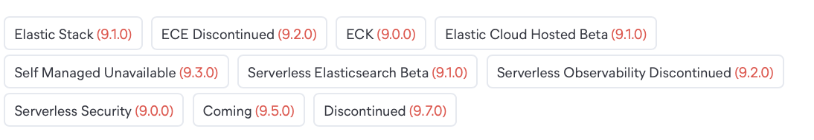
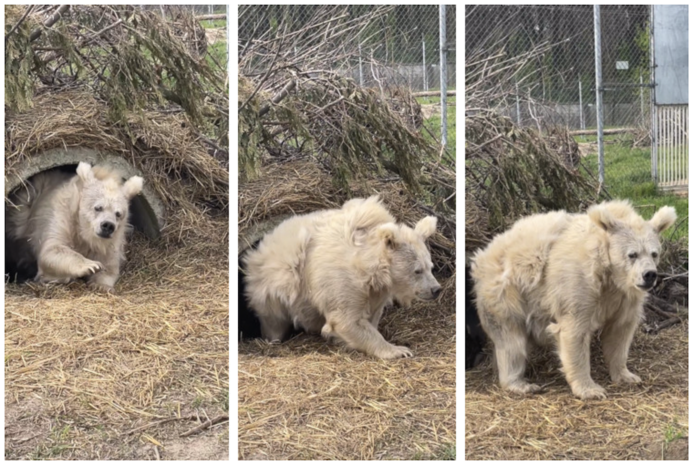
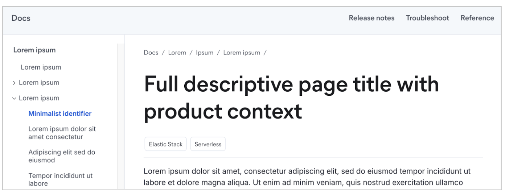

# Syntax quick reference (WIP)

:::{warning}
This page is still in progress. 
:::

This page offers quick guidance on Elastic Docs v3 syntax, including usage tips. Elements are in alphabetical order. The [full syntax guide](index.md) provides implementation details.

## Admonitions

Use admonitions to caution users, or to provide helpful tips or extra information.

::::{dropdown} Types

These examples show the syntax first, followed by the rendered admonition.

 **Warning**

  ```markdown
      :::{warning}
      Users could permanently lose data or leak sensitive information.
      :::
  ```
  :::{warning}
  Users could permanently lose data or leak sensitive information.
  :::

  **Important**

  ```markdown
      :::{important}
      Less dire than a warning. Users might encounter issues with performance or stability.
      :::
  ```
  :::{important}
  Less dire than a warning. Users might encounter issues with performance or stability.
  :::

  **Note**
  ```markdown
      :::{note}
      Supplemental information that provides context or clarification.
      :::
  ```
  :::{note}
  Supplemental information that provides context or clarification.
  :::

  **Tip**
  ```markdown
      :::{tip}
      Advice that helps users work more efficiently or make better choices.
      :::
  ```
  :::{tip}
  Advice that helps users work more efficiently or make better choices.
  :::

  **Custom**
  ```markdown
      :::{admonition} Special note
      Custom admonition with custom label.
      :::
  ```
  :::{admonition} Special note
  Custom admonition with custom label.
  :::

::::

**DOs**<br>
✅ Use custom admonitions as needed

**DON'Ts**<br>
❌ Stack admonitions<br>
❌ Overload a page with too many admonitions<br>
<br>

---

## Anchors

A default anchor is automatically created for each [heading](#headings), in the form `#heading-text` (hyphenated, lowercase, special characters and spaces trimmed). To create a custom anchor, add it in square brackets at the end of a heading: `[my-better-anchor]` 

:::{dropdown} Default anchor
```markdown
#### Hello world!
<!-- Auto-generated default anchor: #hello-world -->
```
:::


:::{dropdown} Custom anchor
```markdown
#### Hello world! [get-started]
```
:::

**DOs**<br>
✅ Create custom anchors for repeated structural headings like "Example request"<br>

**DON'Ts**<br>
❌ Include punctuation marks in custom anchors<br>
❌ Define custom anchors in text that is not a heading

[More details: Links →](links.md#same-page-links-anchors)
<br>
<br>

---

## Applies to 🚧

Tags that identify technical contexts: the feature base (stack/serverless), deployments, and project types that a piece of content "applies to." Use `applies_to` tags to help users determine whether content is right for their deployments and configuration. For more guidance, see 
[](../versions/content-patterns.md).

:::{tip}
The `applies_to` tags are scope signals for readers, not comprehensive metadata. If a page contains general information that applies to all contexts, it doesn't need tags.
:::

### Page-level tag

:::{dropdown} Syntax

This example includes version and release phase facets, which aren't always needed. 

```yaml
---
applies_to:
  stack: 9.0
  deployment:
    ece: preview
    eck: beta 9.0.1
    ess: 
    self: 9.0 
  serverless:
    elasticsearch:  
    observability: deprecated 
    security: 
  product: 
---
```
:::

:::{dropdown} Output
🚧 TODO replace this image: match example and get updated tags 🚧


:::


### Section tag

:::{dropdown} Syntax
````markdown
# Stack-only content
```{applies_to}
stack: 
```
````
:::

:::{dropdown} Output
#### Stack-only content
```{applies_to}
stack:
```
:::

### Inline tag

🚧 Coming soon 🚧

**DOs**<br>
✅ Define a set of page-level `applies_to` tags in a front matter block<br>
✅ Add `{applies_to}` after a heading to indicate that section's contexts<br>
✅ Indicate versions (`major.minor` with an optional `[.patch]`)  and release phases like `beta`

**DON'Ts**<br>
❌ Add `applies_to` tags to general, broadly applicable content<br>
❌ Use `applies_to` tags as metadata or to represent "aboutness"<br>
❌ Include `applies_to` tags in admonitions<br>
❌ Use `Coming (x.x.x)` tags, except in special cases (don't pre-announce features)<br>


[More details: Applies to →](applies.md)
<br>
<br>

---

## Code blocks

Multi-line blocks for code, commands, configuration, and similar content. Use three backticks ` ``` ` on separate lines to start and end the block. For syntax highlighting, add a language identifier after the opening backticks.

:::{dropdown} Syntax
```markdown
    ```yaml
    server.host: "0.0.0.0"
    elasticsearch.hosts: ["http://localhost:9200"]
    ```
```
:::

:::{dropdown} Output
```yaml
server.host: "0.0.0.0"
elasticsearch.hosts: ["http://localhost:9200"]
```
:::


**DOs**<br>
✅ Include code blocks within lists or other block elements as needed<br>
✅ Add language identifiers like `yaml`, `json`, `bash`

**DON'Ts**<br>
❌ Place code blocks in admonitions<br>
❌ Use inline code formatting (single backticks) for multi-line content<br>

[More details: Code →](code.md)
<br>
<br>

---

## Code callouts 🚧

Inline annotations that highlight or explain specific lines in a code block.

### Explicit callout
To explicitly create a code callout, add a number marker in angle brackets (`<1>`, `<2>`, ...) at the end of a line. Add the corresponding callout text below the code block, in a numbered list that matches the markers.

:::{dropdown} Syntax

  ```
      ```json
      {
        "match": {
          "message": "search text" <1>
        }
      }
      ```
      1. Searches the `message` field for the phrase "search text"
  ```
  1. 🚧 rendering bug
:::

:::{dropdown} Output

🚧 rendering bug
```json
{
  "match": {
    "message": "search text" <1>
  }
}
```
1. Searches the `message` field for the phrase "search text"<br>
:::

### Magic (comment-based) callout [magic-callout]
Add comments with `//` or `#` to magically create callouts.

:::{dropdown} Syntax
🚧 rendering bug
  ```json
  {
    "match": {
      "message": "search text" // Searches the message field
    }
  }
  ```
:::

:::{dropdown} Output
🚧 rendering bug
```markdown
    ```json
    {
      "match": {
        "message": "search text" // Searches the message field
      }
    }
    ```
```

:::

**DOs**<br>
✅ Keep callout text short and specific<br>
✅ Use only one type of callout per code block (don't mix [explicit](#explicit-callout) and [magic](#magic-callout))<br>
✅ For explicit callouts, make sure you have a corresponding list item for each callout marker in the code.

**DON'Ts**<br>
❌ Overuse callouts -- they can impede readability<br>

[More details: Code callouts→](code.md#code-callouts)
<br>
<br>

---

## Comments

Use `%` to add single-line comments. Use HTML-style `<!--` and `-->` for multi-line comments.

:::{dropdown} Syntax
```markdown
    % This is a comment
    This is regular text

    <!--
    so much depends 
    upon
    a multi-line 
    comment
    -->
    Regular text after multi-line comment
```
:::

:::{dropdown} Output
% This is a comment
This is regular text

<!--
so much depends 
upon
a multi-line 
comment
-->
Regular text after multi-line comment

:::

**DOs**<br>
✅ Add a space after `%` to start a single-line comment<br>

**DON'Ts**<br>
❌ Use `#` or `//` for comments; they're reserved for [magic callouts](#magic-callout)<br>

<br>

---

## Dropdowns

Collapsible blocks for hiding and showing content. 

::::{dropdown} Syntax
```markdown
    :::{dropdown} Title or label
    Collapsible content
    :::
```
::::

::::{dropdown} Output
:::{dropdown} Title or label
Collapsible content
:::
::::

**DOs**<br>
✅ Use dropdowns for text, lists, images, code blocks, and tables<br>
✅ Add `:open:` to auto-expand a dropdown by default

**DON'Ts**<br>
❌ Use dropdowns for very long paragraphs or entire sections<br>

[More details: Dropdowns →](dropdowns.md)
<br>
<br>

---

## Headings
Title of a page or a section. To create a heading, add number signs `#` at the beginning of the line (one `#` for each heading level). 

:::{dropdown} Syntax
```markdown
# Heading 1
## Heading 2
### Heading 3
#### Heading 4
```
:::

::::{dropdown} Output
:::{image} img/headings.png
:screenshot:
:alt: Heading levels
:width: 300px
:::

::::

**DOs**<br>
✅ Start every page with a Heading 1<br>
✅ Use only one Heading 1 per page<br>
✅ Define custom anchors for repeated headings<br>

**DON'Ts**<br>
❌ Use headings in tabs or dropdowns<br>
❌ Go deeper than Heading 4

[More details: Headings →](headings.md)
<br>
<br>

---

## Images
Standard Markdown images: `[alt text]` in square brackets, followed by the image path in parentheses.

:::{dropdown} Syntax
```markdown

```
:::

:::{dropdown} Output

:::

**DOs**<br>
✅ Store images in a centralized directory<br> 
✅ Follow v3 [best practices for screenshots](../versions/index.md#screenshots)<br>
✅ Specify `:screenshot:` in an [image directive](images.md#screenshots) to add a border<br>

**DON'Ts**<br>
❌ Use lots of UI screenshots that create a maintenance burden<br>
❌ Include confidential info or PII in an image<br>
❌ Add a drop shadow or torn edge effect

[More details: Images →](images.md)
<br>
<br>

---


## Inline formatting 
Elastic Docs v3 supports standard Markdown inline formatting.

`_emphasis_` &nbsp;&nbsp;&nbsp; _italics_ <br>
`**strong**` &nbsp;&nbsp;&nbsp;**bold**  <br>
\` `monospace` \` &nbsp;&nbsp;&nbsp; `inline code` (single backticks) <br>
`~~strikethrough~~` &nbsp;&nbsp;&nbsp; ~~strikethrough~~ <br>
`\* escaped` &nbsp;&nbsp;&nbsp; \* escaped character <br>

**DOs**<br>
✅ Use `_emphasis_` to introduce a term<br>
✅ Use inline `code` in headings and other elements as needed

**DON'Ts**<br>
❌ Overuse `**strong**` or `_emphasis_` -- aim for readability
<br>
<br>

---

## Links

Standard Markdown links to doc pages, sections (anchors), or external content. Prefer absolute paths for links within the doc set.

:::{dropdown} Syntax
```markdown
    [link text](/absolute/file.md#anchor)
    [link text](https://external-site.com)
    [link text](other-repo://path/file.md)
    (#same-page-anchor)
```
:::

**DOs**<br>
✅ Use inline formatting in link text: `[**bold link**](bold-page.md)`<br>
✅ Autogenerate link text from the page or section title: `[](use-title.md#section)`<br>
✅ Define a custom [anchor](#anchors) by adding `[anchor-text]` at the end of a heading line

**DON'Ts**<br>
❌ Use unclear, inaccessible link text like "click here" or "this"<br>
❌ Include terminal punctuation in link text

[More details: Links →](links.md)
<br>
<br>

---

## Lists

Standard Markdown ordered (numbered) and unordered (bulleted) lists. Indent with four spaces to nest paragraphs and other elements under a list item. Unordered lists can start with hyphens `-`, asterisks `*`, or plus signs `+`.

:::{dropdown} Syntax

  ```
      - Unordered item 1
      ····Paragraph within item 1
      - Unordered item 2
  ```

  ```
  1. Ordered item 1
  2. Ordered item 2
  ```
:::

**DOs** <br>
✅ Add code blocks, images, admonitions, and other content within a list item<br>
✅ Nest lists, mixing ordered and unordered as needed<br>
✅ Use parallel structure and phrasing in list items<br>
✅ Capitalize only the first word of list items (sentence case)<br>
✅ Use terminal punctuation consistently and only for complete sentences<br>

**DON'Ts** <br>
❌ Use lists solely for layout purposes <br>
❌ Use lists for structured data or comparisons — use tables instead

[More details: Lists →](lists.md)
<br>
<br>

---

## Navigation title

Optional [front matter](frontmatter.md) element that sets a custom title for docs navigation features: appears in the left nav (table of contents), breadcrumbs, and previous/next links. Compare [headings](#headings) (H1 = page title). 

:::{dropdown} Syntax

Page front matter (yaml):

```yaml
  ---
    navigation_title: "Minimalist identifier" 
  ---
```

Page title (Markdown H1): 

```markdown
    # Full descriptive page title with product context  
```

:::

:::{dropdown} Output



:::


**DOs**<br>
✅ Use active phrasing and shorter forms<br>
✅ Make sure the navigation title clearly identifies the page topic<br>
✅ Omit product names that appear in the full H1 page title

**DON'Ts**<br>
❌ Duplicate the H1 page title<br>
❌ Use a long navigation title or lots of punctuation<br>
❌ Abbreviate with periods or ellipses

[More details: Title →](./titles.md)
<br>
<br>

---

## Substitutions 
Key-value pairs that define reusable variables. They help ensure consistency and enable short forms. To use a substitution (or "sub"), surround the key with curly brackets: `{{variable}}`<br>

% TODO: link to our global docset.yml?

### Define a sub

:::{dropdown} Syntax

In `docset.yml`:

```
subs:
  ccs: "cross-cluster search"
  ech: "Elastic Cloud Hosted"
  kib: "Kibana"
```
:::


### Use a sub

This example uses the sub defined in `docset.yml` above.

:::{dropdown} Syntax

In `myfile.md`:

```
{{ech}} supports most standard {{kib}} settings.
```
:::

:::{dropdown} Output
% TODO replace with actual subs once _docset.yml is updated

Elastic Cloud Hosted supports most standard Kibana settings.
:::

**DOs** <br>
✅ Check the global `docset.yml` file for existing product and feature name subs<br>
✅ Use substitutions in code blocks by setting `subs=true`  <br>
✅ Define new page-specific substitutions as needed  

**DON'Ts**<br>
❌ Override a `docset.yml` sub by defining a page-level sub with the same key (causes build errors)<br>
❌ Use substitutions for common words that don't need to be standardized  

[More details: Substitutions →](./substitutions.md)
<br>
<br>

---

## Tabs

Block element that displays content in switchable tabs to help users zero in on the right context (such as a deployment or language). [Synced tab groups](https://elastic.github.io/docs-builder/syntax/tabs/#tab-groups) are supported.

:::::{dropdown} Syntax
```markdown
    ::::{tab-set}

    :::{tab-item} Tab 1 title
    Tab 1 content
    :::

    :::{tab-item} Tab 2 title
    Tab 2 content
    :::

    ::::
```
:::::

:::::{dropdown} Output
::::{tab-set}

:::{tab-item} Tab 1 title
Tab 1 content
:::

:::{tab-item} Tab 2 title
Tab 2 content
:::

::::
:::::

**DOs**<br>
✅ Use clear, descriptive tab labels<br>
✅ Make sure all tabs have the same type of content and similar goals<br>
✅ Keep tab content scannable and self-contained (don't make the user switch tabs to follow steps or compare content)<br>
✅ Include other block elements in tabs, like [admonitions](#admonitions)

**DON'Ts**<br>
❌ Nest tabs<br>
❌ Split step-by-step procedures across tabs<br>
❌ Use more than 6 tabs (use as few as possible)<br>
❌ Use tabs in [dropdowns](#dropdowns)


[More details: Tabs →](tabs.md)
<br>
<br>

---

## Tables

Standard table layout for structured data. Automatically scrolls horizontally if needed. The **header** row is optional. 

:::{dropdown} Syntax
```markdown
    | Header | Header |
    | ------ | ------ |
    | Data   | Info   | 
    | Info	 | Data   |     
```
:::

:::{dropdown} Output
| Header | Header |
| ------ | ------ |
| Data   | Info   | 
| Info	 | Data   |  
:::

**DOs**<br>
✅ Use leading and trailing pipes for clarity<br>
✅ Add spaces for readability (they're trimmed)<br>
✅ Keep cell content scannable and parallel<br>
✅ Use standard Markdown text alignment when necessary (`:-- --: :--:`)<br>

**DON'Ts**<br>
❌ Insert block elements or multiple paragraphs in a table cell<br>
❌ Use a table solely for position or spacing purposes<br>

[More details: Tables →](tables.md)
<br>
<br>

---

🚧🚧🚧 

% DELETE ME

## Template: quick ref entry
Prose description of this syntax element 

Example dropdowns: In most cases, use dropdowns labeled Syntax and Output. But use different labels and structure as needed.

:::{dropdown} Syntax
```markdown
some syntax, **strong**
```
:::

:::{dropdown} Output
some output, **strong**
:::

**DOs**<br>
✅ First _do_ -- not in a bulleted list; use the checkmark as a bullet character and use line breaks<br>
✅ Second _do_

**DON'Ts**<br>
❌ First _don't_<br>
❌ Second _don't_

[More details →](index.md)
<br>
<br>

---