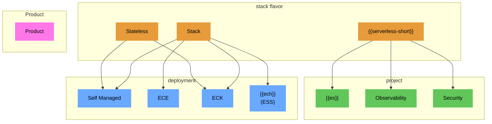

```mermaid
flowchart TB
  %% Top-level section
  subgraph SF["stack flavor"]
    direction LR
    STACK["Stack"]
    STATELESS["Stateless"]
    SERVERLESS["{{serverless-short}}"]
  end

  %% Deployment section
  subgraph DEP["deployment"]
    direction LR
    SM["Self Managed"]
    ECE["ECE"]
    ECK["ECK"]
    ESS["{{ech}}<br/>(ESS)"]
  end

  %% Project section
  subgraph PROJ["project"]
    direction LR
    ES["{{es}}"]
    OBS["Observability"]
    SEC["Security"]
  end

  %% Product section
  subgraph PROD["Product"]
    direction LR
    P["Product"]
  end

  %% Relationships
  STACK --> SM
  STACK --> ECE
  STACK --> ECK
  STACK --> ESS

  STATELESS --> SM
  STATELESS --> ECK

  SERVERLESS --> ES
  SERVERLESS --> OBS
  SERVERLESS --> SEC

  %% Styling (approximate original colors)
  classDef stackNode fill:#e79b3a,stroke:#e79b3a,color:#000;
  classDef deployNode fill:#69a9ff,stroke:#69a9ff,color:#000;
  classDef projectNode fill:#62c75a,stroke:#62c75a,color:#000;
  classDef productNode fill:#ff77e9,stroke:#ff77e9,color:#000;

  class STACK,STATELESS,SERVERLESS stackNode;
  class SM,ECE,ECK,ESS deployNode;
  class ES,OBS,SEC projectNode;
  class P productNode;
```
